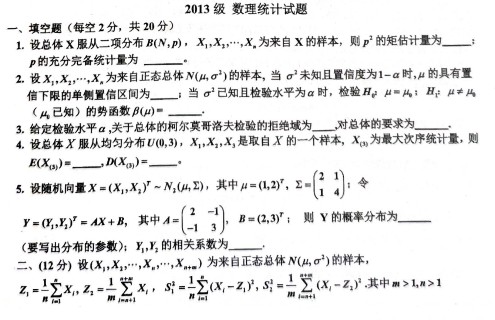
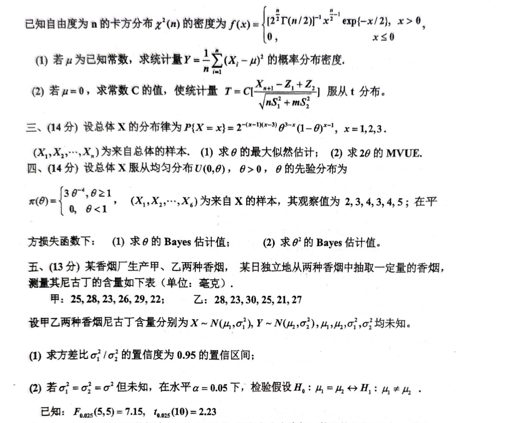
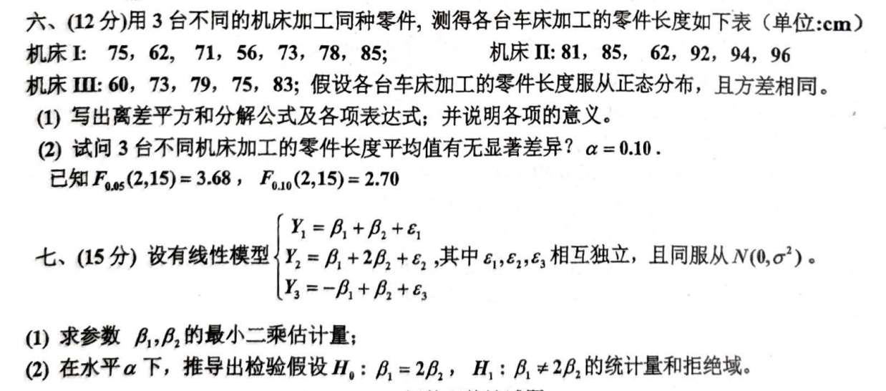

# 2013

# 2013级数理统计试题
## 一、填空题（每空2分，共20分）
1. 设总体 $ X $ 服从二项分布 $ B(N, p) $, $ X_1, X_2, \dots, X_n $ 为来自 $ X $ 的样本，则 $ p^2 $ 的矩估计量为 ______；$ p $ 的充分统计量为 ______。
2. 设 $ X_1, X_2, \dots, X_n $ 为来自正态总体 $ N(\mu, \sigma^2) $ 的样本，当 $ \sigma^2 $ 未知且置信度为 $ 1-\alpha $ 时，$ \mu $ 的具有量信下限的单侧置信区间为 ______；当 $ \sigma^2 $ 已知且检验水平为 $ \alpha $ 时，检验 $ H_0: \mu = \mu_0 $；$ H_1: \mu \neq \mu_0 $（$ \mu_0 $ 已知）的势函数 $ \beta ( \mu ) = $。
3. 给定检验水平 $ \alpha $，关于总体的柯尔莫哥洛夫检验的拒绝域为 ______，对总体的要求为 ______。
4. 设总体 $ X $ 服从均匀分布 $ U(0, 3) $，$ X_1, X_2, X_3 $ 是取自 $ X $ 的一个样本，$ X_{(3)} $ 为最大次序统计量，则 $ \text{E}(X_{(3)}) = ______, \text{D}(X_{(3)}) = ______ $。
5. 设随机向量 $ X = (X_1, X_2)^T \sim N_2(\mu, \Sigma) $, 其中 $ \mu = (1, 2)^T $, $ \Sigma = \begin{pmatrix} 2 & 1 \\ 1 & 4 \end{pmatrix} $；令

$ Y = (Y_1, Y_2)^T = AX + B, \text{其中 } A = \begin{pmatrix} 2 & -1 \\ -1 & 3 \end{pmatrix}, B = (2, 3)^T； $

   则 $ Y $ 的概率分布为 ______（要写出分布的参数）；$ Y_1, Y_2 $ 的相关系数为 ______。

---

## 二、（12分）
设 $ (X_1, X_2, \dots, X_n, X_{n+1}, \dots, X_{n+m}) $ 为来自正态总体 $ N(\mu, \sigma^2) $ 的样本，

$ Z_1 = \frac{1}{n} \sum_{i=1}^n X_i, \; Z_2 = \frac{1}{m} \sum_{i=n+1}^{n+m} X_i, \; S_1^2 = \frac{1}{n} \sum_{i=1}^n (X_i - Z_1)^2, \; S_2^2 = \frac{1}{m} \sum_{i=n+1}^{n+m} (X_i - Z_2)^2, $

其中 $ m > 1, n > 1 $。

1. 若 $ \mu $ 为已知常数，求统计量 $ Y = \frac{1}{m} \sum_{i=1}^n (X_i - \mu)^2 $ 的概率分布密度；
2. 若 $ \mu = 0 $，求常数 $ C $ 的值，使统计量

$ T = C \frac{X_{n+1} - Z_1 + Z_2}{n S_1^2 + m S_2^2} $

   服从 $ t $ 分布。

---

## 三、（14分）
设总体 $ X $ 的分布律为

$ P\{X = x\} = C 2^{-(x-1)(x-3)} \theta^{x-1}(1-\theta)^{x-1}, \; x = 1, 2, 3. $

$ X_1, X_2, \dots, X_n $ 为来自总体的样本。

1. 求 $ \theta $ 的最大似然估计；
2. 求 $ 2\theta $ 的 MVUE。

---

## 四、（14分）
设总体 $ X $ 服从均匀分布 $ U(0, \theta), \theta > 0 $，$ \theta $ 的先验分布为

$ \pi(\theta) = 
\begin{cases} 
3 \theta^2, & \theta \geq 1 \\
0, & \theta < 1
\end{cases}, $

$ (X_1, X_2, \dots, X_6) $ 为来自 $ X $ 的样本，其观察值为 $ 2, 3, 4, 3, 4, 5 $；在平方损失函数下：

1. 求 $ \theta $ 的 Bayes 估计值；
2. 求 $ \theta^2 $ 的 Bayes 估计值。

---

## 五、（13分）
某香烟厂生产甲、乙两种香烟，从中抽取一定量香烟，测量其尼古丁含量如下表（单位：毫克）：

+ 甲：25, 28, 23, 26, 29, 22；
+ 乙：28, 23, 30, 25, 21, 27。

设甲乙两种香烟尼古丁含量分别为 $ X \sim N(\mu_1, \sigma_1^2) $, $ Y \sim N(\mu_2, \sigma_2^2) $, $ \mu_1, \mu_2, \sigma_1^2, \sigma_2^2 $ 均未知。

1. 求方差比 $ \sigma_1^2 / \sigma_2^2 $ 的置信度为 $ 0.95 $ 的置信区间；
2. 若 $ \sigma_1^2 = \sigma_2^2 = \sigma^2 $ 但未知，在水平 $ \alpha = 0.05 $ 下，检验假设 $ H_0: \mu_1 = \mu_2 \leftrightarrow H_1: \mu_1 \neq \mu_2 $。

（已知 $ F_{0.025}(5, 5) = 7.15, t_{0.025}(10) = 2.23 $）

---

## 六、（12分）
用3台不同的机床加工同种零件，测得各台车床加工的零件长度如下表（单位：cm）：

+ 机床I：75, 62, 71, 56, 73, 78, 85；
+ 机床II：81, 85, 62, 92, 94, 96；
+ 机床III：60, 73, 79, 75, 83。

假设各台车床加工的零件长度服从正态分布，且方差相同：

1. 写出离差平方和分解公式及各项表达式；并说明各项的意义；
2. 试问3台不同机床加工的零件长度均值有无显著差异？$ \alpha = 0.10 $。

（已知 $ F_{0.05}(2, 15) = 3.68, F_{0.10}(2, 15) = 2.70 $）

---

## 七、（15分）
设有线性模型

$ \begin{cases}
Y_1 = \beta_1 + \beta_2 + \epsilon_1 \\
Y_2 = \beta_1 + 2 \beta_2 + \epsilon_2 \\
Y_3 = -\beta_1 + \beta_2 + \epsilon_3
\end{cases}, $

其中 $ \epsilon_1, \epsilon_2, \epsilon_3 $ 相互独立，且同服从 $ N(0, \sigma^2) $。

1. 求参数 $ \beta_1, \beta_2 $ 的最小二乘估计量；
2. 在水平 $ \alpha $ 下，推导出检验假设 $ H_0: \beta_1 = 2\beta_2, H_1: \beta_1 \neq 2\beta_2 $ 的统计量和拒绝域。

```markdown
# 2013级数理统计试题

## 一、填空题（每空2分，共20分）

1. 设总体 $X$ 服从二项分布 $B(N, p)$, $X_1, X_2, \dots, X_n$ 为来自 $X$ 的样本，则 $p^2$ 的矩估计量为 ______；$p$ 的充分统计量为 ______。

2. 设 $X_1, X_2, \dots, X_n$ 为来自正态总体 $N(\mu, \sigma^2)$ 的样本，当 $\sigma^2$ 未知且置信度为 $1-\alpha$ 时，$\mu$ 的具有量信下限的单侧置信区间为 ______；当 $\sigma^2$ 已知且检验水平为 $\alpha$ 时，检验 $H_0: \mu = \mu_0$；$H_1: \mu \neq \mu_0$（$\mu_0$ 已知）的势函数 $\beta(\mu) = ______$。

3. 给定检验水平 $\alpha$，关于总体的柯尔莫哥洛夫检验的拒绝域为 ______，对总体的要求为 ______。

4. 设总体 $X$ 服从均匀分布 $U(0, 3)$，$X_1, X_2, X_3$ 是取自 $X$ 的一个样本，$X_{(3)}$ 为最大次序统计量，则 $\text{E}(X_{(3)}) = ______, \text{D}(X_{(3)}) = ______$。

5. 设随机向量 $X = (X_1, X_2)^T \sim N_2(\mu, \Sigma)$, 其中 $\mu = (1, 2)^T$, $\Sigma = \begin{pmatrix} 2 & 1 \\ 1 & 4 \end{pmatrix}$；令 
   $$
   Y = (Y_1, Y_2)^T = AX + B, \text{其中 } A = \begin{pmatrix} 2 & -1 \\ -1 & 3 \end{pmatrix}, B = (2, 3)^T；
   $$
   则 $Y$ 的概率分布为 ______（要写出分布的参数）；$Y_1, Y_2$ 的相关系数为 ______。

---

## 二、（12分）

设 $(X_1, X_2, \dots, X_n, X_{n+1}, \dots, X_{n+m})$ 为来自正态总体 $N(\mu, \sigma^2)$ 的样本，
$$
Z_1 = \frac{1}{n} \sum_{i=1}^n X_i, \; Z_2 = \frac{1}{m} \sum_{i=n+1}^{n+m} X_i, \; S_1^2 = \frac{1}{n} \sum_{i=1}^n (X_i - Z_1)^2, \; S_2^2 = \frac{1}{m} \sum_{i=n+1}^{n+m} (X_i - Z_2)^2,
$$
其中 $m > 1, n > 1$。

1. 若 $\mu$ 为已知常数，求统计量 $Y = \frac{1}{m} \sum_{i=1}^n (X_i - \mu)^2$ 的概率分布密度；

2. 若 $\mu = 0$，求常数 $C$ 的值，使统计量 
   $$
   T = C \frac{X_{n+1} - Z_1 + Z_2}{n S_1^2 + m S_2^2}
   $$
   服从 $t$ 分布。

---

## 三、（14分）

设总体 $X$ 的分布律为
$$
P\{X = x\} = C 2^{-(x-1)(x-3)} \theta^{x-1}(1-\theta)^{x-1}, \; x = 1, 2, 3.
$$
$X_1, X_2, \dots, X_n$ 为来自总体的样本。

1. 求 $\theta$ 的最大似然估计；
2. 求 $2\theta$ 的 MVUE。

---

## 四、（14分）

设总体 $X$ 服从均匀分布 $U(0, \theta), \theta > 0$，$\theta$ 的先验分布为
$$
\pi(\theta) = 
\begin{cases} 
3 \theta^2, & \theta \geq 1 \\
0, & \theta < 1
\end{cases},
$$
$(X_1, X_2, \dots, X_6)$ 为来自 $X$ 的样本，其观察值为 $2, 3, 4, 3, 4, 5$；在平方损失函数下：

1. 求 $\theta$ 的 Bayes 估计值；
2. 求 $\theta^2$ 的 Bayes 估计值。

---

## 五、（13分）

某香烟厂生产甲、乙两种香烟，从中抽取一定量香烟，测量其尼古丁含量如下表（单位：毫克）：
- 甲：25, 28, 23, 26, 29, 22；
- 乙：28, 23, 30, 25, 21, 27。

设甲乙两种香烟尼古丁含量分别为 $X \sim N(\mu_1, \sigma_1^2)$, $Y \sim N(\mu_2, \sigma_2^2)$, $\mu_1, \mu_2, \sigma_1^2, \sigma_2^2$ 均未知。

1. 求方差比 $\sigma_1^2 / \sigma_2^2$ 的置信度为 $0.95$ 的置信区间；
2. 若 $\sigma_1^2 = \sigma_2^2 = \sigma^2$ 但未知，在水平 $\alpha = 0.05$ 下，检验假设 $H_0: \mu_1 = \mu_2 \leftrightarrow H_1: \mu_1 \neq \mu_2$。

（已知 $F_{0.025}(5, 5) = 7.15, t_{0.025}(10) = 2.23$）

---

## 六、（12分）

用3台不同的机床加工同种零件，测得各台车床加工的零件长度如下表（单位：cm）：
- 机床I：75, 62, 71, 56, 73, 78, 85；
- 机床II：81, 85, 62, 92, 94, 96；
- 机床III：60, 73, 79, 75, 83。

假设各台车床加工的零件长度服从正态分布，且方差相同：

1. 写出离差平方和分解公式及各项表达式；并说明各项的意义；
2. 试问3台不同机床加工的零件长度均值有无显著差异？$\alpha = 0.10$。

（已知 $F_{0.05}(2, 15) = 3.68, F_{0.10}(2, 15) = 2.70$）

---

## 七、（15分）

设有线性模型
$$
\begin{cases}
Y_1 = \beta_1 + \beta_2 + \epsilon_1 \\
Y_2 = \beta_1 + 2 \beta_2 + \epsilon_2 \\
Y_3 = -\beta_1 + \beta_2 + \epsilon_3
\end{cases},
$$
其中 $\epsilon_1, \epsilon_2, \epsilon_3$ 相互独立，且同服从 $N(0, \sigma^2)$。

1. 求参数 $\beta_1, \beta_2$ 的最小二乘估计量；
2. 在水平 $\alpha$ 下，推导出检验假设 $H_0: \beta_1 = 2\beta_2, H_1: \beta_1 \neq 2\beta_2$ 的统计量和拒绝域。

```








