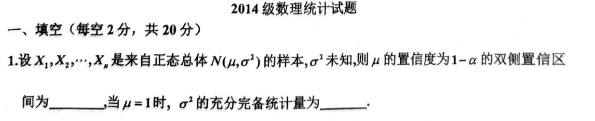
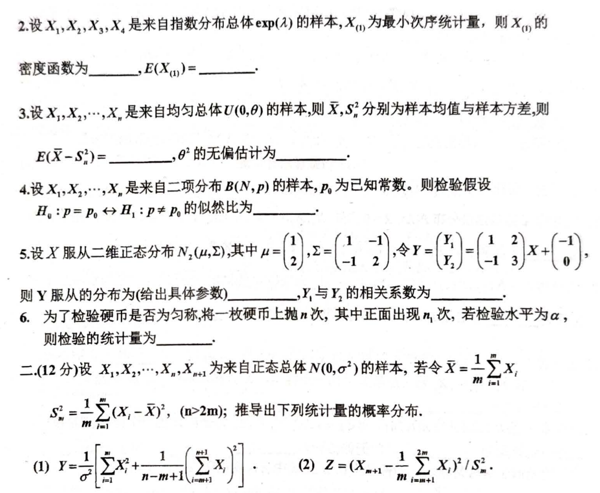
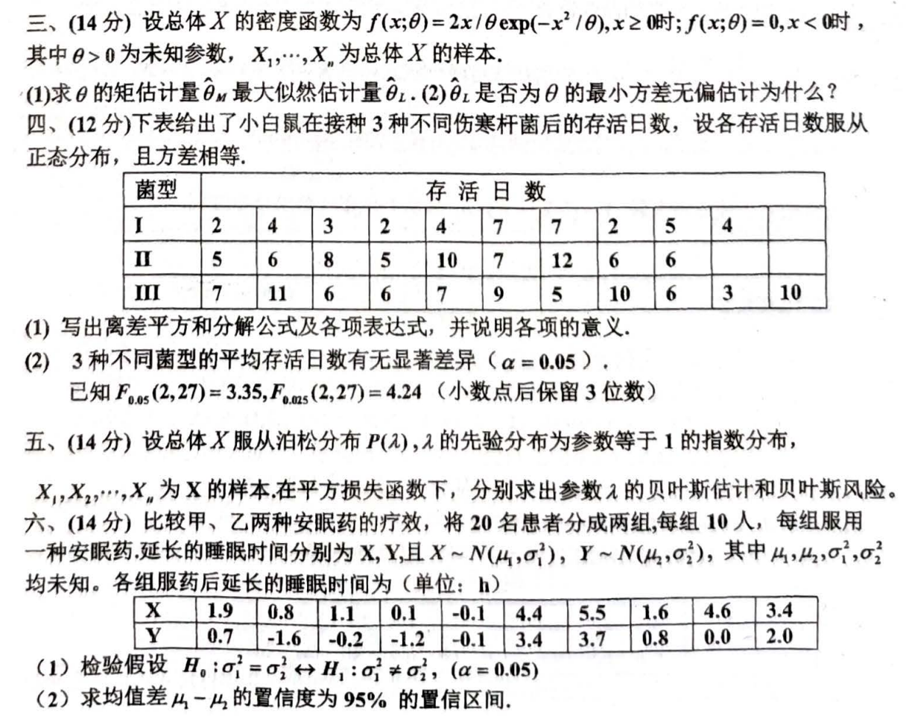
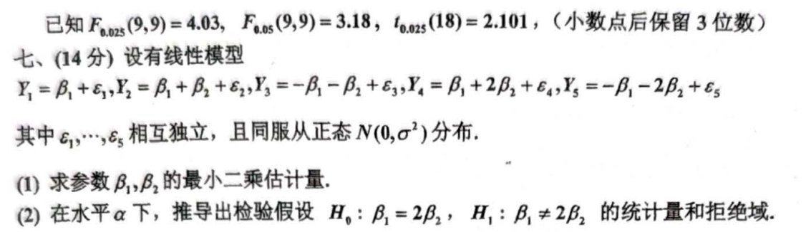

# 2014

# 2014级 数理统计试题
## 一、填空题（每空2分，共20分）
1. 设 $ X_1, X_2, \cdots, X_n $ 是来自正态总体 $ N(\mu, \sigma^2) $ 的样本，$ \sigma^2 $ 未知，则 $ \mu $ 的置信度为 $ 1-\alpha $ 的双侧置信区间为 ______，当 $ \mu = 1 $ 时，$ \sigma^2 $ 的充分完备统计量为 ______。
2. 设 $ X_1, X_2, X_3, X_4 $ 是来自指数分布总体 $ exp(\lambda) $ 的样本，$ X_{(1)} $ 为最小次序统计量，则 $ X_{(1)} $ 的密度函数为 ______，$E(X_{(1)}) = ______$。
3. 设 $ X_1, X_2, \cdots, X_n $ 是来自均匀分布 $ U(0, \theta) $ 的样本，则 $ \overline{X}, S_n^2 $ 分别为样本均值与样本方差，则 $ E(\overline{X} - S_n^2) = ______ $，$ \theta^2 $ 的无偏估计为 ______。
4. 设 $ X_1, X_2, \cdots, X_n $ 是来自二项分布 $ B(N, p) $ 的样本，$ p_0 $ 为已知常数。则检验假设

$ H_0: p = p_0 \leftrightarrow H_1: p \neq p_0 $

   的似然比为 ______。

5. 设 $ X $ 服从二维正态分布 $ N_2(\mu, \Sigma) $，其中

$ \mu = \begin{pmatrix} 1 \\ 2 \end{pmatrix}, \Sigma = \begin{pmatrix} 1 & -1 \\ -1 & 2 \end{pmatrix}, $

   令

$ Y = \begin{pmatrix} Y_1 \\ Y_2 \end{pmatrix} = \begin{pmatrix} 1 & 2 \\ -1 & 3 \end{pmatrix}X + \begin{pmatrix} -1 \\ 0 \end{pmatrix}. $

   则 $ Y $ 服从的分布为（给出具体参数） ______，$ Y_1 $ 与 $ Y_2 $ 的相关系数为 ______。

6. 为了检验硬币是否为均匀，将一枚硬币上抛 $ n $ 次，其中正面出现 $ n_1 $ 次，若检验水平为 $ \alpha $，则检验的统计量为 ______。

---

## 二、（12分）
设 $ X_1, X_2, \cdots, X_n, X_{n+1} $ 为来自正态总体 $ N(0, \sigma^2) $ 的样本，若令

$ \overline{X} = \frac{1}{m} \sum_{i=1}^m X_i, \quad S_n^2 = \frac{1}{n-1} \sum_{i=1}^n (X_i - \overline{X})^2, \quad (n > 2m), $

推导出下列统计量的概率分布：

1. 

$ Y = \frac{\sum_{i=1}^m X_i^2 + \frac{1}{m}\left(\sum_{i=1}^m X_i\right)^2}{n-m-1} / S_n^2 $

2. 

$ Z = \frac{(X_{m+1} - \frac{1}{m}\sum_{i=1}^{2m} X_i)^2}{S_n^2}. $

---

## 三、（14分）
设总体 $ X $ 的密度函数为

$ f(x; \theta) = \begin{cases} 
2x/\theta \exp(-x^2/\theta), & x \geq 0, \\
0, & x < 0,
\end{cases} $

其中 $ \theta > 0 $ 为未知参数，$ X_1, X_2, \cdots, X_n $ 为总体 $ X $ 的样本。

1. 求 $ \theta $ 的矩估计量 $ \hat{\theta}_m $ 和最大似然估计量 $ \hat{\theta}_L $；
2. $ \hat{\theta}_L $ 是否为 $ \theta $ 的最小方差无偏估计量？为什么？

---

## 四、（12分）
下表给出了小白鼠在接种3种不同伪伤寒杆菌后的存活日数，设各存活日数服从正态分布，且方差相等：

| 菌型 | 存活日数 |
| --- | --- |
| I | 2, 4, 4, 3, 7, 7, 2, 5, 4 |
| II | 5, 6, 8, 5, 7, 10, 7, 12, 6, 6 |
| III | 7, 11, 6, 6, 7, 9, 5, 10, 6, 3, 10 |


1. 写出离差平方和分解公式及各项表达式，并说明各项的意义；
2. 检验3种不同菌型的平均存活日数有无显著差异（$ \alpha = 0.05 $）。

已知：

$ F_{0.05}(2, 27) = 3.35, \; F_{0.025}(2, 27) = 4.24. $

---

## 五、（14分）
设总体 $ X $ 服从泊松分布 $ P(\lambda) $，$ \lambda $ 的先验分布为参数等于1的指数分布，$ X_1, X_2, \cdots, X_n $ 为 $ X $ 的样本。在平方损失函数下，分别求出参数 $ \lambda $ 的贝叶斯估计和贝叶斯风险。

---

## 六、（14分）
比较甲、乙两种药物延长睡眠时间的疗效，将20名患者分成两组，每组10人，每组服用一种药物。延长的睡眠时间分别为：

| 组别 | 睡眠时间延长 (单位: h) |
| --- | --- |
| 甲组 | 1.9, 0.8, 1.1, 0.1, 0.1, 4.4, 5.5, 1.6, 4.6, 3.4 |
| 乙组 | 0.7, 1.6, -1.0, -1.2, -0.1, 3.4, 3.7, 0.8, 0.0, 2.0 |


1. 检验假设

$ H_0: \sigma_1^2 = \sigma_2^2 \quad \text{vs.} \quad H_1: \sigma_1^2 \neq \sigma_2^2 \quad (\alpha = 0.05). $

2. 求均值差 $ \mu_1 - \mu_2 $ 的置信度为95%的置信区间。

**已知：**

$ F_{0.025}(9, 9) = 4.03, \; F_{0.05}(9, 9) = 3.18, \; t_{0.025}(18) = 2.101. $

---

## 七、（14分）
设有线性模型：

$ Y_1 = \beta_1 + \epsilon_1, \;
Y_2 = \beta_1 + \beta_2 + \epsilon_2, \;
Y_3 = -\beta_1 - \beta_2 + \epsilon_3, \;
Y_4 = \beta_1 + 2\beta_2 + \epsilon_4, \;
Y_5 = -\beta_1 - 2\beta_2 + \epsilon_5, $

其中 $ \epsilon_1, \cdots, \epsilon_5 $ 相互独立，且服从正态分布 $ N(0, \sigma^2) $。

1. 求参数 $ \beta_1, \beta_2 $ 的最小二乘估计量；
2. 在显著性水平 $ \alpha $ 下，推导出检验假设

$ H_0: \beta_1 = 2\beta_2 \quad \text{vs.} \quad H_1: \beta_1 \neq 2\beta_2 $

   的统计量和拒绝域。


```markdown
# 2014级 数理统计试题

## 一、填空题（每空2分，共20分）

1. 设 $X_1, X_2, \cdots, X_n$ 是来自正态总体 $N(\mu, \sigma^2)$ 的样本，$\sigma^2$ 未知，则 $\mu$ 的置信度为 $1-\alpha$ 的双侧置信区间为 ______，当 $\mu = 1$ 时，$\sigma^2$ 的充分完备统计量为 ______。

2. 设 $X_1, X_2, X_3, X_4$ 是来自指数分布总体 $exp(\lambda)$ 的样本，$X_{(1)}$ 为最小次序统计量，则 $X_{(1)}$ 的密度函数为 ______，$E(X_{(1)}) = ______$。

3. 设 $X_1, X_2, \cdots, X_n$ 是来自均匀分布 $U(0, \theta)$ 的样本，则 $\overline{X}, S_n^2$ 分别为样本均值与样本方差，则 $E(\overline{X} - S_n^2) = ______$，$\theta^2$ 的无偏估计为 ______。

4. 设 $X_1, X_2, \cdots, X_n$ 是来自二项分布 $B(N, p)$ 的样本，$p_0$ 为已知常数。则检验假设
   $$
   H_0: p = p_0 \leftrightarrow H_1: p \neq p_0
   $$
   的似然比为 ______。

5. 设 $X$ 服从二维正态分布 $N_2(\mu, \Sigma)$，其中
   $$
   \mu = \begin{pmatrix} 1 \\ 2 \end{pmatrix}, \Sigma = \begin{pmatrix} 1 & -1 \\ -1 & 2 \end{pmatrix},
   $$
   令
   $$
   Y = \begin{pmatrix} Y_1 \\ Y_2 \end{pmatrix} = \begin{pmatrix} 1 & 2 \\ -1 & 3 \end{pmatrix}X + \begin{pmatrix} -1 \\ 0 \end{pmatrix}.
   $$
   则 $Y$ 服从的分布为（给出具体参数） ______，$Y_1$ 与 $Y_2$ 的相关系数为 ______。

6. 为了检验硬币是否为均匀，将一枚硬币上抛 $n$ 次，其中正面出现 $n_1$ 次，若检验水平为 $\alpha$，则检验的统计量为 ______。

___

## 二、（12分）

设 $X_1, X_2, \cdots, X_n, X_{n+1}$ 为来自正态总体 $N(0, \sigma^2)$ 的样本，若令
$$
\overline{X} = \frac{1}{m} \sum_{i=1}^m X_i, \quad S_n^2 = \frac{1}{n-1} \sum_{i=1}^n (X_i - \overline{X})^2, \quad (n > 2m),
$$
推导出下列统计量的概率分布：

1. 
   $$
   Y = \frac{\sum_{i=1}^m X_i^2 + \frac{1}{m}\left(\sum_{i=1}^m X_i\right)^2}{n-m-1} / S_n^2
   $$

2. 
   $$
   Z = \frac{(X_{m+1} - \frac{1}{m}\sum_{i=1}^{2m} X_i)^2}{S_n^2}.
   $$

___

## 三、（14分）

设总体 $X$ 的密度函数为
$$
f(x; \theta) = \begin{cases} 
2x/\theta \exp(-x^2/\theta), & x \geq 0, \\
0, & x < 0,
\end{cases}
$$
其中 $\theta > 0$ 为未知参数，$X_1, X_2, \cdots, X_n$ 为总体 $X$ 的样本。

1. 求 $\theta$ 的矩估计量 $\hat{\theta}_m$ 和最大似然估计量 $\hat{\theta}_L$；

2. $\hat{\theta}_L$ 是否为 $\theta$ 的最小方差无偏估计量？为什么？

___

## 四、（12分）

下表给出了小白鼠在接种3种不同伪伤寒杆菌后的存活日数，设各存活日数服从正态分布，且方差相等：

| 菌型 | 存活日数         |
| ---- | ---------------- |
| I    | 2, 4, 4, 3, 7, 7, 2, 5, 4 |
| II   | 5, 6, 8, 5, 7, 10, 7, 12, 6, 6 |
| III  | 7, 11, 6, 6, 7, 9, 5, 10, 6, 3, 10 |

1. 写出离差平方和分解公式及各项表达式，并说明各项的意义；

2. 检验3种不同菌型的平均存活日数有无显著差异（$\alpha = 0.05$）。

已知：
$$
F_{0.05}(2, 27) = 3.35, \; F_{0.025}(2, 27) = 4.24.
$$

___

## 五、（14分）

设总体 $X$ 服从泊松分布 $P(\lambda)$，$\lambda$ 的先验分布为参数等于1的指数分布，$X_1, X_2, \cdots, X_n$ 为 $X$ 的样本。在平方损失函数下，分别求出参数 $\lambda$ 的贝叶斯估计和贝叶斯风险。

___

## 六、（14分）

比较甲、乙两种药物延长睡眠时间的疗效，将20名患者分成两组，每组10人，每组服用一种药物。延长的睡眠时间分别为：

| 组别 | 睡眠时间延长 (单位: h)                |
| ---- | ------------------------------------- |
| 甲组 | 1.9, 0.8, 1.1, 0.1, 0.1, 4.4, 5.5, 1.6, 4.6, 3.4 |
| 乙组 | 0.7, 1.6, -1.0, -1.2, -0.1, 3.4, 3.7, 0.8, 0.0, 2.0 |

1. 检验假设 
   $$
   H_0: \sigma_1^2 = \sigma_2^2 \quad \text{vs.} \quad H_1: \sigma_1^2 \neq \sigma_2^2 \quad (\alpha = 0.05).
   $$

2. 求均值差 $\mu_1 - \mu_2$ 的置信度为95%的置信区间。

**已知：**
$$
F_{0.025}(9, 9) = 4.03, \; F_{0.05}(9, 9) = 3.18, \; t_{0.025}(18) = 2.101.
$$

___

## 七、（14分）

设有线性模型：
$$
Y_1 = \beta_1 + \epsilon_1, \;
Y_2 = \beta_1 + \beta_2 + \epsilon_2, \;
Y_3 = -\beta_1 - \beta_2 + \epsilon_3, \;
Y_4 = \beta_1 + 2\beta_2 + \epsilon_4, \;
Y_5 = -\beta_1 - 2\beta_2 + \epsilon_5,
$$
其中 $\epsilon_1, \cdots, \epsilon_5$ 相互独立，且服从正态分布 $N(0, \sigma^2)$。

1. 求参数 $\beta_1, \beta_2$ 的最小二乘估计量；

2. 在显著性水平 $\alpha$ 下，推导出检验假设
   $$
   H_0: \beta_1 = 2\beta_2 \quad \text{vs.} \quad H_1: \beta_1 \neq 2\beta_2
   $$
   的统计量和拒绝域。

```










