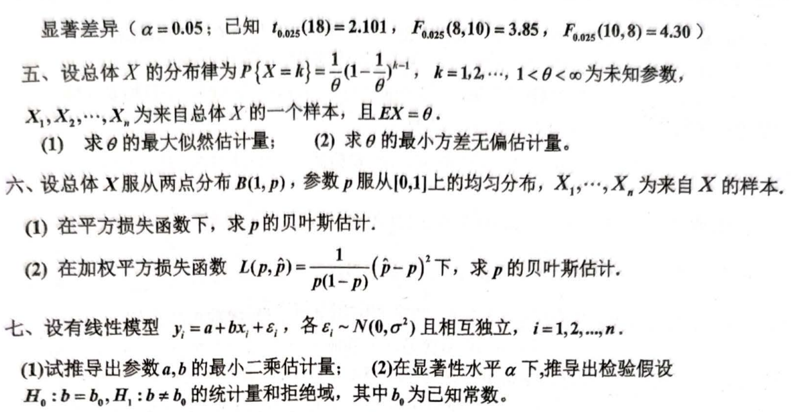

# 2015

# 2015级数理统计试题
## 一、填空题（每空2分，共20分）
1. 设总体 $ X $ 服从泊松分布 $ P(\lambda), \lambda > 0 $ 未知，$ X_1, X_2, \dots, X_n $ 为来自 $ X $ 的样本，则 $ \lambda^2 $ 的矩估计量为 ______；检验假设 $ H_0: \lambda = \lambda_0 $ 对 $ H_1: \lambda \neq \lambda_0 $（$ \lambda_0 $ 为已知常数）的似然比为 ______。
2. 设总体 $ X \sim N(\mu, \sigma^2), \sigma^2 $ 已知，$ X_1, X_2, \dots, X_n $ 为来自 $ X $ 的样本，则 $ \sigma^2 $ 的置信区间为 $ 1-\alpha $ 的置信区间为 ______；若用 $ L $ 表示该置信区间的长度，则 $ EL = ______ $。
3. 设总体 $ X \sim N_p(\mu, \Sigma) $, $ \Sigma $ 为可逆矩阵，则 $ Y = (X - \mu)^T \Sigma^{-1}(X - \mu) $ 服从 ______ 分布，若 $ X_1, X_2, \dots, X_n $ 为来自 $ X $ 的一个样本，$ \bar{X} $ 为样本均值，则协方差阵 $ \text{Cov}(X_1, X_2) = ______ $。
4. 设总体 $ X $ 服从二项分布 $ B(N, p), 0 < p < 1 $, $ X_1, X_2, \dots, X_n $ 为来自 $ X $ 的一个样本，则参数 $ p $ 的充分统计量为 ______；$ p^2 $ 的无偏估计为 ______。
5. 为了检验骰子是否均匀，将一枚骰子掷 $ n $ 次，其中有 $ n_i $ 次出现点数 $ i, i=1, 2, \dots, 6 $, 且 $ \sum_{i=1}^6 n_i = n $；则该检验问题的原假设 $ H_0 $ 为 ______；若显著性水平为 $ \alpha $，拒绝域为 ______。

---

## 二、设 $ X_1, X_2, \dots, X_m, Y_1, Y_2, \dots, Y_n $ 分别来自两个独立总体 $ X $ 和 $ Y $ 的样本. $ \bar{X} \sim N(\mu_1, \sigma_1^2) $, $ \bar{Y} \sim N(\mu_2, \sigma_2^2) $, $ \bar{X}, \bar{Y}, S_X^2, S_Y^2 $ 分别表示总体 $ X $ 和 $ Y $ 的样本均值和样本方差。
1. 求随机变量 $ Y = C(X - \bar{X})/S_X $ 服从 $ t $ 分布的推导过程。
2. 求随机变量

$ Z = \frac{(m+n-2)(\sigma_1^2 + \sigma_2^2) + \sigma_1^2 \sum_{i=1}^m (X_i - \mu_1)^2 + \sigma_2^2 \sum_{i=1}^n (Y_i - \mu_2)^2}{m S_X^2 + n S_Y^2} $

   的概率分布。

---

## 三、为了寻找飞机构板上仪器表的最佳布局，试验了三个方案，观察领航员在紧急情况下的反应时间（以1/10秒记），随机地选择了28名领航员，得到他们对于不同的布局方案的反应时间如下：
+ **方案I**：14, 13, 9, 15, 11, 13, 14, 11
+ **方案II**：10, 12, 7, 11, 8, 12, 9, 10, 13, 9, 10, 9
+ **方案III**：11, 5, 9, 10, 6, 8, 8, 7

设不同布局方案的反应时间服从正态分布，且方差相等。试在显著性水平 $ \alpha = 0.05 $ 下，检验各个方案的反应时间是否有显著差异。（已知 $ F_{0.05}(2, 25) = 3.385 $，小数点后保留3位）

---

## 四、机床厂某日从两台机器加工的同一零件中，分别抽取若干个样品，测得零件尺寸（单位：mm）：
+ **第1台机器**：6.2, 5.7, 6.5, 6.0, 6.0, 6.0, 5.8, 6.0
+ **第2台机器**：5.6, 5.9, 5.6, 5.7, 5.8, 6.0, 5.5, 5.5

假设两台机器加工的零件尺寸均服从正态分布，试问两台机器加工零件尺寸的均值值是否有显著差异（$ \alpha = 0.05 $；已知 $ t_{0.025}(18) = 2.101, F_{0.025}(8, 10) = 3.85, F_{0.025}(10, 8) = 4.30 $）。

---

## 五、设总体 $ X $ 的分布律为
$ P\{X = k\} = \frac{1}{\theta} \left(1 - \frac{1}{\theta}\right)^{k-1}, \; k = 1, 2, \dots, 1 < \theta < \infty $

$ X_1, X_2, \dots, X_n $ 为来自总体 $ X $ 的一个样本，且 $ \text{E}X = \theta $。

1. 求 $ \theta $ 的最大似然估计量；
2. 求 $ \theta $ 的最小方差无偏估计量。

---

## 六、设总体 $ X $ 服从两点分布 $ B(1, p) $, 参数 $ p $ 服从 $ [0, 1] $ 上的均匀分布，$ X_1, X_2, \dots, X_n $ 为来自 $ X $ 的样本。
1. 在平方损失函数下，求 $ p $ 的贝叶斯估计；
2. 在加权平方损失函数

$ L(p, \hat{p}) = \frac{1}{p(1 - p)^2} (\hat{p} - p)^2 $

   下，求 $ p $ 的贝叶斯估计。

---

## 七、设有线性模型
$ y_i = a + b x_i + \epsilon_i, \quad \epsilon_i \sim N(0, \sigma^2) \text{且相互独立}, \; i = 1, 2, \dots, n $

1. 试推导出参数 $ a, b $ 的最小二乘估计量；
2. 在显著性水平 $ \alpha $ 下，推导出检验假设 $ H_0: b = b_0, H_1: b \neq b_0 $ 的统计量和拒绝域，其中 $ b_0 $ 为已知常数。

# 代码与图片




```markdown
# 2015级数理统计试题

## 一、填空题（每空2分，共20分）

1. 设总体 $X$ 服从泊松分布 $P(\lambda), \lambda > 0$ 未知，$X_1, X_2, \dots, X_n$ 为来自 $X$ 的样本，则 $\lambda^2$ 的矩估计量为 ______；检验假设 $H_0: \lambda = \lambda_0$ 对 $H_1: \lambda \neq \lambda_0$（$\lambda_0$ 为已知常数）的似然比为 ______。

2. 设总体 $X \sim N(\mu, \sigma^2), \sigma^2$ 已知，$X_1, X_2, \dots, X_n$ 为来自 $X$ 的样本，则 $\sigma^2$ 的置信区间为 $1-\alpha$ 的置信区间为 ______；若用 $L$ 表示该置信区间的长度，则 $EL = ______$。

3. 设总体 $X \sim N_p(\mu, \Sigma)$, $\Sigma$ 为可逆矩阵，则 $Y = (X - \mu)^T \Sigma^{-1}(X - \mu)$ 服从 ______ 分布，若 $X_1, X_2, \dots, X_n$ 为来自 $X$ 的一个样本，$\bar{X}$ 为样本均值，则协方差阵 $\text{Cov}(X_1, X_2) = ______$。

4. 设总体 $X$ 服从二项分布 $B(N, p), 0 < p < 1$, $X_1, X_2, \dots, X_n$ 为来自 $X$ 的一个样本，则参数 $p$ 的充分统计量为 ______；$p^2$ 的无偏估计为 ______。

5. 为了检验骰子是否均匀，将一枚骰子掷 $n$ 次，其中有 $n_i$ 次出现点数 $i, i=1, 2, \dots, 6$, 且 $\sum_{i=1}^6 n_i = n$；则该检验问题的原假设 $H_0$ 为 ______；若显著性水平为 $\alpha$，拒绝域为 ______。

---

## 二、设 $X_1, X_2, \dots, X_m, Y_1, Y_2, \dots, Y_n$ 分别来自两个独立总体 $X$ 和 $Y$ 的样本. $\bar{X} \sim N(\mu_1, \sigma_1^2)$, $\bar{Y} \sim N(\mu_2, \sigma_2^2)$, $\bar{X}, \bar{Y}, S_X^2, S_Y^2$ 分别表示总体 $X$ 和 $Y$ 的样本均值和样本方差。

1. 求随机变量 $Y = C(X - \bar{X})/S_X$ 服从 $t$ 分布的推导过程。

2. 求随机变量 
   $$
   Z = \frac{(m+n-2)(\sigma_1^2 + \sigma_2^2) + \sigma_1^2 \sum_{i=1}^m (X_i - \mu_1)^2 + \sigma_2^2 \sum_{i=1}^n (Y_i - \mu_2)^2}{m S_X^2 + n S_Y^2}
   $$
   的概率分布。

---

## 三、为了寻找飞机构板上仪器表的最佳布局，试验了三个方案，观察领航员在紧急情况下的反应时间（以1/10秒记），随机地选择了28名领航员，得到他们对于不同的布局方案的反应时间如下：

- **方案I**：14, 13, 9, 15, 11, 13, 14, 11
- **方案II**：10, 12, 7, 11, 8, 12, 9, 10, 13, 9, 10, 9
- **方案III**：11, 5, 9, 10, 6, 8, 8, 7

设不同布局方案的反应时间服从正态分布，且方差相等。试在显著性水平 $\alpha = 0.05$ 下，检验各个方案的反应时间是否有显著差异。（已知 $F_{0.05}(2, 25) = 3.385$，小数点后保留3位）

---

## 四、机床厂某日从两台机器加工的同一零件中，分别抽取若干个样品，测得零件尺寸（单位：mm）：

- **第1台机器**：6.2, 5.7, 6.5, 6.0, 6.0, 6.0, 5.8, 6.0
- **第2台机器**：5.6, 5.9, 5.6, 5.7, 5.8, 6.0, 5.5, 5.5

假设两台机器加工的零件尺寸均服从正态分布，试问两台机器加工零件尺寸的均值值是否有显著差异（$\alpha = 0.05$；已知 $t_{0.025}(18) = 2.101, F_{0.025}(8, 10) = 3.85, F_{0.025}(10, 8) = 4.30$）。

---

## 五、设总体 $X$ 的分布律为 
$$
P\{X = k\} = \frac{1}{\theta} \left(1 - \frac{1}{\theta}\right)^{k-1}, \; k = 1, 2, \dots, 1 < \theta < \infty
$$

$X_1, X_2, \dots, X_n$ 为来自总体 $X$ 的一个样本，且 $\text{E}X = \theta$。

1. 求 $\theta$ 的最大似然估计量；
2. 求 $\theta$ 的最小方差无偏估计量。

---

## 六、设总体 $X$ 服从两点分布 $B(1, p)$, 参数 $p$ 服从 $[0, 1]$ 上的均匀分布，$X_1, X_2, \dots, X_n$ 为来自 $X$ 的样本。

1. 在平方损失函数下，求 $p$ 的贝叶斯估计；
2. 在加权平方损失函数 
   $$
   L(p, \hat{p}) = \frac{1}{p(1 - p)^2} (\hat{p} - p)^2
   $$
   下，求 $p$ 的贝叶斯估计。

---

## 七、设有线性模型 
$$
y_i = a + b x_i + \epsilon_i, \quad \epsilon_i \sim N(0, \sigma^2) \text{且相互独立}, \; i = 1, 2, \dots, n
$$

1. 试推导出参数 $a, b$ 的最小二乘估计量；
2. 在显著性水平 $\alpha$ 下，推导出检验假设 $H_0: b = b_0, H_1: b \neq b_0$ 的统计量和拒绝域，其中 $b_0$ 为已知常数。

```


