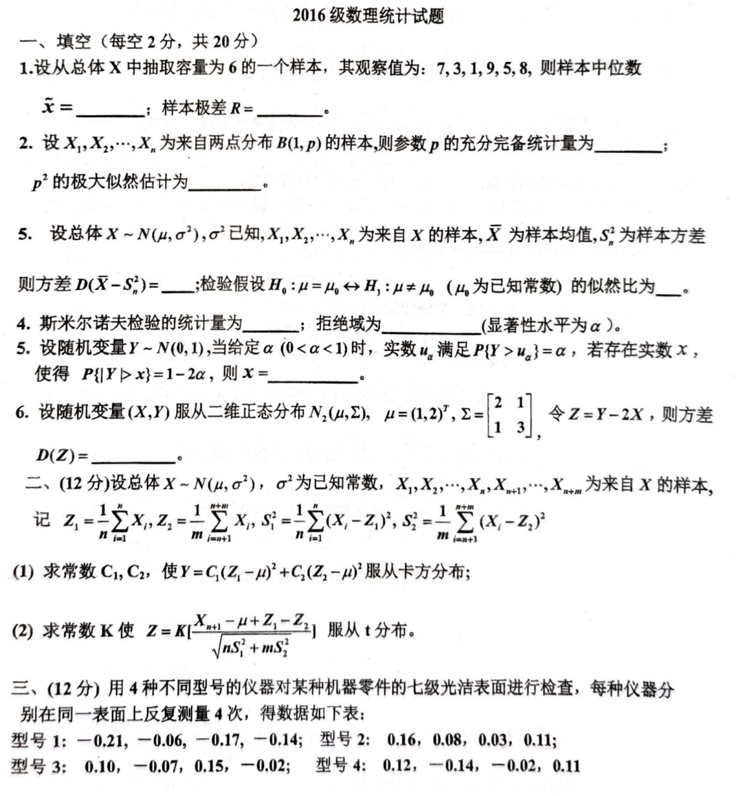
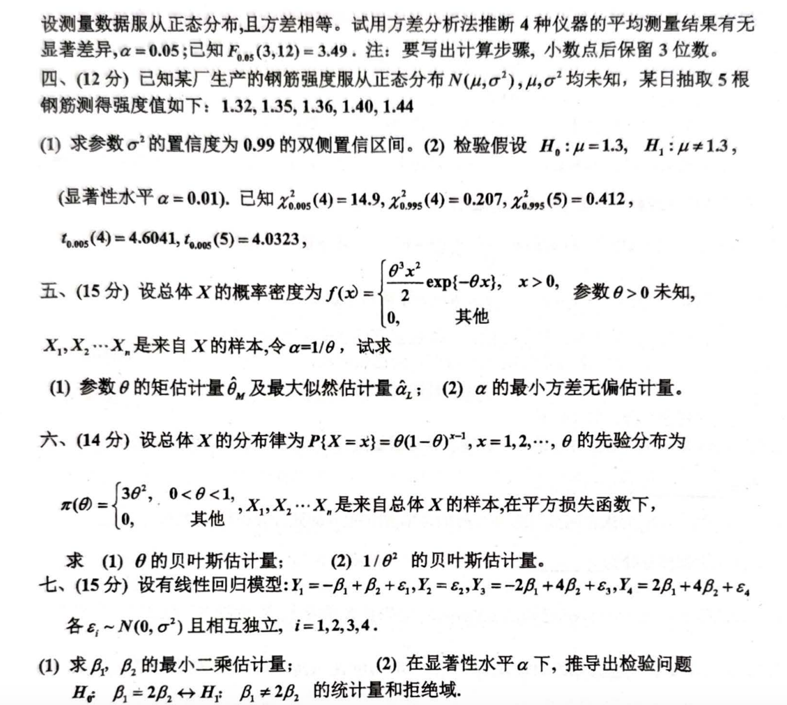

# 2016

# 2016级 数理统计试题
## 一、填空题（每空2分，共20分）
1. 设从总体 $ X $ 中抽取容量为6的一个样本，其观察值为：$ 7, 3, 1, 9, 5, 8 $，则样本中位数 $ \tilde{X} = ______ $；样本极差 $ R = ______ $。
2. 设 $ X_1, X_2, \cdots, X_n $ 为来自两点分布 $ B(1, p) $ 的样本，则参数 $ p $ 的充分完备统计量为 ______；$ p^2 $ 的极大似然估计为 ______。
3. 设总体 $ X \sim N(\mu, \sigma^2) $ 已知 $ \sigma^2 $，$ X_1, X_2, \cdots, X_n $ 为来自 $ X $ 的样本，$ \overline{X} $ 为样本均值，$ S^2 $ 为样本方差，则方差 $ D(X - S^2) = ______ $；检验假设 $ H_0: \mu = \mu_0 \leftrightarrow H_1: \mu \neq \mu_0 $（$ \mu_0 $ 为已知常数）的似然比为 ______。
4. 斯米尔诺夫检验的统计量为 ______；拒绝域为 ______（显著性水平为 $ \alpha $）。
5. 设随机变量 $ Y \sim N(0, 1) $，当给定 $ \alpha (0 < \alpha < 1) $ 时，实数 $ u_\alpha $ 满足 $ P(Y > u_\alpha) = \alpha $，若存在实数 $ x $，使得 $ P(|Y| > x) = 1-2\alpha $，则 $ x = ______ $。
6. 设随机变量 $ (X, Y) $ 服从二维正态分布 $ N_2(\mu, \Sigma) $，$ \mu = (1, 2)^T $，$ \Sigma = \begin{pmatrix} 2 & 1 \\ 1 & 3 \end{pmatrix} $，令 $ Z = Y - 2X $，则方差 $ D(Z) = ______ $。

---

## 二、（12分）
设总体 $ X \sim N(\mu, \sigma^2) $，$ \sigma^2 $ 为已知常数，$ X_1, X_2, \cdots, X_n, X_{n+1}, \cdots, X_{n+m} $ 为来自 $ X $ 的样本，记 

$ \overline{Z}_1 = \frac{1}{n} \sum_{i=1}^n X_i, \; \overline{Z}_2 = \frac{1}{m} \sum_{j=n+1}^{n+m} X_j, \; S_1^2 = \frac{1}{n} \sum_{i=1}^n (X_i - Z_1)^2, \; S_2^2 = \frac{1}{m} \sum_{j=n+1}^{n+m} (X_j - Z_2)^2. $

1. 求常数 $ C_1, C_2 $，使得 $ Y = C_1(Z_1 - \mu)^2 + C_2(Z_2 - \mu)^2 $ 服从卡方分布；
2. 求常数 $ K $ 使得

$ Z = \frac{X_{n+1} - \mu - Z_1}{\sqrt{n S_1^2 + m S_2^2}} $

   服从 $ t $ 分布。

---

## 三、（12分）
用4种不同型号的仪器对某种机器件的七级光洁表面进行检查，每种仪器分别在一表面上反复测量4次，得到数据如下表：

| 型号 | 1 | 2 | 3 | 4 |
| --- | --- | --- | --- | --- |
| 数据 | 0.10 | 0.07 | 0.15 | 0.14 |
|  | 0.12 | 0.10 | 0.13 | 0.16 |
|  | 0.08 | 0.11 | 0.12 | 0.08 |
|  | 0.09 | 0.09 | 0.10 | 0.03 |


设观察数据服从正态分布，且方差相等。试用方差分析法推断4种仪器的平均测量结果有无显著差异，$ \alpha = 0.05 $；已知 $ F_{0.05}(3, 12) = 3.49 $。

**注：要求写出计算步骤，小数点后保留3位有效数字。**

---

## 四、（12分）
已知某厂生产的钢筋强度服从正态分布 $ N(\mu, \sigma^2) $，$ \mu, \sigma^2 $ 均未知，某日抽取5根钢筋测得强度值如下：$ 1.32, 1.35, 1.36, 1.40, 1.44 $。

1. 求参数 $ \mu $ 的置信度为0.99的双侧置信区间。
2. 检验假设 $ H_0: \mu = 1.3 \leftrightarrow H_1: \mu \neq 1.3 $ （显著性水平 $ \alpha = 0.01 $）。

**已知：**

$ \chi^2_{0.005}(4) = 14.9, \; \chi^2_{0.995}(4) = 0.207, \; \chi^2_{0.995}(5) = 0.412, $

$ t_{0.005}(4) = 4.6041, \; t_{0.005}(5) = 4.0323. $

---

## 五、（15分）
设总体 $ X $ 的概率密度为 

$ f(x) = \begin{cases} 
\frac{\theta^3 x^2}{2} \exp(-\theta x), & x > 0, \\
0, & \text{其他}.
\end{cases} $

$ X_1, X_2, \cdots, X_n $ 是来自 $ X $ 的样本，令 $ \alpha = 1/\theta $，试求：

1. 参数 $ \theta $ 的矩估计量及极大似然估计量 $ \hat{\theta} $；
2. $ \alpha $ 的最小方差无偏估计量。

---

## 六、（14分）
设总体 $ X $ 的分布律为

$ P(X = x) = \theta(1 - \theta)^{x-1}, \; x = 1, 2, \cdots, \; 0 < \theta < 1, $

$ \pi(\theta) = \begin{cases}
30\theta^2, & 0 < \theta < 1, \\
0, & \text{其他}.
\end{cases} $

$ X_1, X_2, \cdots, X_n $ 是来自总体 $ X $ 的样本。在平方损失函数下，求：

1. $ \theta $ 的贝叶斯估计量；
2. $ 1/\theta^2 $ 的贝叶斯估计量。

---

## 七、（15分）
设有线性回归模型：

$ Y_1 = -\beta_1 + \beta_2 + \epsilon_1, \;
Y_2 = \beta_1 + \beta_2 + \epsilon_2, \;
Y_3 = -2\beta_1 + 4\beta_2 + \epsilon_3, \;
Y_4 = 2\beta_1 + 4\beta_2 + \epsilon_4, $

各 $ \epsilon_i \sim N(0, \sigma^2) $ 且相互独立，$ i = 1, 2, 3, 4 $。

1. 求 $ \beta_1, \beta_2 $ 的最小二乘估计量；
2. 在显著性水平 $ \alpha $ 下，推出检验问题 $ H_0: \beta_1 = 2\beta_2 \leftrightarrow H_1: \beta_1 \neq 2\beta_2 $ 的统计量和拒绝域。

# 代码与图片
```markdown
# 2016级 数理统计试题

## 一、填空题（每空2分，共20分）

1. 设从总体 $X$ 中抽取容量为6的一个样本，其观察值为：$7, 3, 1, 9, 5, 8$，则样本中位数 $\tilde{X} = ______$；样本极差 $R = ______$。

2. 设 $X_1, X_2, \cdots, X_n$ 为来自两点分布 $B(1, p)$ 的样本，则参数 $p$ 的充分完备统计量为 ______；$p^2$ 的极大似然估计为 ______。

3. 设总体 $X \sim N(\mu, \sigma^2)$ 已知 $\sigma^2$，$X_1, X_2, \cdots, X_n$ 为来自 $X$ 的样本，$\overline{X}$ 为样本均值，$S^2$ 为样本方差，则方差 $D(X - S^2) = ______$；检验假设 $H_0: \mu = \mu_0 \leftrightarrow H_1: \mu \neq \mu_0$（$\mu_0$ 为已知常数）的似然比为 ______。

4. 斯米尔诺夫检验的统计量为 ______；拒绝域为 ______（显著性水平为 $\alpha$）。

5. 设随机变量 $Y \sim N(0, 1)$，当给定 $\alpha (0 < \alpha < 1)$ 时，实数 $u_\alpha$ 满足 $P(Y > u_\alpha) = \alpha$，若存在实数 $x$，使得 $P(|Y| > x) = 1-2\alpha$，则 $x = ______$。

6. 设随机变量 $(X, Y)$ 服从二维正态分布 $N_2(\mu, \Sigma)$，$\mu = (1, 2)^T$，$\Sigma = \begin{pmatrix} 2 & 1 \\ 1 & 3 \end{pmatrix}$，令 $Z = Y - 2X$，则方差 $D(Z) = ______$。

___

## 二、（12分）

设总体 $X \sim N(\mu, \sigma^2)$，$\sigma^2$ 为已知常数，$X_1, X_2, \cdots, X_n, X_{n+1}, \cdots, X_{n+m}$ 为来自 $X$ 的样本，记 
$$
\overline{Z}_1 = \frac{1}{n} \sum_{i=1}^n X_i, \; \overline{Z}_2 = \frac{1}{m} \sum_{j=n+1}^{n+m} X_j, \; S_1^2 = \frac{1}{n} \sum_{i=1}^n (X_i - Z_1)^2, \; S_2^2 = \frac{1}{m} \sum_{j=n+1}^{n+m} (X_j - Z_2)^2.
$$

1. 求常数 $C_1, C_2$，使得 $Y = C_1(Z_1 - \mu)^2 + C_2(Z_2 - \mu)^2$ 服从卡方分布；

2. 求常数 $K$ 使得 
   $$
   Z = \frac{X_{n+1} - \mu - Z_1}{\sqrt{n S_1^2 + m S_2^2}}
   $$
   服从 $t$ 分布。

___

## 三、（12分）

用4种不同型号的仪器对某种机器件的七级光洁表面进行检查，每种仪器分别在一表面上反复测量4次，得到数据如下表：

| 型号 | 1      | 2      | 3      | 4      |
| ---- | ------ | ------ | ------ | ------ |
| 数据 | 0.10   | 0.07   | 0.15   | 0.14   |
|      | 0.12   | 0.10   | 0.13   | 0.16   |
|      | 0.08   | 0.11   | 0.12   | 0.08   |
|      | 0.09   | 0.09   | 0.10   | 0.03   |

设观察数据服从正态分布，且方差相等。试用方差分析法推断4种仪器的平均测量结果有无显著差异，$\alpha = 0.05$；已知 $F_{0.05}(3, 12) = 3.49$。

**注：要求写出计算步骤，小数点后保留3位有效数字。**

___

## 四、（12分）

已知某厂生产的钢筋强度服从正态分布 $N(\mu, \sigma^2)$，$\mu, \sigma^2$ 均未知，某日抽取5根钢筋测得强度值如下：$1.32, 1.35, 1.36, 1.40, 1.44$。

1. 求参数 $\mu$ 的置信度为0.99的双侧置信区间。

2. 检验假设 $H_0: \mu = 1.3 \leftrightarrow H_1: \mu \neq 1.3$ （显著性水平 $\alpha = 0.01$）。

**已知：**
$$
\chi^2_{0.005}(4) = 14.9, \; \chi^2_{0.995}(4) = 0.207, \; \chi^2_{0.995}(5) = 0.412,
$$
$$
t_{0.005}(4) = 4.6041, \; t_{0.005}(5) = 4.0323.
$$

___

## 五、（15分）

设总体 $X$ 的概率密度为 
$$
f(x) = \begin{cases} 
\frac{\theta^3 x^2}{2} \exp(-\theta x), & x > 0, \\
0, & \text{其他}.
\end{cases}
$$
$X_1, X_2, \cdots, X_n$ 是来自 $X$ 的样本，令 $\alpha = 1/10$，试求：

1. 参数 $\theta$ 的矩估计量及极大似然估计量 $\hat{\theta}$；

2. $\alpha$ 的最小方差无偏估计量。

___

## 六、（14分）

设总体 $X$ 的分布律为
$$
P(X = x) = \theta(1 - \theta)^{x-1}, \; x = 1, 2, \cdots, \; 0 < \theta < 1,
$$

$$
\pi(\theta) = \begin{cases}
30\theta^2, & 0 < \theta < 1, \\
0, & \text{其他}.
\end{cases}
$$

$X_1, X_2, \cdots, X_n$ 是来自总体 $X$ 的样本。在平方损失函数下，求：

1. $\theta$ 的贝叶斯估计量；

2. $1/\theta^2$ 的贝叶斯估计量。

___

## 七、（15分）

设有线性回归模型：
$$
Y_1 = -\beta_1 + \beta_2 + \epsilon_1, \;
Y_2 = \beta_1 + \beta_2 + \epsilon_2, \;
Y_3 = -2\beta_1 + 4\beta_2 + \epsilon_3, \;
Y_4 = 2\beta_1 + 4\beta_2 + \epsilon_4,
$$
各 $\epsilon_i \sim N(0, \sigma^2)$ 且相互独立，$i = 1, 2, 3, 4$。

1. 求 $\beta_1, \beta_2$ 的最小二乘估计量；

2. 在显著性水平 $\alpha$ 下，推出检验问题 $H_0: \beta_1 = 2\beta_2 \leftrightarrow H_1: \beta_1 \neq 2\beta_2$ 的统计量和拒绝域。

```





