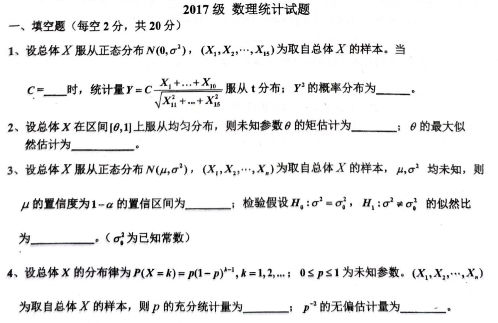
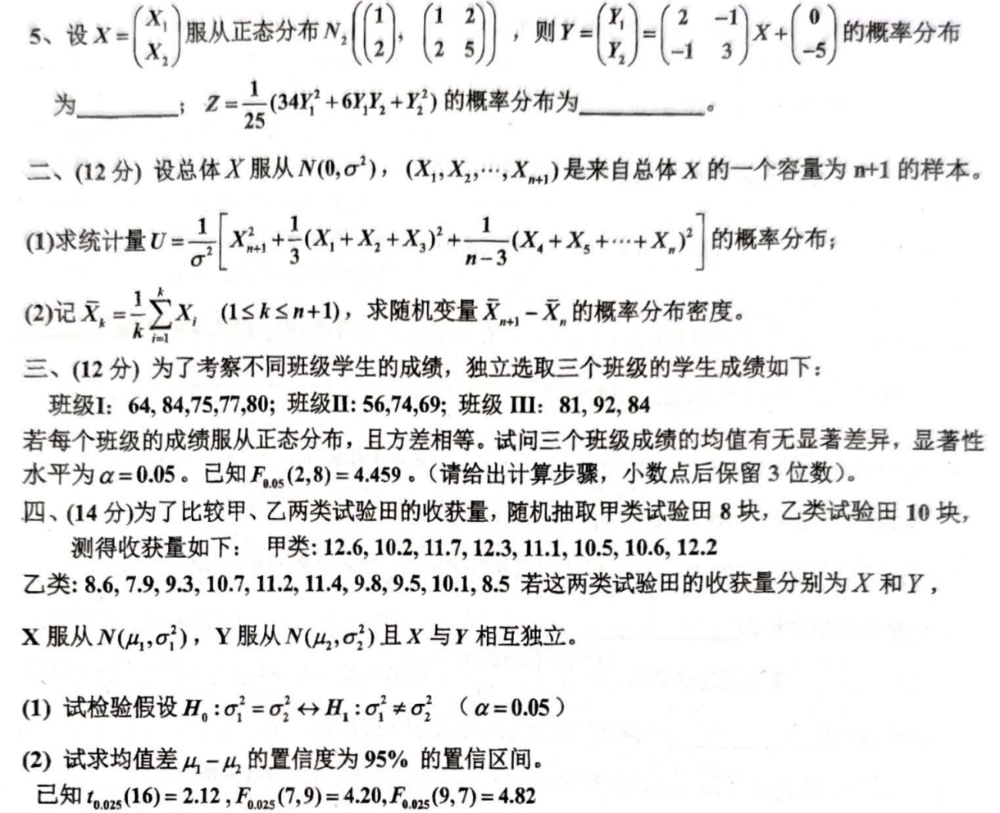
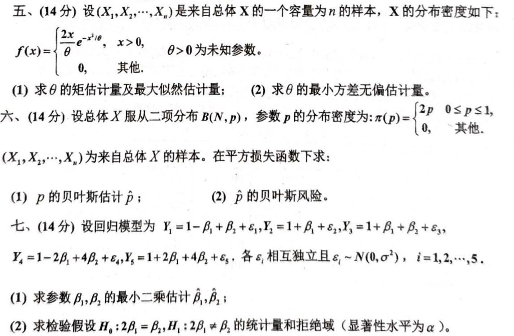

# 2017

# 2017级 数理统计试题
## 一、填空题（每空2分，共20分）
1. 设总体 $ X $ 服从正态分布 $ N(0, \sigma^2) $，$ (X_1, X_2, \cdots, X_{15}) $ 为取自总体 $ X $ 的样本。当

$ C = ______ $

   时，统计量

$ Y = C \frac{X_1 + \cdots + X_{10}}{\sqrt{X_{11}^2 + \cdots + X_{15}^2}} $

   服从 $ t $ 分布；$ Y^2 $ 的概率分布为 ______。

2. 设总体 $ X $ 在区间 $ [0, 1] $ 上服从均匀分布，则未知参数 $ \theta $ 的矩估计为 ______；$ \theta $ 的最大似然估计为 ______。
3. 设总体 $ X $ 服从正态分布 $ N(\mu, \sigma^2) $，$ (X_1, X_2, \cdots, X_n) $ 为取自总体 $ X $ 的样本，$ \mu, \sigma^2 $ 均未知，则 $ \mu $ 的置信度为 $ 1-\alpha $ 的置信区间为 ______；检验假设

$ H_0: \sigma^2 = \sigma_0^2, \quad H_1: \sigma^2 \neq \sigma_0^2 $

   的似然比为 ______。（$ \sigma_0^2 $ 为已知常数）

4. 设总体 $ X $ 的分布律为

$ P(X = k) = p(1-p)^{k-1}, \; k = 1, 2, \cdots, \; 0 \leq p \leq 1 $

   为未知参数。$ (X_1, X_2, \cdots, X_n) $ 为取自总体 $ X $ 的样本，则 $ p $ 的充分统计量为 ______；$ p^{-2} $ 的无偏估计量为 ______。

5. 设

$ X = \begin{pmatrix} X_1 \\ X_2 \end{pmatrix} $

   服从正态分布 $ N_2 \left(\begin{pmatrix} 1 \\ 2 \end{pmatrix}, \begin{pmatrix} 1 & 2 \\ 2 & 5 \end{pmatrix} \right) $，则

$ Y = \begin{pmatrix} Y_1 \\ Y_2 \end{pmatrix} = \begin{pmatrix} 2 & -1 \\ -1 & 3 \end{pmatrix} X + \begin{pmatrix} 0 \\ -5 \end{pmatrix} $

   的概率分布为 ______。

---

## 二、（12分）
设总体 $ X $ 服从 $ N(0, \sigma^2) $，$ (X_1, X_2, \cdots, X_{n+1}) $ 是来自总体 $ X $ 的一个容量为 $ n+1 $ 的样本。

1. 求统计量

$ U = \frac{1}{2}X_{n+1}^2 + \frac{1}{3}(X_1 + X_2 + X_3)^2 + \frac{1}{n-3}(X_4 + X_5 + \cdots + X_n)^2 $

   的概率分布；

2. 记

$ \overline{X}_k = \frac{1}{k} \sum_{i=1}^k X_i, \; (1 \leq k \leq n+1), $

   求随机变量 $ X_{n+1} - \overline{X}_k $ 的概率分布密度。

---

## 三、（12分）
为了考察不同班级学生的成绩，独立选取三个班级的学生成绩如下：

班级I：64, 84, 75, 77, 80；  
班级II：56, 74, 69；  
班级III：81, 92, 84。

若每个班级的成绩服从正态分布，且方差相等。试问三个班级成绩的均值有无显著差异，显著性水平 $ \alpha = 0.05 $。已知

$ F_{0.05}(2, 8) = 4.459 $

（请给出计算步骤，小数点后保留3位有效数字）。

---

## 四、（14分）
为了比较甲、乙两类试验田的收获量，随机抽取甲类试验田8块，乙类试验田10块，测得收获量如下：

甲类：12.6, 10.2, 11.7, 12.3, 11.1, 10.5, 10.6, 12.2；  
乙类：8.6, 7.9, 9.3, 10.7, 11.2, 11.4, 9.8, 9.5, 10.1, 8.5。

若这两类试验田的收获量分别为 $ X $ 和 $ Y $，$ X $ 服从 $ N(\mu_1, \sigma_1^2) $，$ Y $ 服从 $ N(\mu_2, \sigma_2^2) $ 且 $ X $ 与 $ Y $ 相互独立。

1. 检验假设

$ H_0: \sigma_1^2 = \sigma_2^2 \quad \text{vs.} \quad H_1: \sigma_1^2 \neq \sigma_2^2 $

   （$ \alpha = 0.05 $）；

2. 求 $ \mu_1 - \mu_2 $ 的置信度为95%的置信区间。

已知

$ F_{0.05}(7, 9) = 2.12, \; F_{0.025}(7, 9) = 2.88, \; t_{0.025}(16) = 2.12, \; t_{0.05}(16) = 1.75. $

---

## 五、（14分）
设 $ (X_1, X_2, \cdots, X_n) $ 是来自总体 $ X $ 的一个容量为 $ n $ 的样本，$ X $ 的分布密度如下：

$ f(x) = \begin{cases} 
\frac{2x}{\theta} e^{-x^2/\theta}, & x > 0, \\
0, & \text{其他}.
\end{cases} $

1. 求 $ \theta $ 的矩估计量及最大似然估计量；
2. 求 $ \theta $ 的最小方差无偏估计量。

---

## 六、（14分）
设总体 $ X $ 服从二项分布 $ B(N, p) $，参数 $ p $ 的分布密度为：

$ \pi(p) = \begin{cases} 
2p, & 0 \leq p \leq 1, \\
0, & \text{其他}.
\end{cases} $

$ (X_1, X_2, \cdots, X_n) $ 为来自总体 $ X $ 的样本。在平方损失函数下求：

1. $ p $ 的贝叶斯估计 $ \hat{p} $；
2. $ \hat{p} $ 的贝叶斯风险。

---

## 七、（14分）
设回归模型为

$ Y_1 = 1 - \beta_1 + \beta_2 + \epsilon_1, \;
Y_2 = 1 + \beta_1 + \beta_2 + \epsilon_2, \;
Y_3 = 1 - 2\beta_1 + 4\beta_2 + \epsilon_3, \;
Y_4 = 1 - 2\beta_1 + 4\beta_2 + \epsilon_4, \;
Y_5 = 1 + 2\beta_1 + 4\beta_2 + \epsilon_5, $

各 $ \epsilon_i $ 相互独立且 $ \epsilon_i \sim N(0, \sigma^2) $，$ i = 1, 2, \cdots, 5 $。

1. 求参数 $ \beta_1, \beta_2 $ 的最小二乘估计 $ \hat{\beta}_1, \hat{\beta}_2 $；
2. 求检验假设

$ H_0: 2\beta_1 = \beta_2 \quad \text{vs.} \quad H_1: 2\beta_1 \neq \beta_2 $

   的统计量和拒绝域（显著性水平为 $ \alpha $）。

# 代码与题目
```markdown
# 2017级 数理统计试题

## 一、填空题（每空2分，共20分）

1. 设总体 $X$ 服从正态分布 $N(0, \sigma^2)$，$(X_1, X_2, \cdots, X_{15})$ 为取自总体 $X$ 的样本。当 
   $$
   C = ______
   $$
   时，统计量
   $$
   Y = C \frac{X_1 + \cdots + X_{10}}{\sqrt{X_{11}^2 + \cdots + X_{15}^2}}
   $$
   服从 $t$ 分布；$Y^2$ 的概率分布为 ______。

2. 设总体 $X$ 在区间 $[0, 1]$ 上服从均匀分布，则未知参数 $\theta$ 的矩估计为 ______；$\theta$ 的最大似然估计为 ______。

3. 设总体 $X$ 服从正态分布 $N(\mu, \sigma^2)$，$(X_1, X_2, \cdots, X_n)$ 为取自总体 $X$ 的样本，$\mu, \sigma^2$ 均未知，则 $\mu$ 的置信度为 $1-\alpha$ 的置信区间为 ______；检验假设
   $$
   H_0: \sigma^2 = \sigma_0^2, \quad H_1: \sigma^2 \neq \sigma_0^2
   $$
   的似然比为 ______。（$\sigma_0^2$ 为已知常数）

4. 设总体 $X$ 的分布律为
   $$
   P(X = k) = p(1-p)^{k-1}, \; k = 1, 2, \cdots, \; 0 \leq p \leq 1
   $$
   为未知参数。$(X_1, X_2, \cdots, X_n)$ 为取自总体 $X$ 的样本，则 $p$ 的充分统计量为 ______；$p^{-2}$ 的无偏估计量为 ______。

5. 设
   $$
   X = \begin{pmatrix} X_1 \\ X_2 \end{pmatrix}
   $$
   服从正态分布 $N_2 \left(\begin{pmatrix} 1 \\ 2 \end{pmatrix}, \begin{pmatrix} 1 & 2 \\ 2 & 5 \end{pmatrix} \right)$，则
   $$
   Y = \begin{pmatrix} Y_1 \\ Y_2 \end{pmatrix} = \begin{pmatrix} 2 & -1 \\ -1 & 3 \end{pmatrix} X + \begin{pmatrix} 0 \\ -5 \end{pmatrix}
   $$
   的概率分布为 ______。

---

## 二、（12分）

设总体 $X$ 服从 $N(0, \sigma^2)$，$(X_1, X_2, \cdots, X_{n+1})$ 是来自总体 $X$ 的一个容量为 $n+1$ 的样本。

1. 求统计量
   $$
   U = \frac{1}{2}X_{n+1}^2 + \frac{1}{3}(X_1 + X_2 + X_3)^2 + \frac{1}{n-3}(X_4 + X_5 + \cdots + X_n)^2
   $$
   的概率分布；

2. 记
   $$
   \overline{X}_k = \frac{1}{k} \sum_{i=1}^k X_i, \; (1 \leq k \leq n+1),
   $$
   求随机变量 $X_{n+1} - \overline{X}_k$ 的概率分布密度。

---

## 三、（12分）

为了考察不同班级学生的成绩，独立选取三个班级的学生成绩如下：

班级I：64, 84, 75, 77, 80；  
班级II：56, 74, 69；  
班级III：81, 92, 84。

若每个班级的成绩服从正态分布，且方差相等。试问三个班级成绩的均值有无显著差异，显著性水平 $\alpha = 0.05$。已知
$$
F_{0.05}(2, 8) = 4.459
$$
（请给出计算步骤，小数点后保留3位有效数字）。

---

## 四、（14分）

为了比较甲、乙两类试验田的收获量，随机抽取甲类试验田8块，乙类试验田10块，测得收获量如下：

甲类：12.6, 10.2, 11.7, 12.3, 11.1, 10.5, 10.6, 12.2；  
乙类：8.6, 7.9, 9.3, 10.7, 11.2, 11.4, 9.8, 9.5, 10.1, 8.5。

若这两类试验田的收获量分别为 $X$ 和 $Y$，$X$ 服从 $N(\mu_1, \sigma_1^2)$，$Y$ 服从 $N(\mu_2, \sigma_2^2)$ 且 $X$ 与 $Y$ 相互独立。

1. 检验假设
   $$
   H_0: \sigma_1^2 = \sigma_2^2 \quad \text{vs.} \quad H_1: \sigma_1^2 \neq \sigma_2^2
   $$
   （$\alpha = 0.05$）；

2. 求 $\mu_1 - \mu_2$ 的置信度为95%的置信区间。

已知
$$
F_{0.05}(7, 9) = 2.12, \; F_{0.025}(7, 9) = 2.88, \; t_{0.025}(16) = 2.12, \; t_{0.05}(16) = 1.75.
$$

---

## 五、（14分）

设 $(X_1, X_2, \cdots, X_n)$ 是来自总体 $X$ 的一个容量为 $n$ 的样本，$X$ 的分布密度如下：
$$
f(x) = \begin{cases} 
\frac{2x}{\theta} e^{-x^2/\theta}, & x > 0, \\
0, & \text{其他}.
\end{cases}
$$

1. 求 $\theta$ 的矩估计量及最大似然估计量；
2. 求 $\theta$ 的最小方差无偏估计量。

---

## 六、（14分）

设总体 $X$ 服从二项分布 $B(N, p)$，参数 $p$ 的分布密度为：
$$
\pi(p) = \begin{cases} 
2p, & 0 \leq p \leq 1, \\
0, & \text{其他}.
\end{cases}
$$

$(X_1, X_2, \cdots, X_n)$ 为来自总体 $X$ 的样本。在平方损失函数下求：

1. $p$ 的贝叶斯估计 $\hat{p}$；
2. $\hat{p}$ 的贝叶斯风险。

---

## 七、（14分）

设回归模型为
$$
Y_1 = 1 - \beta_1 + \beta_2 + \epsilon_1, \;
Y_2 = 1 + \beta_1 + \beta_2 + \epsilon_2, \;
Y_3 = 1 - 2\beta_1 + 4\beta_2 + \epsilon_3, \;
Y_4 = 1 - 2\beta_1 + 4\beta_2 + \epsilon_4, \;
Y_5 = 1 + 2\beta_1 + 4\beta_2 + \epsilon_5,
$$
各 $\epsilon_i$ 相互独立且 $\epsilon_i \sim N(0, \sigma^2)$，$i = 1, 2, \cdots, 5$。

1. 求参数 $\beta_1, \beta_2$ 的最小二乘估计 $\hat{\beta}_1, \hat{\beta}_2$；
2. 求检验假设
   $$
   H_0: 2\beta_1 = \beta_2 \quad \text{vs.} \quad H_1: 2\beta_1 \neq \beta_2
   $$
   的统计量和拒绝域（显著性水平为 $\alpha$）。

```








