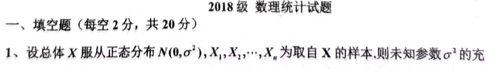
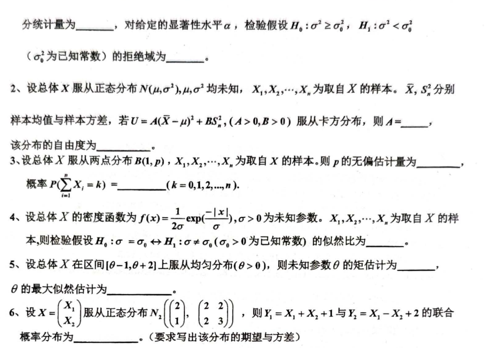
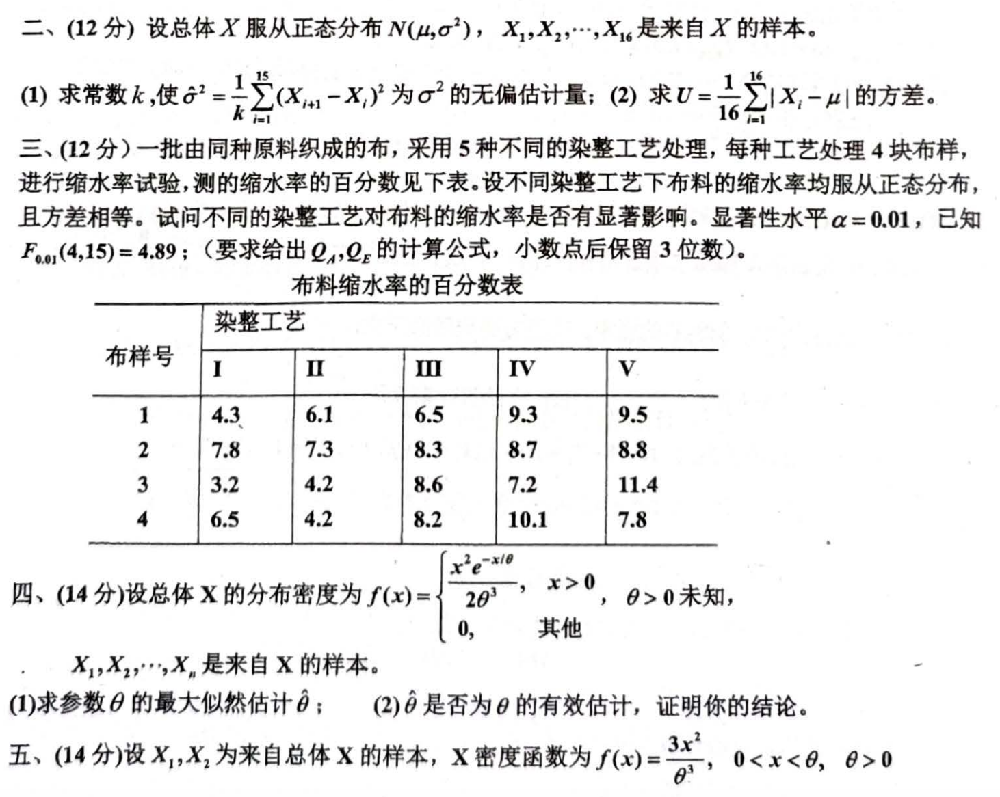
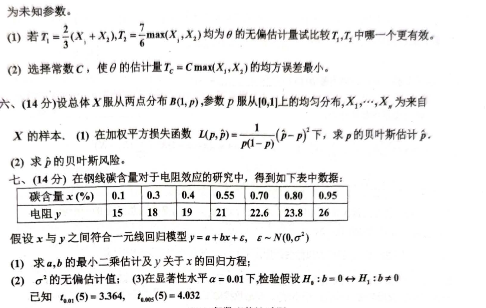

# 2018级数理统计试题

```markdown

## 一、填空题（每空2分，共20分）

1. 设总体 $X$ 服从正态分布 $N(0, \sigma^2)$，$X_1, X_2, \cdots, X_n$ 为取自 $X$ 的样本。则未知参数 $\sigma^2$ 的充**分统计量为________，对给定的显著性水平 $\alpha$，检验假设 $H_0: \sigma^2 \geq \sigma_0^2, H_1: \sigma^2 < \sigma_0^2$（$\sigma_0^2$ 为已知常数）的拒绝域为________。**

2. 设总体 $X$ 服从正态分布 $N(\mu, \sigma^2)$，$\mu, \sigma^2$ 均未知，$X_1, X_2, \cdots, X_n$ 为取自 $X$ 的样本。$\overline{X}, S^2$ 分别为样本均值与样本方差，若 $U = A(\overline{X} - \mu)^2 + B S_n^2$ ($A > 0, B > 0$) 服从卡方分布，则 $A = ________，$该分布的自由度为________。

3. 设总体 $X$ 服从两点分布 $B(1, p)$，$X_1, X_2, \cdots, X_n$ 为取自 $X$ 的样本。则 $p$ 的无偏估计量为________，概率 $P\left(\sum_{i=1}^n X_i = k\right) = ________ (k = 0, 1, 2, \cdots, n)$。

4. 设总体 $X$ 的密度函数为 $f(x) = \frac{1}{2\sigma} \exp\left(-\frac{|x|}{\sigma}\right), \sigma > 0$ 为未知参数。$X_1, X_2, \cdots, X_n$ 为取自 $X$ 的样本，则检验假设 $H_0: \sigma = \sigma_0 \leftrightarrow H_1: \sigma \neq \sigma_0$ ($\sigma_0 > 0$ 为已知常数) 的似然比为________。

5. 设总体 $X$ 在区间 $[\theta - 1, \theta + 2]$ 上服从均匀分布（$\theta > 0$），则未知参数 $\theta$ 的矩估计为________。

6. 设 $X = \begin{pmatrix} X_1 \\ X_2 \end{pmatrix}$ 服从正态分布 $N_2 \left( \begin{pmatrix} 2 \\ 2 \end{pmatrix}, \begin{pmatrix} 2 & 2 \\ 2 & 3 \end{pmatrix} \right)$，则 $Y_1 = X_1 + X_2 + 1$ 与 $Y_2 = X_1 - X_2 + 2$ 的联合概率分布为________。（要求写出该分布的期望与方差）

---

## 二、（12分）设总体 $X$ 服从正态分布 $N(\mu, \sigma^2)$，$X_1, X_2, \cdots, X_{16}$ 是来自 $X$ 的样本。

1. 求常数 $k$，使 $\hat{\sigma}^2 = \frac{1}{k} \sum_{i=1}^{16} (X_i - \overline{X})^2$ 为 $\sigma^2$ 的无偏估计量；
2. 求 $U = \frac{1}{16} \sum_{i=1}^{16} |X_i - \mu|$ 的方差。

---

## 三、（12分）

一批由同种原料组成的布，采用5种不同的染整工艺处理，每种工艺处理4块布样，进行缩水率试验，测得的缩水率的百分数如下表所示：

| 染整工艺 | I   | II  | III | IV  | V   |
| -------- | --- | --- | --- | --- | --- |
| 布样号  |     |     |     |     |     |
| 1        | 4.3 | 6.1 | 6.5 | 9.3 | 9.5 |
| 2        | 7.8 | 7.3 | 8.3 | 8.7 | 8.8 |
| 3        | 3.2 | 4.2 | 8.6 | 7.2 | 11.4|
| 4        | 6.5 | 4.2 | 9.2 | 10.1| 7.8 |

设不同染整工艺对布料的缩水率均服从正态分布，且方差相等。试问不同的染整工艺对布料的缩水率是否有显著影响。显著性水平 $\alpha = 0.01$，已知 $F_{0.01}(4, 15) = 4.89$。（要求给出 $Q_1, Q_2$ 的计算公式，小数点后保留3位有效数字）

---

## 四、（14分）

设总体 $X$ 的分布密度为 

$$
f(x) = \begin{cases} 
\frac{x^2 e^{-x/\theta}}{2 \theta^3}, & x > 0, \theta > 0; \\
0, & \text{其他}.
\end{cases}
$$

$X_1, X_2, \cdots, X_n$ 是来自 $X$ 的样本。

1. 求参数 $\theta$ 的最大似然估计 $\hat{\theta}$；
2. $\hat{\theta}$ 是否为 $\theta$ 的有效估计，证明你的结论。

---

## 五、（14分）

设 $X_1, X_2$ 为来自总体 $X$ 的样本，$X$ 密度函数为 $f(x) = \frac{3x^2}{\theta^3}, \; 0 < x < \theta, \; \theta > 0$。

1. 求 $\theta$ 的最大似然估计；
2. 证明估计的结论。

---

## 六、（14分）

设总体$X$服从两点分布$B(1, p)$，参数$p$服从$[0,1]$上的均匀分布，$X_1, \cdots, X_n$为来自$X$的样本。

1. 在加权平方损失函数

   $$
   L(p, \hat{p}) = \frac{1}{p(1-p)} (\hat{p} - p)^2
   $$

   下，求$p$的贝叶斯估计$\hat{p}$。

2. 求$\hat{p}$的贝叶斯风险。


## 七、（14分）

在钢丝碳含量 $x$ 对于电阻效应的研究中，得到如下表中数据：

| 碳含量 $x$ (%) | 0.1 | 0.3 | 0.4 | 0.55 | 0.7 | 0.8 | 0.95 |
| --------------- | ----| ----| ----| ----| ----| ----| ----|
| 电阻 $y$       | 15  | 18  | 19  | 21  | 22.6| 23.8| 26  |

假设 $x$ 与 $y$ 之间符合一元线回归模型 $y = a + b x + \epsilon, \epsilon \sim N(0, \sigma^2)$。

1. 求 $a, b$ 的最小二乘估计及关于 $x$ 的回归方程；
2. $\sigma^2$ 的无偏估计值；
3. 在显著性水平 $\alpha = 0.01$ 下，检验假设 $H_0: b = 0 \leftrightarrow H_1: b \neq 0$。

已知 $t_{0.01}(5) = 3.364, t_{0.005}(5) = 4.032$。

```








