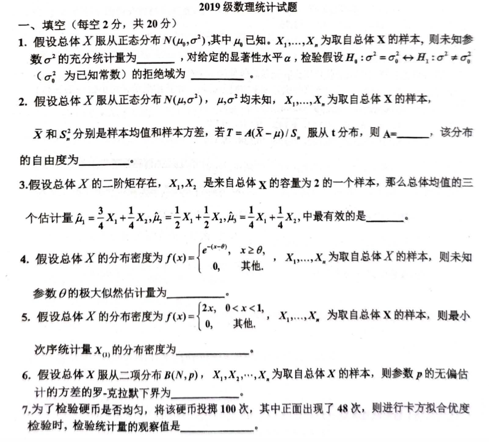
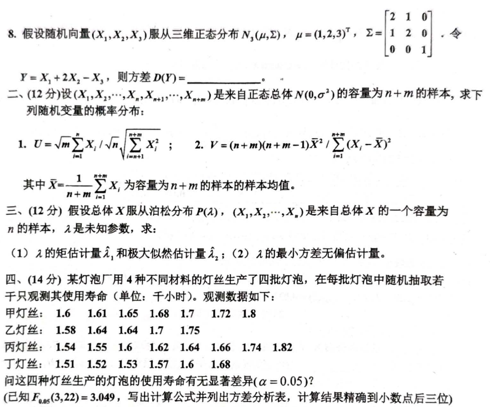
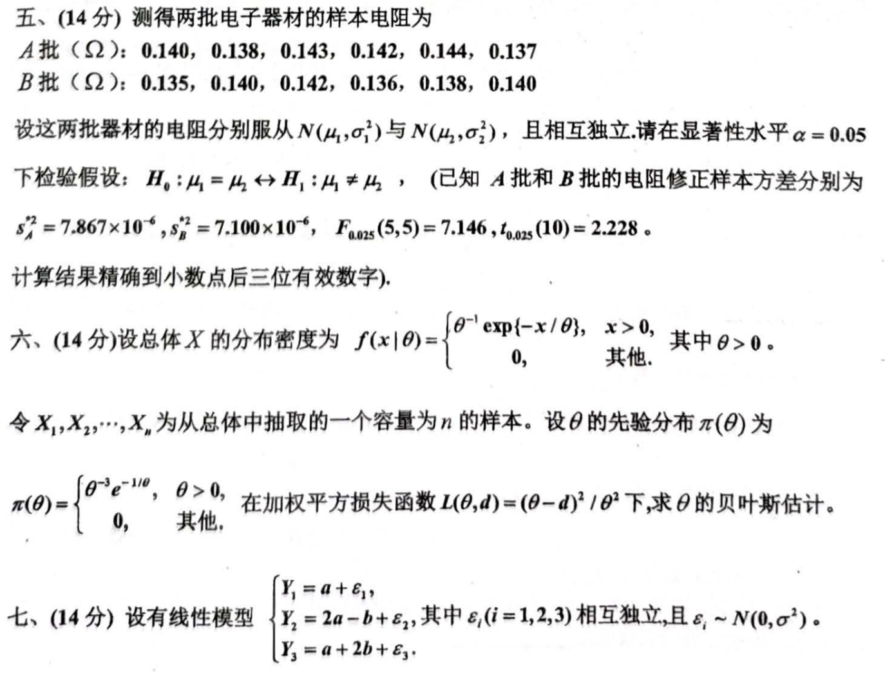
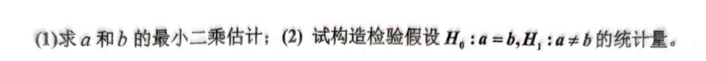

# 代码与图片
```markdown
# 2019 级数理统计试题

## 一、填空（每空 2 分，共 20 分）

1. 假设总体 $X$ 服从正态分布 $N(\mu_0, \sigma^2)$，其中 $\mu_0$ 已知，$X_1, \dots, X_n$ 为取自总体 $X$ 的样本，则未知参数 $\sigma^2$ 的充分统计量为 _______，对给定的显著性水平 $\alpha$，检验假设 $H_0: \sigma^2 = \sigma_0^2 \leftrightarrow H_1: \sigma^2 \neq \sigma_0^2$ 的拒绝域为 _______。

2. 假设总体 $X$ 服从正态分布 $N(\mu, \sigma^2)$，$\mu, \sigma^2$ 均未知，$X_1, \dots, X_n$ 为取自总体 $X$ 的样本，$\bar{X}$ 和 $S^2$ 分别是样本均值和样本方差，若 $T = A(\bar{X} - \mu)/S$ 服从 $t$ 分布，则 $A = _______,$ 该分布的自由度为 _______。

3. 假设总体 $X$ 的二阶矩存在，$X_1, X_2$ 是来自总体 $X$ 的容量为 2 的一个样本，那么总体均值的三个估计量 $\mu_1 = \frac{3}{4} X_1 + \frac{1}{4} X_2, \mu_2 = \frac{1}{2} X_1 + \frac{1}{2} X_2, \mu_3 = \frac{1}{4} X_1 + \frac{3}{4} X_2$，中最有效的是 _______。

4. 假设总体 $X$ 的分布密度为 $f(x) = 
\begin{cases} 
e^{-(x-\theta)}, & x \geq \theta, \\
0, & \text{其他},
\end{cases}$

$X_1, \dots, X_n$ 为取自总体 $X$ 的样本，则未知参数 $\theta$ 的极大似然估计量为 _______。

5. 假设总体 $X$ 的分布密度为 $f(x) = 
\begin{cases} 
2x, & 0 < x < 1, \\
0, & \text{其他},
\end{cases}$

$X_1, \dots, X_n$ 为取自总体 $X$ 的样本，则最小次序统计量 $X_{(1)}$ 的分布密度为 _______。

6. 假设总体 $X$ 服从二项分布 $B(N, p)$，$X_1, X_2, \dots, X_n$ 为取自总体 $X$ 的样本，则参数 $p$ 的无偏估计的方差的罗·克拉默下界为 _______。

7. 为了检验硬币是否均匀，将该硬币抛掷 100 次，其中正面出现了 48 次，测试进行卡方拟合优度检验时，检验统计量的观察值为 _______。

---

## 二、（12 分）设 $(X_1, X_2, \dots, X_n, X_{n+1}, \dots, X_{n+m})$ 是来自正态总体 $N(0, \sigma^2)$ 的容量为 $n+m$ 的样本，求下列随机变量的概率分布：

1. $U = \sqrt{\frac{m}{n}} \frac{\sum_{i=1}^n X_i}{\sqrt{\sum_{i=n+1}^{n+m} X_i^2}}$；
2. $V = \frac{(n+m)(n+m-1)\bar{X}^2}{\sum_{i=1}^{n+m} (X_i - \bar{X})^2}$。

其中 $\bar{X} = \frac{1}{n+m} \sum_{i=1}^{n+m} X_i$ 为容量为 $n+m$ 样本的样本均值。

---

## 三、（12 分）假设总体 $X$ 服从泊松分布 $P(\lambda)$，$(X_1, X_2, \dots, X_n)$ 是来自总体 $X$ 的一个容量为 $n$ 的样本，$\lambda$ 是未知参数，求：

1. $\lambda$ 的矩估计量 $\hat{\lambda}$ 和极大似然估计量 $\hat{\lambda}$；
2. $\lambda$ 的最小方差无偏估计量。

---

## 四、（14 分）某灯泡厂用 4 种不同材料的灯丝生产了 4 批灯泡，在每批灯泡中随机抽取若干只观测其使用寿命（单位：千小时）。观测数据如下：

| 甲灯丝 | 乙灯丝 | 丙灯丝 | 丁灯丝 |
|--------|--------|--------|--------|
| 1.6    | 1.58   | 1.54   | 1.52   |
| 1.61   | 1.55   | 1.55   | 1.53   |
| 1.65   | 1.6    | 1.62   | 1.57   |
| 1.68   | 1.66   | 1.64   | 1.59   |
| 1.7    | 1.74   | 1.66   | 1.74   |
| 1.72   | 1.82   | 1.67   | 1.82   |
| 1.8    |        |        |        |

问这 4 种灯丝生产的灯泡的使用寿命有无显著差异（$\alpha = 0.05$）？（已知 $F_{0.05}(3,22) = 3.049$，写出计算公式并列出计算结果精确到小数点后三位）

---

## 五、（14 分）测得两批电子器材的样本电阻为：

- A 批（$\Omega$）：$0.140, 0.138, 0.143, 0.142, 0.144, 0.137$；
- B 批（$\Omega$）：$0.135, 0.140, 0.142, 0.136, 0.138, 0.140$。

设这两批电子器材的电阻分别服从 $N(\mu_1, \sigma_1^2)$ 与 $N(\mu_2, \sigma_2^2)$，且相互独立。请在显著性水平 $\alpha = 0.05$ 下检验假设：

$$
H_0: \mu_1 = \mu_2 \leftrightarrow H_1: \mu_1 \neq \mu_2,
$$

（已知 A 批和 B 批的电阻修正样本方差分别为 $s_A^2 = 7.867 \times 10^{-6}, s_B^2 = 7.100 \times 10^{-6}$，$F_{0.025}(5,5) = 7.146, t_{0.025}(10) = 2.228$）。计算结果精确到小数点后三位。

---

## 六、（14 分）设总体 $X$ 的分布密度为

$$
f(x | \theta) =
\begin{cases} 
\theta^{-1} \exp\{-x/\theta\}, & x > 0, \\
0, & \text{其他},
\end{cases}
$$

其中 $\theta > 0$。

令 $X_1, X_2, \dots, X_n$ 为从总体中抽取的一个容量为 $n$ 的样本。设 $\theta$ 的先验分布为

$$
\pi(\theta) =
\begin{cases} 
\theta^{-3} e^{-1/\theta}, & \theta > 0, \\
0, & \text{其他},
\end{cases}
$$

在加权平方损失函数 $L(\theta, d) = (\theta - d)^2 / \theta^2$ 下，求 $\theta$ 的贝叶斯估计量。

---

## 七、（14 分）设有线性模型：

$$
\begin{aligned}
Y_1 &= a + \epsilon_1, \\
Y_2 &= 2a - b + \epsilon_2, \\
Y_3 &= a + 2b + \epsilon_3,
\end{aligned}
$$

其中 $\epsilon_i (i=1,2,3)$ 相互独立，且 $\epsilon_i \sim N(0, \sigma^2)$。

1. 求 $a$ 和 $b$ 的最小二乘估计；
2. 试构造检验假设 $H_0: a = b, H_1: a \neq b$ 的统计量。

```








