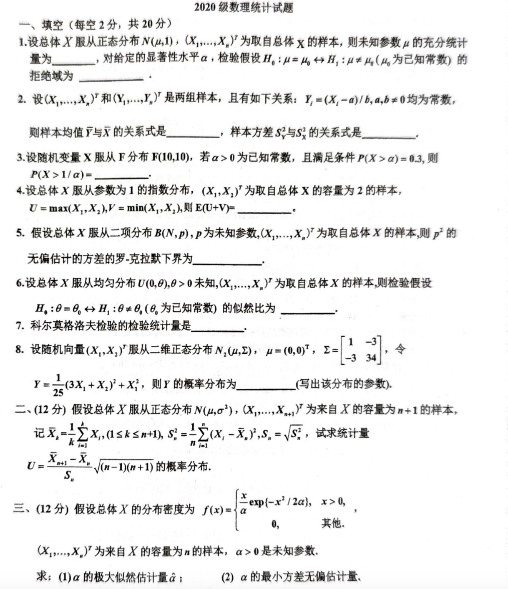
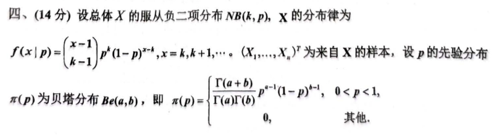
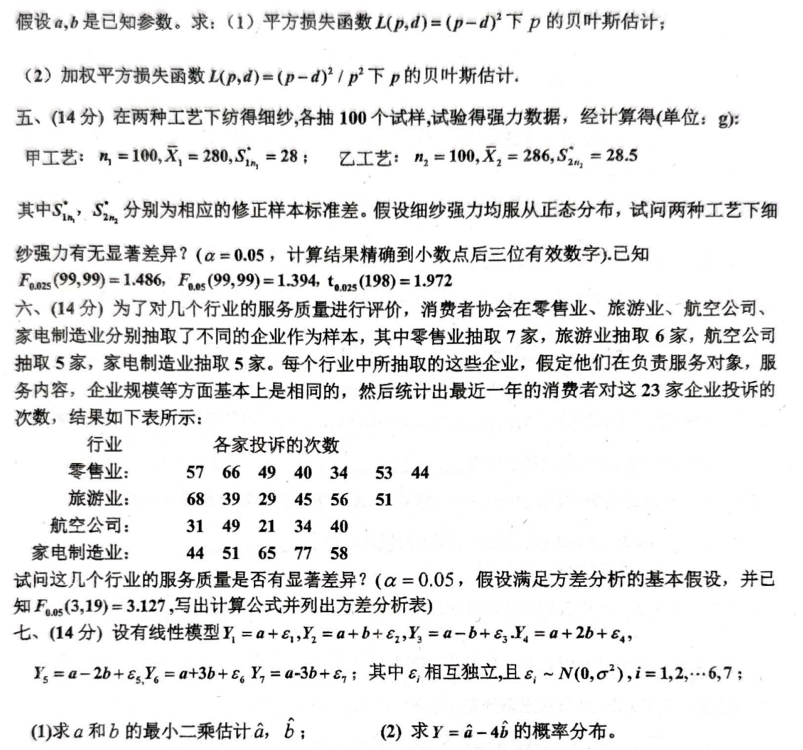

# 2020年

## 2020 级数理统计试题
### 一、填空 (每空 2 分，共 20 分)
1. 假设总体 $ X $ 服从正态分布 $ N(\mu, 1) $，$ (X_1, X_2, ..., X_n) $ 为取自总体 $ X $ 的样本，则未知参数 $ \mu $ 的充分统计量为_______，对给定的显著性水平 $ \alpha $，检验假设 $ H_0:\mu=\mu_0 $ 与 $ H_1:\mu \neq \mu_0 $ (其中 $ \mu_0 $ 为已知常数)的拒绝域为_______。
2. 设 $ (X_1, X_2, ..., X_n)^T $ 和 $ (Y_1, Y_2, ..., Y_n)^T $ 是两组样本，且有如下关系：$ Y_i = (X_i - a)/b $, $ a, b \neq 0 $ 均为常数，则样本均值 $ \bar{Y} $ 与 $ \bar{X} $ 的关系式是_______，样本方差 $ S_Y^2 $ 与 $ S_X^2 $ 的关系式是_______。
3. 设随机变量 $ X $ 服从 $ F $ 分布 $ F(10, 10) $，若 $ \alpha > 0 $ 为已知常数，且满足条件 $ P(X > \alpha) = 0.1 $，则 $ P(X > 1/\alpha) = $ _______。
4. 设总体 $ X $ 服从参数为 1 的指数分布，$ (X_1, X_2)^T $ 为取自总体 $ X $ 的容量为 2 的样本，令 $ U = max(X_1, X_2) $, $ V = min(X_1, X_2) $，则 $ E(U+V) = $ _______。
5. 假设总体 $ X $ 服从二项分布 $ B(N, p) $，$ p $ 为未知参数，$ (X_1, ..., X_n)^T $ 为取自总体 $ X $ 的样本，则 $ p^2 $ 的无偏估计量的罗-克拉默下界为_______。
6. 假设总体 $ X $ 服从均匀分布 $ U(0, \theta) $, $ \theta > 0 $ 未知，$ (X_1, ..., X_n)^T $ 为取自总体 $ X $ 的样本，则检验假设 $ H_0:\theta=\theta_0 $ 与 $ H_1:\theta \neq \theta_0 $ (其中 $ \theta_0 $ 为已知常数)的似然比为_______。
7. 科尔莫戈洛夫检验的检验统计量是_______。
8. 设随机向量 $ (X_1, X_2)^T $ 服从二维正态分布 $ N(\boldsymbol{\mu}, \boldsymbol{\Sigma}) $，$ \boldsymbol{\mu} = \begin{pmatrix} 0 \\ 0 \end{pmatrix} $，$ \boldsymbol{\Sigma} = \begin{pmatrix} 1 & -3 \\ -3 & 34 \end{pmatrix} $，令 $ Y = \frac{1}{25}(3X_1 + X_2)^2 $，则 $ Y $ 的概率分布为_______ (写出该分布的参数)。
9. 假设总体 $ X $ 服从正态分布 $ N(\mu, \sigma^2) $，$ (X_1, X_2, ..., X_{n+1})^T $ 为来自 $ X $ 的容量为 $ n+1 $ 的样本，记 $ \bar{X}_n = \frac{1}{n}\sum_{i=1}^{n} X_i $， $ S_n^2 = \frac{1}{n-1}\sum_{i=1}^{n} (X_i - \bar{X}_n)^2 $，令 $ T = \frac{\bar{X}_{n+1} - \bar{X}_n}{S_n} \sqrt{\frac{n(n+1)}{n+1}} $，则 $ T $ 的概率分布为_______。

### 二、（12 分）
假设总体 $ X $ 的分布密度为 $ f(x) = \begin{cases} \frac{x}{\alpha^2} \exp(-\frac{x^2}{2\alpha^2}), & x > 0, \\ 0, & 其他. \end{cases} $，$ (X_1, X_2, ..., X_n)^T $ 为来自 $ X $ 的容量为 $ n $ 的样本，$ \alpha > 0 $ 是未知参数。

求: (1) $ \alpha $ 的极大似然估计量 $ \hat{\alpha} $；  (2) $ \alpha^2 $ 的最小方差无偏估计量。

### 三、（12 分）
假设总体 $ X $ 的服从负二项分布 $ NB(k, p) $，$ X $ 的分布律为

$ f(x|p) = \binom{x-1}{k-1} p^k (1-p)^{x-k} $, $ x = k, k+1, ... $。$ (X_1, ..., X_n)^T $ 为来自 $ X $ 的样本，设 $ p $ 的先验分布 $ \pi(p) $ 为贝塔分布 $ Be(a, b) $，即 $ \pi(p) = \frac{\Gamma(a+b)}{\Gamma(a)\Gamma(b)} p^{a-1} (1-p)^{b-1} $, $ 0 < p < 1 $，其他为 0。

假设 $ a, b $ 是已知参数。求: (1) 平方损失函数 $ L(p, d) = (p-d)^2 $ 下 $ p $ 的贝叶斯估计；

(2) 加权平方损失函数 $ L(p, d) = (p-d)^2 / p^2 $ 下 $ p $ 的贝叶斯估计。

### 四、（14 分）
在两种工艺下纺织细纱，各抽 100 个试样，试验得强力数据，经计算得 (单位: g):

甲工艺: $ n_1 = 100 $, $ \bar{X}_1 = 280 $, $ S_1 = 28 $;  乙工艺: $ n_2 = 100 $, $ \bar{X}_2 = 286 $, $ S_2 = 28.5 $

其中 $ S_1, S_2 $ 分别为相应的修正样本标准差。假设细纱强力均服从正态分布，试问两种工艺下细纱强力有无显著差异？ ($ \alpha = 0.05 $，计算结果精确到小数点后三位有效数字)。已知 $ F_{0.025}(99, 99) = 1.486 $, $ F_{0.975}(99, 99) = 1/1.486 = 0.673 $, $ t_{0.025}(198) = 1.972 $

### 五、（14 分）
为了对几个行业的服务质量进行评价，消费者协会在零售业、旅游业、航空公司、家电制造业分别抽取了不同的企业作为样本，其中零售业抽取 7 家，旅游业抽取 6 家，航空公司抽取 5 家，家电制造业抽取 5 家。每个行业中所抽取的这些企业，假定他们在负责服务对象，服务内容，企业规模等方面基本上是相同的，然后统计出最近一年的消费者对这 23 家企业投诉的次数，结果如下表所示:

| 行业 | 各家投诉的次数 |
| --- | --- |
| 零售业 | 57  66  49  40  34  53  44 |
| 旅游业 | 68  39  29  45  56  51 |
| 航空公司 | 31  49  21  34  40 |
| 家电制造业 | 44  51  65  77  58 |


试问这几个行业的服务质量是否有显著差异？ ($ \alpha = 0.05 $，假设满足方差分析的基本假设，已知 $ F_{0.05}(3, 19) = 3.127 $，写出计算公式并列出方差分析表)

### 六、（14 分）
设有线性模型 $ Y_i = a + b + \epsilon_i $, $ Y_2 = a + b + \epsilon_2 $, $ Y_3 = a - b + \epsilon_3 $, $ Y_4 = a + 2b + \epsilon_4 $, $ Y_5 = a - 2b + \epsilon_5 $, $ Y_6 = a + 3b + \epsilon_6 $, $ Y_7 = a - 3b + \epsilon_7 $; 其中 $ \epsilon_i $ 相互独立，且 $ \epsilon_i \sim N(0, \sigma^2) $, $ i = 1, 2, ..., 7 $.

(1) 求 $ a $ 和 $ b $ 的最小二乘估计 $ \hat{a}, \hat{b} $；  (2) 求 $ Y = \hat{a} - 4\hat{b} $ 的概率分布。

```markdown
## 2020 级数理统计试题

### 一、填空 (每空 2 分，共 20 分)

1. 假设总体 $X$ 服从正态分布 $N(\mu, 1)$，$(X_1, X_2, ..., X_n)$ 为取自总体 $X$ 的样本，则未知参数 $\mu$ 的充分统计量为_______，对给定的显著性水平 $\alpha$，检验假设 $H_0:\mu=\mu_0$ 与 $H_1:\mu \neq \mu_0$ (其中 $\mu_0$ 为已知常数)的拒绝域为_______。

2. 设 $(X_1, X_2, ..., X_n)^T$ 和 $(Y_1, Y_2, ..., Y_n)^T$ 是两组样本，且有如下关系：$Y_i = (X_i - a)/b$, $a, b \neq 0$ 均为常数，则样本均值 $\bar{Y}$ 与 $\bar{X}$ 的关系式是_______，样本方差 $S_Y^2$ 与 $S_X^2$ 的关系式是_______。

3. 设随机变量 $X$ 服从 $F$ 分布 $F(10, 10)$，若 $\alpha > 0$ 为已知常数，且满足条件 $P(X > \alpha) = 0.1$，则 $P(X > 1/\alpha) =$ _______。

4. 设总体 $X$ 服从参数为 1 的指数分布，$(X_1, X_2)^T$ 为取自总体 $X$ 的容量为 2 的样本，令 $U = max(X_1, X_2)$, $V = min(X_1, X_2)$，则 $E(U+V) =$ _______。

5. 假设总体 $X$ 服从二项分布 $B(N, p)$，$p$ 为未知参数，$(X_1, ..., X_n)^T$ 为取自总体 $X$ 的样本，则 $p^2$ 的无偏估计量的罗-克拉默下界为_______。

6. 假设总体 $X$ 服从均匀分布 $U(0, \theta)$, $\theta > 0$ 未知，$(X_1, ..., X_n)^T$ 为取自总体 $X$ 的样本，则检验假设 $H_0:\theta=\theta_0$ 与 $H_1:\theta \neq \theta_0$ (其中 $\theta_0$ 为已知常数)的似然比为_______。

7. 科尔莫戈洛夫检验的检验统计量是_______。

8. 设随机向量 $(X_1, X_2)^T$ 服从二维正态分布 $N(\boldsymbol{\mu}, \boldsymbol{\Sigma})$，$\boldsymbol{\mu} = \begin{pmatrix} 0 \\ 0 \end{pmatrix}$，$\boldsymbol{\Sigma} = \begin{pmatrix} 1 & -3 \\ -3 & 34 \end{pmatrix}$，令 $Y = \frac{1}{25}(3X_1 + X_2)^2$，则 $Y$ 的概率分布为_______ (写出该分布的参数)。

9. 假设总体 $X$ 服从正态分布 $N(\mu, \sigma^2)$，$(X_1, X_2, ..., X_{n+1})^T$ 为来自 $X$ 的容量为 $n+1$ 的样本，记 $\bar{X}_n = \frac{1}{n}\sum_{i=1}^{n} X_i$， $S_n^2 = \frac{1}{n-1}\sum_{i=1}^{n} (X_i - \bar{X}_n)^2$，令 $T = \frac{\bar{X}_{n+1} - \bar{X}_n}{S_n} \sqrt{\frac{n(n+1)}{n+1}}$，则 $T$ 的概率分布为_______。

### 二、（12 分）假设总体 $X$ 的分布密度为 $f(x) = \begin{cases} \frac{x}{\alpha^2} \exp(-\frac{x^2}{2\alpha^2}), & x > 0, \\ 0, & 其他. \end{cases}$，$(X_1, X_2, ..., X_n)^T$ 为来自 $X$ 的容量为 $n$ 的样本，$\alpha > 0$ 是未知参数。

求: (1) $\alpha$ 的极大似然估计量 $\hat{\alpha}$；  (2) $\alpha^2$ 的最小方差无偏估计量。

### 三、（12 分）假设总体 $X$ 的服从负二项分布 $NB(k, p)$，$X$ 的分布律为

$f(x|p) = \binom{x-1}{k-1} p^k (1-p)^{x-k}$, $x = k, k+1, ...$。$(X_1, ..., X_n)^T$ 为来自 $X$ 的样本，设 $p$ 的先验分布 $\pi(p)$ 为贝塔分布 $Be(a, b)$，即 $\pi(p) = \frac{\Gamma(a+b)}{\Gamma(a)\Gamma(b)} p^{a-1} (1-p)^{b-1}$, $0 < p < 1$，其他为 0。

假设 $a, b$ 是已知参数。求: (1) 平方损失函数 $L(p, d) = (p-d)^2$ 下 $p$ 的贝叶斯估计；

(2) 加权平方损失函数 $L(p, d) = (p-d)^2 / p^2$ 下 $p$ 的贝叶斯估计。

### 四、（14 分）在两种工艺下纺织细纱，各抽 100 个试样，试验得强力数据，经计算得 (单位: g):

甲工艺: $n_1 = 100$, $\bar{X}_1 = 280$, $S_1 = 28$;  乙工艺: $n_2 = 100$, $\bar{X}_2 = 286$, $S_2 = 28.5$

其中 $S_1, S_2$ 分别为相应的修正样本标准差。假设细纱强力均服从正态分布，试问两种工艺下细纱强力有无显著差异？ ($\alpha = 0.05$，计算结果精确到小数点后三位有效数字)。已知 $F_{0.025}(99, 99) = 1.486$, $F_{0.975}(99, 99) = 1/1.486 = 0.673$, $t_{0.025}(198) = 1.972$

### 五、（14 分）为了对几个行业的服务质量进行评价，消费者协会在零售业、旅游业、航空公司、家电制造业分别抽取了不同的企业作为样本，其中零售业抽取 7 家，旅游业抽取 6 家，航空公司抽取 5 家，家电制造业抽取 5 家。每个行业中所抽取的这些企业，假定他们在负责服务对象，服务内容，企业规模等方面基本上是相同的，然后统计出最近一年的消费者对这 23 家企业投诉的次数，结果如下表所示:

| 行业     | 各家投诉的次数                               |
| -------- | -------------------------------------------- |
| 零售业   | 57  66  49  40  34  53  44                 |
| 旅游业   | 68  39  29  45  56  51                 |
| 航空公司 | 31  49  21  34  40                 |
| 家电制造业 | 44  51  65  77  58                 |

试问这几个行业的服务质量是否有显著差异？ ($\alpha = 0.05$，假设满足方差分析的基本假设，已知 $F_{0.05}(3, 19) = 3.127$，写出计算公式并列出方差分析表)

### 六、（14 分）设有线性模型 $Y_i = a + b + \epsilon_i$, $Y_2 = a + b + \epsilon_2$, $Y_3 = a - b + \epsilon_3$, $Y_4 = a + 2b + \epsilon_4$, $Y_5 = a - 2b + \epsilon_5$, $Y_6 = a + 3b + \epsilon_6$, $Y_7 = a - 3b + \epsilon_7$; 其中 $\epsilon_i$ 相互独立，且 $\epsilon_i \sim N(0, \sigma^2)$, $i = 1, 2, ..., 7$.

(1) 求 $a$ 和 $b$ 的最小二乘估计 $\hat{a}, \hat{b}$；  (2) 求 $Y = \hat{a} - 4\hat{b}$ 的概率分布。

```

# 代码与图片





