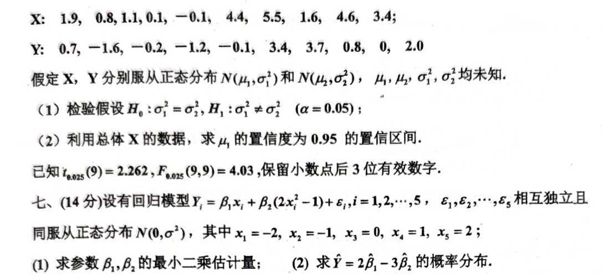

# 2021

# 2021 级数理统计试题
## 一、填空（每空2分，共20分）
1. 设$ (2,3,1,5,6,8) $是来自总体$ X $的容量为6的样本观察值，则样本中位数$ \tilde{x}= $__________。
2. 经验分布函数$ F_6(x)= $__________。
3. 设$ X_1,\dots,X_n $是来自参数为$ p $的几何分布$ G(p) $的样本，则未知参数$ p $的矩估计量为__________，$ p $的充分完全统计量为__________。
4. 设总体$ X $服从参数为$ \lambda $的指数分布，$ X_1,\dots,X_n $为来自$ X $的样本，$ \lambda>0 $为未知参数。则检验假设$ H_0:\lambda=\lambda_0,H_1:\lambda\ne\lambda_0 $的似然比为__________($ \lambda_0 $为已知常数)。
5. 设$ X_1,\dots,X_n $为来自正态总体$ N(1,\sigma^2) $的一个样本，$ \sigma^2>0 $为未知参数，则$ 2\sigma^4 $的最大似然估计量为__________，$ \sigma^2 $的置信度为$ 1-\alpha $的置信区间为__________。
6. 设总体$ X $的分布密度为

$ f(x)=\begin{cases}
   \frac{x^{\alpha-1}e^{-x}}{\Gamma(\alpha)}, & x>0,\\
   0, & 其他。
   \end{cases} $

   其中$ \Gamma(\alpha)=\int_0^\infty x^{\alpha-1}e^{-x}dx $，$ \alpha>0 $为未知参数，$ X_1,\dots,X_n $为来自$ X $的样本，则$ \alpha^2 $的无偏估计量__________。

7. 设随机变量$ X=(X_1,X_2)^T $服从二维正态分布$ N\left(\begin{bmatrix}1\\3\end{bmatrix},\begin{bmatrix}2 & 1\\1 & 4\end{bmatrix}\right) $，则随机变量

$ Y=\begin{bmatrix}2 & -1\\-1 & 3\end{bmatrix}\begin{bmatrix}X_1\\X_2\end{bmatrix} $

   服从__________分布，行列式$ Z=(Y-EY)^T\Sigma_Y^{-1}(Y-EY) $服从__________分布。

## 二、（12分）
设$ X_1,\dots,X_m $和$ Y_1,\dots,Y_n $分别来自两个独立正态总体$ N(\mu_1,\sigma^2) $和$ N(\mu_2,\sigma^2) $的样本。求下列随机变量的概率分布（要求写出分布参数）：

1. $ Y=\frac{\sqrt{n}}{\sqrt{m}}\frac{\overline{X}-\mu_1}{\sqrt{\sum_{i=1}^m(X_i-\mu_1)^2}} $；
2. $ Z=\frac{(m+n-2)[m(\overline{X}-\mu_1)^2+n(\overline{Y}-\mu_2)^2]}{2(mS_X^2+nS_Y^2)} $。

其中$ \overline{X},S_X^2 $和$ \overline{Y},S_Y^2 $分别是总体$ N(\mu_1,\sigma^2) $和$ N(\mu_2,\sigma^2) $的样本均值和样本方差。

## 三、（14分）
设$ X_1,\dots,X_n $为来自总体$ X $的样本，$ X $的分布密度为

$ f(x)=\begin{cases}
\frac{2}{\theta}\exp\left(-\frac{2x}{\theta}\right), & x>0,\\
0, & 其他。
\end{cases} $

$ \theta>0 $为未知参数。

1. 求$ \theta $的最大似然估计$ \hat{\theta}_L $；
2. 证明$ \hat{\theta}_L $是$ \theta $的方差无偏估计，为什么？

## 四、（14分）
某工厂有三台机器$ A $、$ B $、$ C $制造同一种产品。对每台机器观察5天的日产量，记录如下（单位：件）：

+ $ A: 41,48,51,57,49 $；
+ $ B: 65,57,54,72,64 $；
+ $ C: 45,51,48,56,48 $。

若各台机器的日产量服从正态分布，且方差相等。试用方差分析法推断不同机器之间的日产量是否有显著差异？已知$ \alpha=0.05 $，$ F_{0.025}(2,12)=3.89 $。

## 五、（14分）
设总体$ X $的分布律为$ P(X=x)=\theta(1-\theta)^{x-1},x=1,2,\dots $；参数$ \theta $的先验分布为

$ \pi(\theta)=\begin{cases}
2\theta, & 0<\theta<1,\\
0, & 其他。
\end{cases} $

$ (X_1,X_2,\dots,X_n) $为来自$ X $的样本。

1. 在平方损失函数下，求参数函数$ \frac{1}{\theta} $的贝叶斯估计；
2. 在加权平方损失函数$ L(\theta,d)=\theta(\theta-d)^2 $下，求参数$ \theta $的贝叶斯估计。

## 六、（12分）
为比较两种安眠药$ A $、$ B $的疗效，对两种药分别抽取10个失眠者为试验对象。以$ X $表示使用$ A $后延长的睡眠时间，$ Y $表示使用$ B $后延长的睡眠时间（单位：h）。试验结果如下：

+ $ X: 1.9, 0.8, 1.1, 0.1, -0.1, 4.4, 5.5, 1.6, 4.6, 3.4 $；
+ $ Y: 0.7, -1.6, -0.2, -1.2, -0.1, 3.4, 3.7, 0.8, 0, 2.0 $。

假定$ X,Y $分别服从正态分布$ N(\mu_1,\sigma_1^2) $和$ N(\mu_2,\sigma_2^2) $，$ \mu_1,\mu_2,\sigma_1^2,\sigma_2^2 $均未知。

1. 检验假设$ H_0:\sigma_1^2=\sigma_2^2,H_1:\sigma_1^2\ne\sigma_2^2 $（$ \alpha=0.05 $）；
2. 利用总体$ X $的数据，求$ \mu_1 $的置信度为$ 0.95 $的置信区间。

已知$ t_{0.025}(9)=2.262,F_{0.025}(9,9)=4.03 $，保留小数点后3位有效数字。

## 七、（14分）
设有回归模型 $ Y_i = \beta_1 x_i + \beta_2 (2x_i^2 - 1) + \epsilon_i $，$ i = 1, 2, \cdots, 5 $，$ \epsilon_1, \epsilon_2, \cdots, \epsilon_5 $ 相互独立且同服从正态分布 $ N(0, \sigma^2) $，其中 $ x_1 = -2, x_2 = -1, x_3 = 0, x_4 = 1, x_5 = 2 $；

1. 求参数 $ \beta_1, \beta_2 $ 的最小二乘估计量；
2. 求 $ \hat{Y} = 2 \hat{\beta}_1 - 3 \hat{\beta}_2 $ 的概率分布。

# 代码与图片
```markdown
# 2021 级数理统计试题

## 一、填空（每空2分，共20分）

1. 设$(2,3,1,5,6,8)$是来自总体$X$的容量为6的样本观察值，则样本中位数$\tilde{x}=$__________。

2. 经验分布函数$F_6(x)=$__________。

3. 设$X_1,\dots,X_n$是来自参数为$p$的几何分布$G(p)$的样本，则未知参数$p$的矩估计量为__________，$p$的充分完全统计量为__________。

4. 设总体$X$服从参数为$\lambda$的指数分布，$X_1,\dots,X_n$为来自$X$的样本，$\lambda>0$为未知参数。则检验假设$H_0:\lambda=\lambda_0,H_1:\lambda\ne\lambda_0$的似然比为__________($\lambda_0$为已知常数)。

5. 设$X_1,\dots,X_n$为来自正态总体$N(1,\sigma^2)$的一个样本，$\sigma^2>0$为未知参数，则$2\sigma^4$的最大似然估计量为__________，$\sigma^2$的置信度为$1-\alpha$的置信区间为__________。

6. 设总体$X$的分布密度为
   $$
   f(x)=\begin{cases}
   \frac{x^{\alpha-1}e^{-x}}{\Gamma(\alpha)}, & x>0,\\
   0, & 其他。
   \end{cases}
   $$
   其中$\Gamma(\alpha)=\int_0^\infty x^{\alpha-1}e^{-x}dx$，$\alpha>0$为未知参数，$X_1,\dots,X_n$为来自$X$的样本，则$\alpha$的无偏估计量__________。

7. 设随机变量$X=(X_1,X_2)^T$服从二维正态分布$N\left(\begin{bmatrix}1\\3\end{bmatrix},\begin{bmatrix}2 & 1\\1 & 4\end{bmatrix}\right)$，则随机变量
   $$
   Y=\begin{bmatrix}2 & -1\\-1 & 3\end{bmatrix}\begin{bmatrix}X_1\\X_2\end{bmatrix}
   $$
   服从__________分布，$Z=(Y-EY)^T\Sigma_Y^{-1}(Y-EY)$服从__________分布。

## 二、（12分）

设$X_1,\dots,X_m$和$Y_1,\dots,Y_n$分别来自两个独立正态总体$N(\mu_1,\sigma^2)$和$N(\mu_2,\sigma^2)$的样本。求下列随机变量的概率分布（要求写出分布参数）：

1. $Y=\frac{\sqrt{n}}{\sqrt{m}}\frac{\overline{X}-\mu_1}{\sqrt{\sum_{i=1}^m(X_i-\mu_1)^2}}$；

2. $Z=\frac{(m+n-2)[m(\overline{X}-\mu_1)^2+n(\overline{Y}-\mu_2)^2]}{2(mS_X^2+nS_Y^2)}$。

其中$\overline{X},S_X^2$和$\overline{Y},S_Y^2$分别是总体$N(\mu_1,\sigma^2)$和$N(\mu_2,\sigma^2)$的样本均值和样本方差。

## 三、（14分）

设$X_1,\dots,X_n$为来自总体$X$的样本，$X$的分布密度为
$$
f(x)=\begin{cases}
\frac{2}{\theta}\exp\left(-\frac{2x}{\theta}\right), & x>0,\\
0, & 其他。
\end{cases}
$$
$\theta>0$为未知参数。

1. 求$\theta$的最大似然估计$\hat{\theta}_L$；

2. 证明$\hat{\theta}_L$是$\theta$的方差无偏估计，为什么？

## 四、（14分）

某工厂有三台机器$A$、$B$、$C$制造同一种产品。对每台机器观察5天的日产量，记录如下（单位：件）：

- $A: 41,48,51,57,49$；
- $B: 65,57,54,72,64$；
- $C: 45,51,48,56,48$。

若各台机器的日产量服从正态分布，且方差相等。试用方差分析法推断不同机器之间的日产量是否有显著差异？已知$\alpha=0.05$，$F_{0.025}(2,12)=3.89$。

## 五、（14分）

设总体$X$的分布律为$P(X=x)=\theta(1-\theta)^{x-1},x=1,2,\dots$；参数$\theta$的先验分布为
$$
\pi(\theta)=\begin{cases}
2\theta, & 0<\theta<1,\\
0, & 其他。
\end{cases}
$$
$(X_1,X_2,\dots,X_n)$为来自$X$的样本。

1. 在平方损失函数下，求参数函数$\frac{1}{\theta}$的贝叶斯估计；

2. 在加权平方损失函数$L(\theta,d)=\theta(\theta-d)^2$下，求参数$\theta$的贝叶斯估计。

## 六、（12分）

为比较两种安眠药$A$、$B$的疗效，对两种药分别抽取10个失眠者为试验对象。以$X$表示使用$A$后延长的睡眠时间，$Y$表示使用$B$后延长的睡眠时间（单位：h）。试验结果如下：

- $X: 1.9, 0.8, 1.1, 0.1, -0.1, 4.4, 5.5, 1.6, 4.6, 3.4$；
- $Y: 0.7, -1.6, -0.2, -1.2, -0.1, 3.4, 3.7, 0.8, 0, 2.0$。

假定$X,Y$分别服从正态分布$N(\mu_1,\sigma_1^2)$和$N(\mu_2,\sigma_2^2)$，$\mu_1,\mu_2,\sigma_1^2,\sigma_2^2$均未知。

1. 检验假设$H_0:\sigma_1^2=\sigma_2^2,H_1:\sigma_1^2\ne\sigma_2^2$（$\alpha=0.05$）；

2. 利用总体$X$的数据，求$\mu_1$的置信度为$0.95$的置信区间。

已知$t_{0.025}(9)=2.262,F_{0.025}(9,9)=4.03$，保留小数点后3位有效数字。

## 七、（14分）

设有回归模型 $Y_i = \beta_1 x_i + \beta_2 (2x_i^2 - 1) + \epsilon_i$，$i = 1, 2, \cdots, 5$，$\epsilon_1, \epsilon_2, \cdots, \epsilon_5$ 相互独立且同服从正态分布 $N(0, \sigma^2)$，其中 $x_1 = -2, x_2 = -1, x_3 = 0, x_4 = 1, x_5 = 2$；

1. 求参数 $\beta_1, \beta_2$ 的最小二乘估计量；
2. 求 $\hat{Y} = 2 \hat{\beta}_1 - 3 \hat{\beta}_2$ 的概率分布。

```




