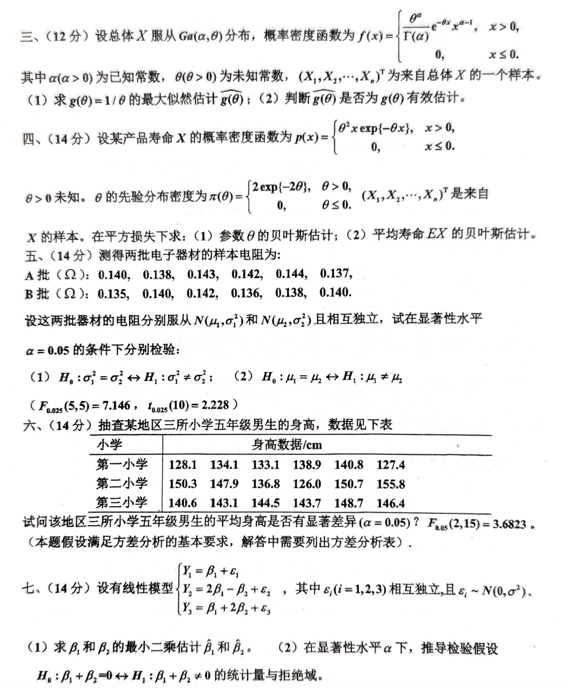

# 2022年

# 一、填空（每空2分，共20分）
1. 设 $ (X_1, X_2, \cdots, X_n)^T $ 为来自泊松分布 $ P(\lambda) $ 的一个容量为 $ n $ 的样本，则 $ \lambda $ 的矩估计量为 $ \_\_\_\_\_\_\_ $。
2. 设 $ (X_1, X_2, \cdots, X_n)^T $ 为来自正态分布 $ N(\mu, \sigma^2) $ 的一个容量为 $ n $ 的样本，

$ Z = \frac{1}{n} \sum_{i=1}^n (X_i - \mu)^2, $

   则 $ E(Z) = \_\_\_\_\_\_\_ $， $ D(Z) = \_\_\_\_\_\_\_ $。

3. 设随机变量 $ Y \sim N(0,1) $，当给定 $ \alpha \ (0<\alpha<1) $ 时，实数 $ u_\alpha $ 满足 $ P(Y > u_\alpha) = \alpha $，则 $ P\{|Y| > u_\alpha\} = \_\_\_\_\_\_\_ $。
4. 设总体 $ X $ 服从区间 $ [0,1] $ 上的均匀分布，$ (X_1, X_2, \cdots, X_n)^T $ 为来自该总体的一个容量为 $ n $ 的样本，$ X_{(n)} $ 是该样本的最大次序统计量，则 $ E(X_{(n)}) = \_\_\_\_\_\_\_ $。
5. 设总体服从二项分布 $ B(N, p) $，$ (X_1, X_2, \cdots, X_n)^T $ 是来自 $ X $ 的一个样本，

$ \bar{X} = \frac{1}{n} \sum_{i=1}^n X_i， $

   则 $ E(X_1 - \bar{X}) = \_\_\_\_\_\_\_ $；$ D(X_1 - \bar{X}) = \_\_\_\_\_\_\_ $。

6. 设总体 $ X $ 服从两点分布 $ B(1, p) $，$ 0<p<1 $，$ (X_1, X_2, \cdots, X_n)^T $ 为来自 $ X $ 的一个样本，则

$ g(p) = p - p^2 $

   的一个无偏估计量为 $ \_\_\_\_\_\_\_ $。

7. 在显著性水平 $ \alpha $ 下，柯尔莫戈罗夫检验的统计量为 $ \_\_\_\_\_\_\_ $；拒绝域为 $ \_\_\_\_\_\_\_ $。

# 大题
### 二、（12分）
设 $ X_1, X_2 $ 独立同分布，概率密度函数均为

$ f(x; \theta) = k \theta^k x^{-(k+1)}, \quad x > \theta, \theta > 0, k > 2 $

已知：

1. 证明：$ T_1 = \frac{k-1}{2k}(X_1 + X_2) $，$ T_2 = \frac{2k-1}{2k}\min(X_1, X_2) $ 都是 $ \theta $ 的无偏估计；
2. 证明：在均方意义下，在形如 $ T_C = C \min(X_1, X_2) $ 的估计中，$ C = \frac{2k-2}{2k-1} $ 时最优。

---

### 三、（12分）
设总体 $ X $ 服从 $ Ga(\alpha, \theta) $ 分布，概率密度函数为

$ f(x) =
\begin{cases} 
\frac{\theta^\alpha}{\Gamma(\alpha)} x^{\alpha-1} e^{-\theta x}, & x > 0, \\ 
0, & x \leq 0.
\end{cases} $

其中 $ \alpha (\alpha > 0) $ 为已知常数，$ \theta (\theta > 0) $ 为未知常数，$ (X_1, X_2, \cdots, X_n) $ 为来自总体 $ X $ 的一个样本。

1. 求 $ \theta = 1 / \theta $ 的最大似然估计 $ g(\theta) $；
2. 判断 $ g(\theta) $ 是否为 $ \theta $ 的有效估计。

---

### 四、（14分）
设某产品寿命 $ X $ 的概率密度函数为

$ p(x) = 
\begin{cases} 
\theta^2 x e^{-\theta x}, & x > 0, \\ 
0, & x \leq 0.
\end{cases} $

$ \theta > 0 $ 未知。已知先验分布密度为

$ \pi(\theta) = 
\begin{cases} 
2 \exp(-2\theta), & \theta > 0, \\ 
0, & \theta \leq 0.
\end{cases} $

$ (X_1, X_2, \cdots, X_n)^T $ 是来自 $ X $ 的样本。在平方损失下：

1. 参数 $ \theta $ 的贝叶斯估计；
2. 平均寿命 $ E(X) $ 的贝叶斯估计。

---

### 五、（14分）
测得两批电子器材的样本电阻 (单位：$ \Omega $)：

+ A批：$ 0.140, 0.138, 0.143, 0.142, 0.144, 0.137 $；
+ B批：$ 0.135, 0.140, 0.142, 0.136, 0.138, 0.140 $。

设这两批器材的电阻分别服从 $ N(\mu_1, \sigma_1^2) $ 和 $ N(\mu_2, \sigma_2^2) $，且相互独立，试在显著性水平 $ \alpha = 0.05 $ 的条件下分别检验：

1. $ H_0: \sigma_1^2 = \sigma_2^2 \quad \text{vs.} \quad H_1: \sigma_1^2 \neq \sigma_2^2 $；
2. $ H_0: \mu_1 = \mu_2 \quad \text{vs.} \quad H_1: \mu_1 \neq \mu_2 $。

已知：

+ $ F_{0.025}(5, 5) = 7.146 $，
+ $ t_{0.025}(10) = 2.228 $。

---

### 六、（14分）
抽查某地区三所小学五年级男生的身高，数据见下表：

| 小学 | 身高数据/cm |
| --- | --- |
| 第一小学 | 128.1, 134.1, 133.1, 138.9, 140.8, 127.4 |
| 第二小学 | 150.3, 147.9, 136.8, 126.0, 150.7, 155.8 |
| 第三小学 | 140.6, 143.1, 144.5, 143.7, 148.7, 146.4 |

试问该地区三所小学五年级男生的平均身高是否有显著差异（$ \alpha = 0.05 $）？

已知 $ F_{0.05}(2, 15) = 3.6823 $。

_注：本题假定满足方差分析的基本要求，解答中需要列出方差分析表。_

---

### 七、（14分）
设有线性模型：

$ Y_i = \beta_1 + \varepsilon_i, $

$ Y_2 = 2 \beta_1 - \beta_2 + \varepsilon_2, $

$ Y_3 = \beta_1 + 2 \beta_2 + \varepsilon_3, $

其中 $ \varepsilon_i (i = 1, 2, 3) $ 相互独立，且 $ \varepsilon_i \sim N(0, \sigma^2) $。

1. 求 $ \beta_1, \beta_2 $ 的最小二乘估计 $ \hat{\beta_1} $ 和 $ \hat{\beta_2} $；
2. 在显著性水平 $ \alpha $ 下，推导检验假设 $ H_0: \beta_1 + \beta_2 = 0 \quad \text{vs.} \quad H_1: \beta_1 + \beta_2 \neq 0 $ 的统计量及其分布。

