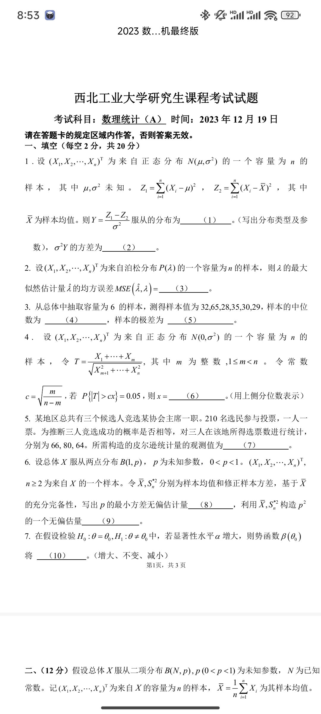
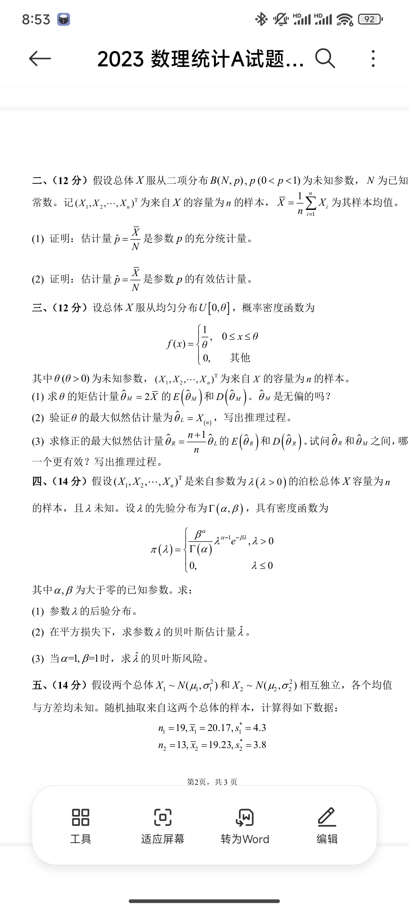
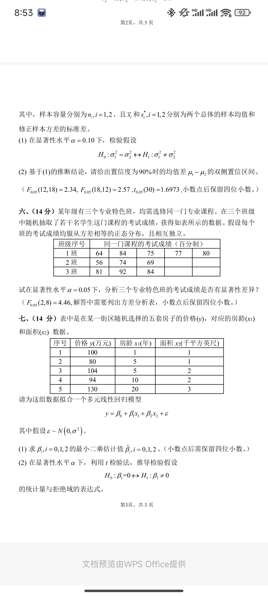

# 2023

# 题目
# 一、填空（每空2分，共20分）
1. 设 $ (X_1, X_2, \dots, X_n)^\top $ 为来自正态分布 $ N(\mu, \sigma^2) $ 的一个容量为 $ n $ 的样本，其中 $ \mu, \sigma^2 $ 未知。  
$ Z_1 = \sum_{i=1}^n (X_i - \mu)^2, \quad Z_2 = \sum_{i=1}^n (X_i - \bar{X})^2 $，其中 $ \bar{X} $ 为样本均值。  
则 $ \eta = \frac{Z_1 - Z_2}{\sigma^2} $ 服从的分布为 **(1)** 。   
$ \sigma^2 \eta $ 的方差为 **(2)** 。
2. 设 $ (X_1, X_2, \dots, X_n)^\top $ 为来自泊松分布 $ P(\lambda) $ 的一个容量为 $ n $ 的样本，则 $ \lambda $ 的最大似然估计量 $ \hat{\lambda} $ 的均方误差 $ MSE(\hat{\lambda}, \lambda) =  $ **(3)** 。
3. 从总体中抽取容量为6的样本，测得样本值为 32, 65, 28, 35, 30, 29，样本的中位数为 **(4)** ，样本的极差为 **(5)** 。
4. 设 $ (X_1, X_2, \dots, X_n)^\top $ 为来自正态分布 $ N(0, \sigma^2) $ 的一个容量为 $ n $ 的样本，令  
$ T = \frac{X_1 + X_2 + \cdots + X_m}{\sqrt{X_{m+1}^2 + \cdots + X_n^2}} $，其中 $ m $ 为整数，$ 1 \leq m < n $。  
令常数 $ c = \sqrt{\frac{m}{n - m}} $，若 $ P(|T| > c x) = 0.05 $，则 $ x =  $ **(6)** (用上侧分位数表示)。
5. 某地区总共有三名候选人竞选某协会主席一职。210名选民参与投票，一人一票。  
为推断三人竞选成功的概率是否相等，对三人在该地所获得选票数 $ 66, 80, 64 $ 所需构造的皮尔逊统计量的观测值为 **(7)** 。
6. x设总体 $ X $ 服从两点分布 $ B(l, p) $，$ p $ 为未知参数，$ 0 < p < 1 $。  
$ (X_1, X_2, \dots, X_n)^\top $ 为容量为 $ n $ 的样本。令 $ \bar{X}, S^2 $ 分别为样本均值和修正样本方差，基于 $ \bar{X} $ 和 $ S^2 $ 写出 $ p $ 的最小方差无偏估计量 **(8)** ，利用 $ \bar{X}, S^2 $ 构造 $ p^2 $ 的一个无偏估计量 **(9)** 。
7. 在假设检验 $ H_0: \theta = \theta_0 $ 与 $ H_1: \theta \neq \theta_0 $ 中，若显著性水平 $ \alpha $ 增大，则势函数 $ \beta(\theta) $ 将 **(10)** 。

---

## 二、（12分）
假设总体 $ X $ 服从两项分布 $ B(N, p) $，$ p (0 < p < 1) $ 为未知参数，$ N $ 为已知常数。  
记 $ (X_1, X_2, \dots, X_n)^\top $ 为来自 $ X $ 的容量为 $ n $ 的样本，$ \bar{X} = \frac{1}{n} \sum_{i=1}^n X_i $ 为其样本均值。  

1. 证明：估计量 $ \hat{p} = \frac{\bar{X}}{N} $ 是参数 $ p $ 的充分类统计量。
2. 证明：估计量 $ \hat{p} = \frac{\bar{X}}{N} $ 是参数 $ p $ 的有效估计量。

---

## 三、（12分）
设总体 $ X $ 服从均匀分布 $ U[0, \theta] $，概率密度函数为  

$ f(x) = \begin{cases} 
\frac{1}{\theta}, & 0 \leq x \leq \theta \\ 
0, & \text{其他}
\end{cases} $

其中 $ \theta(> 0) $ 为未知参数，$ (X_1, X_2, \dots, X_n)^\top $ 为来自 $ X $ 的容量为 $ n $ 的样本。  

1. 求 $ \theta $ 的矩估计量 $ \hat{\theta}_M = 2 \bar{X} $ 的 $ E(\hat{\theta}_M) $ 和 $ D(\hat{\theta}_M) $。$ \hat{\theta}_M $ 是无偏的吗？  
2. 验证 $ \theta $ 的最大似然估计量为 $ \hat{\theta}_L = X_{(n)} $，写出推理过程。  
3. 求修正的最大似然估计量 $ \hat{\theta}_R = \frac{n+1}{n} \hat{\theta}_L $ 的 $ E(\hat{\theta}_R) $ 和 $ D(\hat{\theta}_R) $。试问 $ \hat{\theta}_R $ 和 $ \hat{\theta}_M $ 之间，哪一个更有效？写出推理过程。

---

## 四、（14分）
假设 $ (X_1, X_2, \dots, X_n)^\top $ 是来自参数为 $ \lambda (\lambda > 0) $ 的泊松总体 $ X $ 容量为 $ n $ 的样本，且 $ \lambda $ 未知。  
设 $ \lambda $ 的先验分布为 $ Gamma(\alpha, \beta) $，具有密度函数  

$ \pi(\lambda) = \begin{cases} 
\frac{\beta^\alpha}{\Gamma(\alpha)} \lambda^{\alpha-1} e^{-\beta \lambda}, & \lambda > 0 \\ 
0, & \lambda \leq 0 
\end{cases} $

其中 $ \alpha, \beta $ 为大于零的已知参数。

1. 求参数 $ \lambda $ 的后验分布。
2. 在平方损失下，求参数 $ \lambda $ 的贝叶斯估计量 $ \hat{\lambda} $。
3. 当 $ \alpha = 1, \beta = 1 $ 时，求 $ \lambda $ 的贝叶斯风险。

---

## 五、（14分）
假设两个总体 $ X_1 \sim N(\mu_1, \sigma_1^2) $ 和 $ X_2 \sim N(\mu_2, \sigma_2^2) $ 相互独立，各个均值与方差均未知。  
随机抽取来自这两个总体的样本，计算得到如下数据：  

$ n_1 = 19, \bar{X}_1 = 20.17, s_1^2 = 4.3  
n_2 = 13, \bar{X}_2 = 19.23, s_2^2 = 3.8 $

1. 在显著性水平 $ \alpha = 0.10 $ 下，检验假设

$ H_0: \sigma_1^2 = \sigma_2^2 \quad \leftrightarrow \quad H_1: \sigma_1^2 \neq \sigma_2^2 $

2. 基于(1)的推断结论，请给出置信度为90%的均值差 $ \mu_1 - \mu_2 $ 的双侧置信区间。  
已知 $ F_{0.05}(12, 18) = 2.34, F_{0.05}(18, 12) = 2.57, t_{0.05}(30) = 1.6973 $。

---

## 六、（14分）
某年级有三个专业特色班，均需修同一门专业课程。在三个班级中随机抽取了若干名学生这门课程的考试成绩，获得如下表所示的数据。假设每个班的考试成绩均服从方差相等的正态分布，且相互独立。

| 班级序号 | 同一门课程的考试成绩（百分制） |
| --- | --- |
| 1班 | 64, 84, 75, 77, 80 |
| 2班 | 56, 74, 69, 77 |
| 3班 | 81, 92, 84, 79, 80, 83 |


试在显著性水平 $ \alpha = 0.05 $ 下，分析三个专业特色班的考试成绩是否显著性差异？  
已知 $ F_{0.05}(2, 8) = 4.46 $，解答中需要列出方差分析表，小数点保留四位小数。

---

## 七、（14分）
表中是在某一街区随机选择的五套房子的价格 $ (y) $，对应的房龄 $ (x_1) $ 和面积 $ (x_2) $ 数据：

| 序号 | 价格 $ y $ (万元) | 房龄 $ x_1 $ (年) | 面积 $ x_2 $ (千平方英尺) |
| --- | --- | --- | --- |
| 1 | 100 | 1 | 1 |
| 2 | 80 | 5 | 1 |
| 3 | 104 | 5 | 2 |
| 4 | 94 | 10 | 2 |
| 5 | 130 | 20 | 3 |


请为这组数据拟合一个多元线性回归模型  

$ y = \beta_0 + \beta_1 x_1 + \beta_2 x_2 + \varepsilon $

其中假设 $ \varepsilon \sim N(0, \sigma^2) $。

1. 求 $ \beta_i, i = 0, 1, 2 $ 的最小二乘估计值 $ \hat{\beta}_i, i = 0, 1, 2 $。（小数点后需保留四位小数）  
2. 在显著性水平 $ \alpha = 0.05 $ 下，利用 $ t $ 检验法，推导检验假设

$ H_0: \beta_1 = 0 \quad \leftrightarrow \quad H_1: \beta_1 \neq 0 $

   的统计量与拒绝域的表达式。


# 代码与图片
```markdown
# 西北工业大学研究生课程考试试题
**考试科目**: 数理统计（A）  
**时间**: 2023年12月19日  

请在答题卡的规定区域内作答，否则答案无效。

---

## 一、填空（每空2分，共20分）
1. 设 $(X_1, X_2, \dots, X_n)^\top$ 为来自正态分布 $N(\mu, \sigma^2)$ 的一个容量为 $n$ 的样本，其中 $\mu, \sigma^2$ 未知。  
   $Z_1 = \sum_{i=1}^n (X_i - \mu)^2, \quad Z_2 = \sum_{i=1}^n (X_i - \bar{X})^2$，其中 $\bar{X}$ 为样本均值。  
   则 $\eta = \frac{Z_1 - Z_2}{\sigma^2}$ 服从的分布为 **(1)** 。  
   $\sigma^2 \eta$ 的方差为 **(2)** 。

2. 设 $(X_1, X_2, \dots, X_n)^\top$ 为来自泊松分布 $P(\lambda)$ 的一个容量为 $n$ 的样本，则 $\lambda$ 的最大似然估计量 $\hat{\lambda}$ 的均方误差 $MSE(\hat{\lambda}, \lambda) = $ **(3)** 。

3. 从总体中抽取容量为6的样本，测得样本值为 32, 65, 28, 35, 30, 29，样本的中位数为 **(4)** ，样本的极差为 **(5)** 。

4. 设 $(X_1, X_2, \dots, X_n)^\top$ 为来自正态分布 $N(0, \sigma^2)$ 的一个容量为 $n$ 的样本，令  
   $T = \frac{X_1 + X_2 + \cdots + X_m}{\sqrt{X_{m+1}^2 + \cdots + X_n^2}}$，其中 $m$ 为整数，$1 \leq m < n$。  
   令常数 $c = \sqrt{\frac{m}{n - m}}$，若 $P(|T| > c x) = 0.05$，则 $x = $ **(6)** (用上侧分位数表示)。

5. 某地区总共有三名候选人竞选某协会主席一职。210名选民参与投票，一人一票。  
   为推断三人竞选成功的概率是否相等，对三人在该地所获得选票数 $66, 80, 64$ 所需构造的皮尔逊统计量的观测值为 **(7)** 。

6. 设总体 $X$ 服从两点分布 $B(l, p)$，$p$ 为未知参数，$0 < p < 1$。  
   $(X_1, X_2, \dots, X_n)^\top$ 为容量为 $n$ 的样本。令 $\bar{X}, S^2$ 分别为样本均值和修正样本方差，基于 $\bar{X}$ 和 $S^2$ 写出 $p$ 的最小方差无偏估计量 **(8)** ，利用 $\bar{X}, S^2$ 构造 $p^2$ 的一个无偏估计量 **(9)** 。

7. 在假设检验 $H_0: \theta = \theta_0$ 与 $H_1: \theta \neq \theta_0$ 中，若显著性水平 $\alpha$ 增大，则势函数 $\beta(\theta)$ 将 **(10)** 。

---

## 二、（12分）
假设总体 $X$ 服从两项分布 $B(N, p)$，$p (0 < p < 1)$ 为未知参数，$N$ 为已知常数。  
记 $(X_1, X_2, \dots, X_n)^\top$ 为来自 $X$ 的容量为 $n$ 的样本，$\bar{X} = \frac{1}{n} \sum_{i=1}^n X_i$ 为其样本均值。  

1. 证明：估计量 $\hat{p} = \frac{\bar{X}}{N}$ 是参数 $p$ 的充分类统计量。
2. 证明：估计量 $\hat{p} = \frac{\bar{X}}{N}$ 是参数 $p$ 的有效估计量。

---

## 三、（12分）
设总体 $X$ 服从均匀分布 $U[0, \theta]$，概率密度函数为  
$$
f(x) = \begin{cases} 
\frac{1}{\theta}, & 0 \leq x \leq \theta \\ 
0, & \text{其他}
\end{cases}
$$  
其中 $\theta(> 0)$ 为未知参数，$(X_1, X_2, \dots, X_n)^\top$ 为来自 $X$ 的容量为 $n$ 的样本。  

1. 求 $\theta$ 的矩估计量 $\hat{\theta}_M = 2 \bar{X}$ 的 $E(\hat{\theta}_M)$ 和 $D(\hat{\theta}_M)$。$\hat{\theta}_M$ 是无偏的吗？  
2. 验证 $\theta$ 的最大似然估计量为 $\hat{\theta}_L = X_{(n)}$，写出推理过程。  
3. 求修正的最大似然估计量 $\hat{\theta}_R = \frac{n+1}{n} \hat{\theta}_L$ 的 $E(\hat{\theta}_R)$ 和 $D(\hat{\theta}_R)$。试问 $\hat{\theta}_R$ 和 $\hat{\theta}_M$ 之间，哪一个更有效？写出推理过程。

---

## 四、（14分）
假设 $(X_1, X_2, \dots, X_n)^\top$ 是来自参数为 $\lambda (\lambda > 0)$ 的泊松总体 $X$ 容量为 $n$ 的样本，且 $\lambda$ 未知。  
设 $\lambda$ 的先验分布为 $Gamma(\alpha, \beta)$，具有密度函数  
$$
\pi(\lambda) = \begin{cases} 
\frac{\beta^\alpha}{\Gamma(\alpha)} \lambda^{\alpha-1} e^{-\beta \lambda}, & \lambda > 0 \\ 
0, & \lambda \leq 0 
\end{cases}
$$  
其中 $\alpha, \beta$ 为大于零的已知参数。

1. 求参数 $\lambda$ 的后验分布。
2. 在平方损失下，求参数 $\lambda$ 的贝叶斯估计量 $\hat{\lambda}$。
3. 当 $\alpha = 1, \beta = 1$ 时，求 $\lambda$ 的贝叶斯风险。

---

## 五、（14分）
假设两个总体 $X_1 \sim N(\mu_1, \sigma_1^2)$ 和 $X_2 \sim N(\mu_2, \sigma_2^2)$ 相互独立，各个均值与方差均未知。  
随机抽取来自这两个总体的样本，计算得到如下数据：  
$$
n_1 = 19, \bar{X}_1 = 20.17, s_1^2 = 4.3  
n_2 = 13, \bar{X}_2 = 19.23, s_2^2 = 3.8
$$  

1. 在显著性水平 $\alpha = 0.10$ 下，检验假设  
$$
H_0: \sigma_1^2 = \sigma_2^2 \quad \leftrightarrow \quad H_1: \sigma_1^2 \neq \sigma_2^2
$$  

2. 基于(1)的推断结论，请给出置信度为90%的均值差 $\mu_1 - \mu_2$ 的双侧置信区间。  
已知 $F_{0.05}(12, 18) = 2.34, F_{0.05}(18, 12) = 2.57, t_{0.05}(30) = 1.6973$。


---

## 六、（14分）
某年级有三个专业特色班，均需修同一门专业课程。在三个班级中随机抽取了若干名学生这门课程的考试成绩，获得如下表所示的数据。假设每个班的考试成绩均服从方差相等的正态分布，且相互独立。

| 班级序号 | 同一门课程的考试成绩（百分制） |
| -------- | ----------------------------- |
| 1班      | 64, 84, 75, 77, 80            |
| 2班      | 56, 74, 69, 77                |
| 3班      | 81, 92, 84, 79, 80, 83        |

试在显著性水平 $\alpha = 0.05$ 下，分析三个专业特色班的考试成绩是否显著性差异？  
已知 $F_{0.05}(2, 8) = 4.46$，解答中需要列出方差分析表，小数点保留四位小数。

---

## 七、（14分）
表中是在某一街区随机选择的五套房子的价格 $(y)$，对应的房龄 $(x_1)$ 和面积 $(x_2)$ 数据：

| 序号 | 价格 $y$ (万元) | 房龄 $x_1$ (年) | 面积 $x_2$ (千平方英尺) |
| ---- | --------------- | --------------- | ----------------------- |
| 1    | 100             | 1               | 1                       |
| 2    | 80              | 5               | 1                       |
| 3    | 104             | 5               | 2                       |
| 4    | 94              | 10              | 2                       |
| 5    | 130             | 20              | 3                       |

请为这组数据拟合一个多元线性回归模型  
$$
y = \beta_0 + \beta_1 x_1 + \beta_2 x_2 + \varepsilon
$$  
其中假设 $\varepsilon \sim N(0, \sigma^2)$。

1. 求 $\beta_i, i = 0, 1, 2$ 的最小二乘估计值 $\hat{\beta}_i, i = 0, 1, 2$。（小数点后需保留四位小数）  
2. 在显著性水平 $\alpha = 0.05$ 下，利用 $t$ 检验法，推导检验假设  
   $$
   H_0: \beta_1 = 0 \quad \leftrightarrow \quad H_1: \beta_1 \neq 0
   $$
   的统计量与拒绝域的表达式。
```








