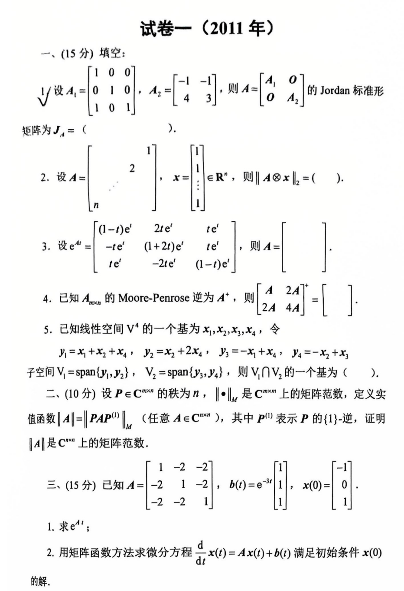
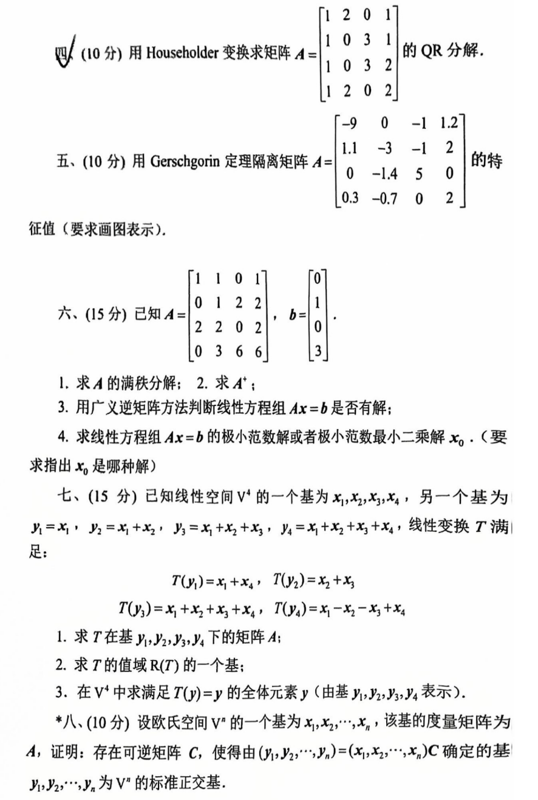

# 2011

# 试卷一（2011年）
## 一、(15分) 填空：
1. 设 $ A_1 = \begin{bmatrix} 1 & 0 & 0 \\ 0 & 1 & 0 \\ 1 & 0 & 1 \end{bmatrix}, A_2 = \begin{bmatrix} -1 & -1 \\ 4 & 3 \end{bmatrix} $，则 $ A = \begin{bmatrix} A_1 & 0 \\ 0 & A_2 \end{bmatrix} $ 的 Jordan 标准形矩阵为 $ J_A = \begin{bmatrix} \quad \end{bmatrix} $。
2. 设 $ A = \begin{bmatrix} & & 1   \\ & 2 & \\ n & \end{bmatrix}, x = \begin{bmatrix} 1 \\ \vdots \\ 1 \end{bmatrix} \in R^n $，则 $ \| A \otimes x \|_2 = (\quad ) $。
3. 设 $ e^{At} = \begin{bmatrix} (1-t)e^t & 2te^t & te^t \\ -te^t & (1+2t)e^t & te^t \\ te^t & -2te^t & (1-t)e^t \end{bmatrix} $，则 $ A = \begin{bmatrix} \quad \end{bmatrix} $。
4. 已知 $ A_{m \times n} $ 的 Moore-Penrose 逆为 $ A^+ $，则 $ \begin{bmatrix} A & 2A \\ 2A & 4A \end{bmatrix}^+ = \begin{bmatrix} \quad \end{bmatrix} $。
5. 已知线性空间 $ V^4 $ 的一个基为 $ x_1, x_2, x_3, x_4 $，令

$ y_1 = x_1 + x_2 + x_4, \quad 
   y_2 = x_2 + 2x_4, \quad 
   y_3 = -x_1 + x_4, \quad 
   y_4 = -x_2 + x_3 $

   子空间 $ V_1 = \text{span}\{y_1, y_2\}, V_2 = \text{span}\{y_3, y_4\} $，则 $ V_1 \cap V_2 $ 的一个基为 $ (\quad ) $。

---

## 二、(10分)
设 $ P \in C^{m \times n} $ 的秩为 $ n $，$ \| \cdot \|_M $ 是 $ C^{m \times n} $ 上的矩阵范数，定义实值函数 $ \| A \| = \| PAP^{(1)} \|_M $（任意 $ A \in C^{m \times n} $，其中 $ P^{(1)} $ 表示 $ P $ 的 $ \{1\} $-逆），证明 $ \| A \| $ 是 $ C^{m \times n} $ 上的矩阵范数。

---

## 三、(15分)
已知 $ A = \begin{bmatrix} 1 & -2 & -2 \\ -2 & 1 & -2 \\ -2 & -2 & 1 \end{bmatrix}, \quad b(t) = e^{3t} \begin{bmatrix} 1 \\ 1 \\ 1 \end{bmatrix}, \quad x(0) = \begin{bmatrix} -1 \\ 0 \\ 1 \end{bmatrix} $

1. 求 $ e^{At} $；
2. 用矩阵函数方法求微分方程 $ \frac{d}{dt} x(t) = Ax(t) + b(t) $ 满足初始条件 $ x(0) $ 的解。

---

## 四、(10分)
用 Householder 变换求矩阵 $ A = \begin{bmatrix} 1 & 2 & 0 & 1 \\ 1 & 0 & 3 & 1 \\ 0 & 3 & 2 & 0 \\ 1 & 2 & 0 & 2 \end{bmatrix} $ 的 QR 分解。

---

## 五、(10分)
用 Gershgorin 定理隔离矩阵 $ A = \begin{bmatrix} -9 & 0 & -1 & 1.2 \\ 1.1 & -3 & -1 & 2 \\ 0 & -1.4 & 5 & 0 \\ 0.3 & -0.7 & 0 & 2 \end{bmatrix} $ 的特征值（要求画图表示）。

---

## 六、(15分)
已知 $ A = \begin{bmatrix} 1 & 1 & 0 & 1 \\ 0 & 1 & 2 & 2 \\ 0 & 0 & 2 & 0 \\ 0 & 0 & 3 & 6 \end{bmatrix}, \quad b = \begin{bmatrix} 0 \\ 1 \\ 0 \\ 3 \end{bmatrix} $

1. 求 $ A $ 的满秩分解；
2. 求 $ A^+ $；
3. 用广义逆矩阵方法判断线性方程组 $ Ax = b $ 是否有解；
4. 求线性方程组 $ Ax = b $ 的极小范数解或极小范数最小二乘解 $ x_0 $。（要求指出 $ x_0 $ 是哪种解）

---

## 七、(15分)
已知线性空间 $ V^4 $ 的一个基为 $ x_1, x_2, x_3, x_4 $，另一个基为

$ y_1 = x_1, \quad 
y_2 = x_1 + x_2, \quad 
y_3 = x_1 + x_2 + x_3, \quad 
y_4 = x_1 + x_2 + x_3 + x_4 $

线性变换 $ T $ 满足：

$ T(y_1) = x_1 + x_4, \quad 
T(y_2) = x_2 + x_3, \quad 
T(y_3) = x_1 + x_2 + x_3 + x_4, \quad 
T(y_4) = x_1 - x_2 - x_3 + x_4 $

1. 求 $ T $ 在基 $ y_1, y_2, y_3, y_4 $ 下的矩阵 $ A $；
2. 求 $ T $ 的值域 $ R(T) $ 的一个基；
3. 在 $ V^4 $ 中求满足 $ T(y) = y $ 的全体元素 $ y $（由基 $ y_1, y_2, y_3, y_4 $ 表示）。

---

## *八、(10分)
设欧氏空间 $ V $ 的一个基为 $ x_1, x_2, \cdots, x_n $，该基的度量矩阵为 $ A $，证明：存在可逆矩阵 $ C $，使得由 $ (y_1, y_2, \cdots, y_n) = (x_1, x_2, \cdots, x_n)C $ 确定的基 $ y_1, y_2, \cdots, y_n $ 为 $ V $ 的标准正交基。


## 代码与图片
```plain
# 试卷一（2011年）

## 一、(15分) 填空：

1. 设 $A_1 = \begin{bmatrix} 1 & 0 & 0 \\ 0 & 1 & 0 \\ 1 & 0 & 1 \end{bmatrix}, A_2 = \begin{bmatrix} -1 & -1 \\ 4 & 3 \end{bmatrix}$，则 $A = \begin{bmatrix} A_1 & 0 \\ 0 & A_2 \end{bmatrix}$ 的 Jordan 标准形矩阵为 $J_A = \begin{bmatrix} \quad \end{bmatrix}$。

2. 设 $A = \begin{bmatrix} 1 & \quad & \quad \\ & 2 & \quad \\ & \quad & n \end{bmatrix}, x = \begin{bmatrix} 1 \\ \vdots \\ 1 \end{bmatrix} \in R^n$，则 $\| A \otimes x \|_2 = (\quad )$。

3. 设 $e^{At} = \begin{bmatrix} (1-t)e^t & 2te^t & te^t \\ -te^t & (1+2t)e^t & te^t \\ te^t & -2te^t & (1-t)e^t \end{bmatrix}$，则 $A = \begin{bmatrix} \quad \end{bmatrix}$。

4. 已知 $A_{m \times n}$ 的 Moore-Penrose 逆为 $A^+$，则 $\begin{bmatrix} A & 2A \\ 2A & 4A \end{bmatrix}^+ = \begin{bmatrix} \quad \end{bmatrix}$。

5. 已知线性空间 $V^4$ 的一个基为 $x_1, x_2, x_3, x_4$，令
   $$
   y_1 = x_1 + x_2 + x_4, \quad 
   y_2 = x_2 + 2x_4, \quad 
   y_3 = -x_1 + x_4, \quad 
   y_4 = -x_2 + x_3
   $$
   子空间 $V_1 = \text{span}\{y_1, y_2\}, V_2 = \text{span}\{y_3, y_4\}$，则 $V_1 \cap V_2$ 的一个基为 $(\quad )$。

---

## 二、(10分)

设 $P \in C^{m \times n}$ 的秩为 $n$，$\| \cdot \|_M$ 是 $C^{m \times n}$ 上的矩阵范数，定义实值函数 $\| A \| = \| PAP^{(1)} \|_M$（任意 $A \in C^{m \times n}$，其中 $P^{(1)}$ 表示 $P$ 的 $\{1\}$-逆），证明 $\| A \|$ 是 $C^{m \times n}$ 上的矩阵范数。

---

## 三、(15分)

已知 $A = \begin{bmatrix} 1 & -2 & -2 \\ -2 & 1 & -2 \\ -2 & -2 & 1 \end{bmatrix}, \quad b(t) = e^{3t} \begin{bmatrix} 1 \\ 1 \\ 1 \end{bmatrix}, \quad x(0) = \begin{bmatrix} -1 \\ 0 \\ 1 \end{bmatrix}$

1. 求 $e^{At}$；
2. 用矩阵函数方法求微分方程 $\frac{d}{dt} x(t) = Ax(t) + b(t)$ 满足初始条件 $x(0)$ 的解。

---

## 四、(10分)

用 Householder 变换求矩阵 $A = \begin{bmatrix} 1 & 2 & 0 & 1 \\ 1 & 0 & 3 & 1 \\ 0 & 3 & 2 & 0 \\ 1 & 2 & 0 & 2 \end{bmatrix}$ 的 QR 分解。

---

## 五、(10分)

用 Gershgorin 定理隔离矩阵 $A = \begin{bmatrix} -9 & 0 & -1 & 1.2 \\ 1.1 & -3 & -1 & 2 \\ 0 & -1.4 & 5 & 0 \\ 0.3 & -0.7 & 0 & 2 \end{bmatrix}$ 的特征值（要求画图表示）。

---

## 六、(15分)

已知 $A = \begin{bmatrix} 1 & 1 & 0 & 1 \\ 0 & 1 & 2 & 2 \\ 0 & 0 & 2 & 0 \\ 0 & 0 & 3 & 6 \end{bmatrix}, \quad b = \begin{bmatrix} 0 \\ 1 \\ 0 \\ 3 \end{bmatrix}$

1. 求 $A$ 的满秩分解；
2. 求 $A^+$；
3. 用广义逆矩阵方法判断线性方程组 $Ax = b$ 是否有解；
4. 求线性方程组 $Ax = b$ 的极小范数解或极小范数最小二乘解 $x_0$。（要求指出 $x_0$ 是哪种解）

---

## 七、(15分)

已知线性空间 $V^4$ 的一个基为 $x_1, x_2, x_3, x_4$，另一个基为
$$
y_1 = x_1, \quad 
y_2 = x_1 + x_2, \quad 
y_3 = x_1 + x_2 + x_3, \quad 
y_4 = x_1 + x_2 + x_3 + x_4
$$
线性变换 $T$ 满足：
$$
T(y_1) = x_1 + x_4, \quad 
T(y_2) = x_2 + x_3, \quad 
T(y_3) = x_1 + x_2 + x_3 + x_4, \quad 
T(y_4) = x_1 - x_2 - x_3 + x_4
$$

1. 求 $T$ 在基 $y_1, y_2, y_3, y_4$ 下的矩阵 $A$；
2. 求 $T$ 的值域 $R(T)$ 的一个基；
3. 在 $V^4$ 中求满足 $T(y) = y$ 的全体元素 $y$（由基 $y_1, y_2, y_3, y_4$ 表示）。

---

## 八、(10分)

设欧氏空间 $V$ 的一个基为 $x_1, x_2, \cdots, x_n$，该基的度量矩阵为 $A$，证明：存在可逆矩阵 $C$，使得由 $(y_1, y_2, \cdots, y_n) = (x_1, x_2, \cdots, x_n)C$ 确定的基 $y_1, y_2, \cdots, y_n$ 为 $V$ 的标准正交基。

```



