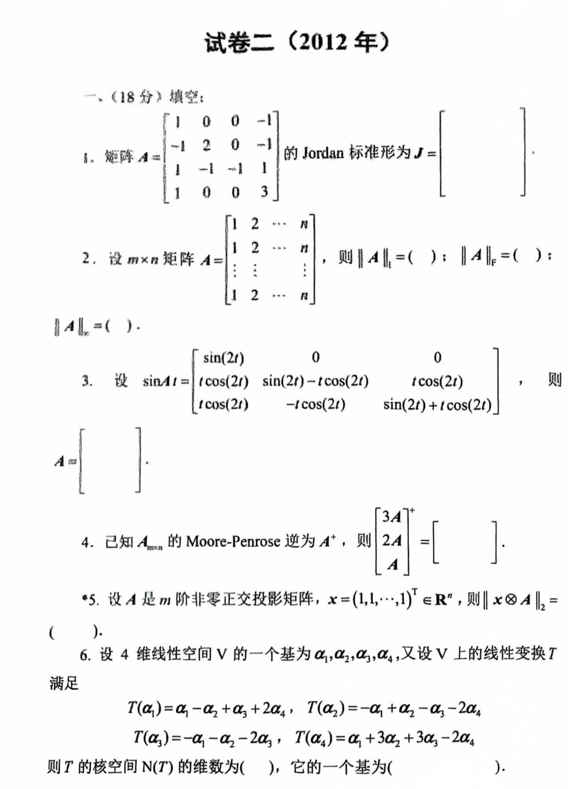
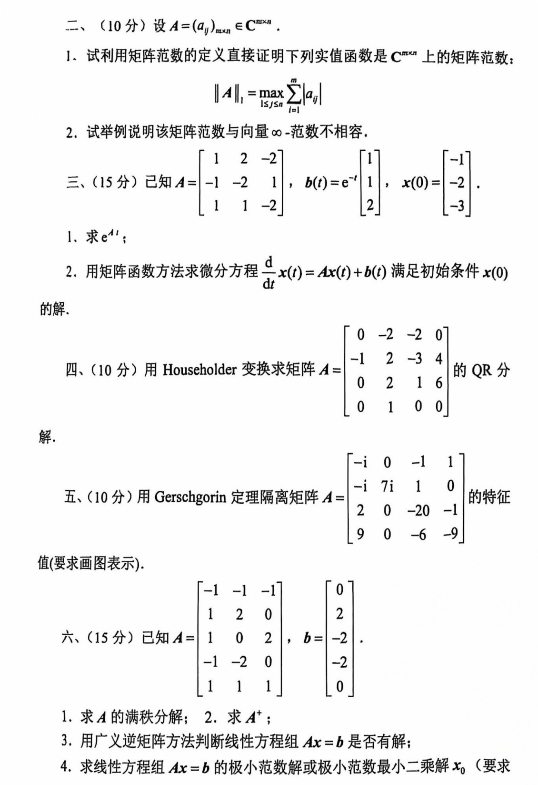

# 2012

# 试卷二（2012 年）
## 一、（18 分）填空
1. 矩阵 $ A = \begin{bmatrix} 1 & 0 & 0 & -1 \\ -1 & 2 & 0 & -1 \\ 1 & -1 & -1 & 1 \\ 1 & 0 & 0 & 3 \end{bmatrix} $ 的 Jordan 标准形为 $ J = \left[ \ \right] $
2. 设 $ m \times n $ 矩阵 $ A = \begin{bmatrix} 1 & 2 & \cdots & n \\ 1 & 2 & \cdots & n \\ \vdots & \vdots & \ddots & \vdots \\ 1 & 2 & \cdots & n \end{bmatrix} $，则 $ \| A \|_1 = ( \ ) $；$ \| A \|_F = ( \ ) $
3. 设 $ \sin(At) = \begin{bmatrix} \sin(2t) & 0 & 0 & 0 \\ \cos(2t) & \sin(2t) & -t\cos(2t) & t\cos(2t) \\ t\cos(2t) & -t\cos(2t) & \sin(2t) & t\cos(2t) \\ \cos(2t) & -\cos(2t) & \sin(2t) & t\cos(2t) \end{bmatrix} $，则 $ A = \left[ \ \right] $
4. 已知 $ A_{mn} $ 的 Moore-Penrose 逆为 $ A^+ $，则 $ \begin{bmatrix} 3A & A \\ 2A & A \end{bmatrix}^+ = \left[ \ \right] $
5. 设 $ A $ 是 $ m $ 阶非零正交投影矩阵，$ x = (1, 1, \cdots, 1)^T \in \mathbb{R}^n $，则 $ \| x \otimes A \|_2 = ( \ ) $
6. 设 4 维线性空间 $ V $ 的一个基为 $ \alpha_1, \alpha_2, \alpha_3, \alpha_4 $，又设 $ V $ 上的线性变换 $ T $ 满足：

$ T(\alpha_1) = \alpha_1 - \alpha_2 + \alpha_3 + 2\alpha_4, \quad
   T(\alpha_2) = -\alpha_1 + \alpha_2 - \alpha_3 - 2\alpha_4, \\
   T(\alpha_3) = -\alpha_1 - \alpha_2 - 2\alpha_3, \quad
   T(\alpha_4) = \alpha_1 + 3\alpha_3 - 2\alpha_4 $

   则 $ T $ 的核空间 $ N(T) $ 的维数为 $ ( \ ) $，它的一个基为 $ ( \ ) $

---

## 二、（10 分）
设 $ A = (a_{ij})_{m \times n} \in \mathbb{C}^{m \times n} $

1. 试利用矩阵范数的定义直接证明下列实值函数是 $ \mathbb{C}^{m \times n} $ 上的矩阵范数：

$ \| A \|_1 = \max_{1 \leq j \leq n} \sum_{i=1}^m |a_{ij}| $

2. 试举例说明该矩阵范数与向量 $ \infty $-范数不相容。

---

## 三、（15 分）
已知 $ A = \begin{bmatrix} -1 & 2 & -2 \\ 1 & 1 & 2 \\ 1 & -1 & -2 \end{bmatrix} $，$ b(t) = e^{-t}\begin{bmatrix} 1 \\ 1 \\ 2 \end{bmatrix} $，$ x(0) = \begin{bmatrix} -1 \\ -2 \\ -3 \end{bmatrix} $

1. 求 $ e^{At} $；
2. 用矩阵函数方法求微分方程 $ \frac{d}{dt}x(t) = Ax(t) + b(t) $ 满足初始条件 $ x(0) $ 的解。

---

## 四、（10 分）
用 Householder 变换求矩阵 $ A = \begin{bmatrix} 0 & -2 & -2 & 0 \\ -1 & 2 & 3 & 4 \\ 0 & 2 & 1 & 6 \\ 0 & 1 & 0 & 0 \end{bmatrix} $ 的 QR 分解。

---

## 五、（10 分）
用 Gerschgorin 定理隔离矩阵 $ A = \begin{bmatrix} -i & 0 & -1 & 1 \\ -i & 7i & 1 & 0 \\ 2 & 0 & -20 & -1 \\ 9 & 0 & -6 & -9 \end{bmatrix} $ 的特征值（要求画图表示）。

---

## 六、（15 分）
已知 $ A = \begin{bmatrix} -1 & -1 & -1 \\ 1 & 2 & 0 \\ -1 & -2 & 0 \\ 1 & 1 & 1 \end{bmatrix} $，$ b = \begin{bmatrix} 0 \\ 2 \\ -2 \\ 0 \end{bmatrix} $

1. 求 $ A $ 的满秩分解；
2. 求 $ A^+ $；
3. 用广义逆矩阵方法判断线性方程组 $ Ax = b $ 是否有解；
4. 求线性方程组 $ Ax = b $ 的极小范数解或极小范数最小二乘解 $ x_0 $。（要求指出$ x_0 $是哪种解）

# 代码与图片
```plain
# 试卷二（2012 年）

## 一、（18 分）填空

1. 矩阵 $A = \begin{bmatrix} 1 & 0 & 0 & -1 \\ -1 & 2 & 0 & -1 \\ 1 & -1 & -1 & 1 \\ 1 & 0 & 0 & 3 \end{bmatrix}$ 的 Jordan 标准形为 $J = \left[ \ \right]$

2. 设 $m \times n$ 矩阵 $A = \begin{bmatrix} 1 & 2 & \cdots & n \\ 1 & 2 & \cdots & n \\ \vdots & \vdots & \ddots & \vdots \\ 1 & 2 & \cdots & n \end{bmatrix}$，则 $\| A \|_1 = ( \ )$；$\| A \|_F = ( \ )$

3. 设 $\sin(At) = \begin{bmatrix} \sin(2t) & 0 & 0 & 0 \\ \cos(2t) & \sin(2t) & -t\cos(2t) & t\cos(2t) \\ t\cos(2t) & -t\cos(2t) & \sin(2t) & t\cos(2t) \\ \cos(2t) & -\cos(2t) & \sin(2t) & t\cos(2t) \end{bmatrix}$，则 $A = \left[ \ \right]$

4. 已知 $A_{mn}$ 的 Moore-Penrose 逆为 $A^+$，则 $\begin{bmatrix} 3A & 4 \\ 2A & A \end{bmatrix}^+ = \left[ \ \right]$

5. 设 $A$ 是 $m$ 阶非零正交投影矩阵，$x = (1, 1, \cdots, 1)^T \in \mathbb{R}^n$，则 $\| x \otimes A \|_2 = ( \ )$

6. 设 4 维线性空间 $V$ 的一个基为 $\alpha_1, \alpha_2, \alpha_3, \alpha_4$，又设 $V$ 上的线性变换 $T$ 满足：
   $$
   T(\alpha_1) = \alpha_1 - \alpha_2 + \alpha_3 + 2\alpha_4, \quad
   T(\alpha_2) = -\alpha_1 + \alpha_2 - \alpha_3 - 2\alpha_4, \\
   T(\alpha_3) = -\alpha_1 - \alpha_2 - 2\alpha_3, \quad
   T(\alpha_4) = \alpha_1 + 3\alpha_3 - 2\alpha_4
   $$
   则 $T$ 的核空间 $N(T)$ 的维数为 $( \ )$，它的一个基为 $( \ )$

---

## 二、（10 分）

设 $A = (a_{ij})_{m \times n} \in \mathbb{C}^{m \times n}$

1. 试利用矩阵范数的定义直接证明下列实值函数是 $\mathbb{C}^{m \times n}$ 上的矩阵范数：
   $$
   \| A \|_1 = \max_{1 \leq j \leq n} \sum_{i=1}^m |a_{ij}|
   $$

2. 试举例说明该矩阵范数与向量 $\infty$-范数不相容。

---

## 三、（15 分）

已知 $A = \begin{bmatrix} -1 & 2 & -2 \\ 1 & 1 & 2 \\ 1 & -1 & -2 \end{bmatrix}$，$b(t) = e^{-t}\begin{bmatrix} 1 \\ 1 \\ 2 \end{bmatrix}$，$x(0) = \begin{bmatrix} -1 \\ -2 \\ -3 \end{bmatrix}$

1. 求 $e^{At}$；

2. 用矩阵函数方法求微分方程 $\frac{d}{dt}x(t) = Ax(t) + b(t)$ 满足初始条件 $x(0)$ 的解。

---

## 四、（10 分）

用 Householder 变换求矩阵 $A = \begin{bmatrix} 0 & -2 & -2 & 0 \\ -1 & 2 & 3 & 4 \\ 0 & 2 & 1 & 6 \\ 0 & 1 & 0 & 0 \end{bmatrix}$ 的 QR 分解。

---

## 五、（10 分）

用 Gerschgorin 定理隔离矩阵 $A = \begin{bmatrix} -i & 0 & -1 & 1 \\ -i & 7i & 1 & 0 \\ 2 & 0 & -20 & -1 \\ 9 & 0 & -6 & -9 \end{bmatrix}$ 的特征值（要求画图表示）。

---

## 六、（15 分）

已知 $A = \begin{bmatrix} -1 & -1 & -1 \\ 1 & 2 & 0 \\ -1 & -2 & 0 \\ 1 & 1 & 1 \end{bmatrix}$，$b = \begin{bmatrix} 0 \\ 2 \\ -2 \\ 0 \end{bmatrix}$

1. 求 $A$ 的满秩分解；

2. 求 $A^+$；

3. 用广义逆矩阵方法判断线性方程组 $Ax = b$ 是否有解；

4. 求线性方程组 $Ax = b$ 的极小范数解或极小范数最小二乘解 $x_0$。（要求指出$x_0$是哪种解）

```





