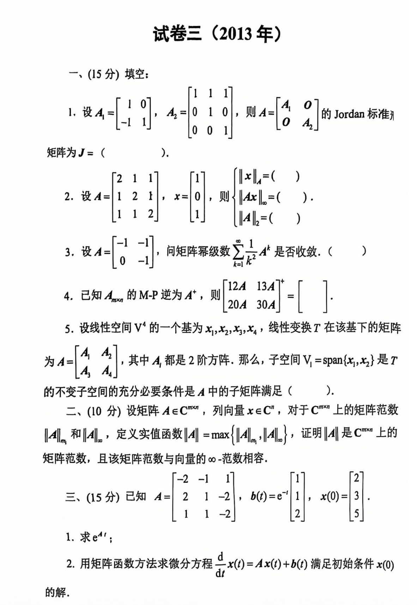
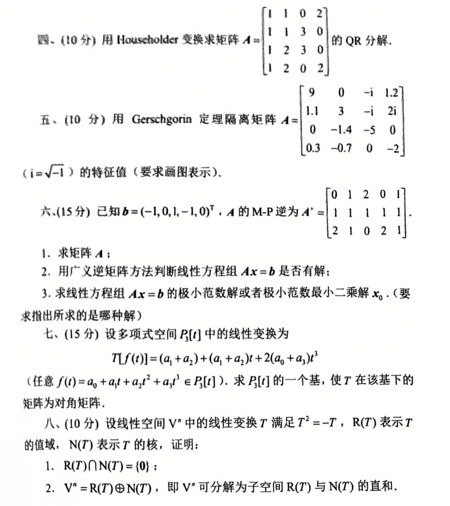

# 2013

# 试卷三（2013年）
## 一、(15 分) 填空：
1. 设

$ A_1 =
   \begin{bmatrix}
   1 & 0 \\
   -1 & 1
   \end{bmatrix},\quad
   A_2 =
   \begin{bmatrix}
   1 & 1 & 1 \\
   0 & 1 & 0 \\
   0 & 0 & 1
   \end{bmatrix},\quad
   A =
   \begin{bmatrix}
   A_1 & 0 \\
   0 & A_2
   \end{bmatrix} $

   的 Jordan 标准形矩阵为 

$ J = (\quad ). $

2. 设

$ A =
   \begin{bmatrix}
   2 & 1 & 1 \\
   1 & 2 & 1 \\
   1 & 1 & 2
   \end{bmatrix},\quad
   x =
   \begin{bmatrix}
   1 \\
   0 \\
   1
   \end{bmatrix}, $

   则

$ \|x\|_\infty = (\quad ),\quad
   \|Ax\|_\infty = (\quad ),\quad
   \|A\|_2 = (\quad ). $

3. 设

$ A =
   \begin{bmatrix}
   -1 & -1 \\
   0 & -1
   \end{bmatrix}, $

   问矩阵幂级数 $ \sum_{k=1}^\infty \frac{1}{k^2} A^k $ 是否收敛。(  )

4. 已知 $ A_{\text{m}{\times}\text{n}} $ 的 M-P 逆为 $ A^+ $，则

$ \begin{bmatrix}
   12A & 13A \\ 20A & 30A
   \end{bmatrix}^+ = [\quad ]. $

5. 设线性空间 $ V^4 $ 的一个基为 $ x_1, x_2, x_3, x_4 $，线性变换 $ T $ 在该基下的矩阵为

$ A =
   \begin{bmatrix}
   A_4 & A_2 \\
   A_4 & A_4
   \end{bmatrix}, $

   其中 $ A_4 $ 都是 2 阶方阵。那么，子空间 $ V_1 = \text{span}\{x_1, x_2\} $ 是 $ T $ 的不变子空间的充分必要条件是 $ A $ 中的子矩阵满足 (  )。

---

## 二、(10 分)
设矩阵 $ A \in \mathbb{C}^{m \times m} $，列向量 $ x \in \mathbb{C}^m $，对 $ \mathbb{C}^m $ 上的矩阵范数 $ \|A\|_m $ 和 $ \|A\|_\infty $，定义实值函数 $ \|A\| = \max\{\|A\|_m, \|A\|_\infty\} $，证明 $ \|A\| $ 是 $ \mathbb{C}^m $ 上的矩阵范数，且该矩阵范数与向量 $ \infty $-范数相容。

---

## 三、(15 分)
已知 

$ A =
\begin{bmatrix}
-2 & -1 & 1 \\
2 & 1 & -2 \\
1 & 1 & -2
\end{bmatrix},\quad
b(t) =
\begin{bmatrix}
e^{-t} \\
1 \\
2
\end{bmatrix},\quad
x(0) =
\begin{bmatrix}
3 \\
3 \\
5
\end{bmatrix}. $

1. 求 $ e^{At} $；
2. 用矩阵函数方法求微分方程

$ \frac{d}{dt} x(t) = Ax(t) + b(t) $

   满足初始条件 $ x(0) $ 的解。

---

## 四、(10 分)
用 Householder 变换求矩阵 

$ A =
\begin{bmatrix}
1 & 1 & 1 \\
1 & 2 & 3 \\
1 & 2 & 0
\end{bmatrix} $

的 QR 分解。

---

## 五、(10 分)
用 Gerschgorin 定理离散矩阵

$ A =
\begin{bmatrix}
9 & 0 & -i & 1.2 \\
1.1 & 3 & -i & 2i \\
0 & -1.4 & -5 & 0 \\
0.3 & -0.7 & 0 & -2
\end{bmatrix} $

（$ i = \sqrt{-1} $）的特征值（要求画图表示）。

---

## 六、(15 分)
已知 

$ b = (-1, 0, 1, -1, 0)^T,\quad
A $

的 M-P 逆为

$ A^+ =
\begin{bmatrix}
0 & 1 & 2 & 0 & 1 \\
1 & 1 & 1 & 1 & 1 \\
2 & 1 & 0 & 2 & 1
\end{bmatrix}. $

1. 求矩阵 $ A $；
2. 用广义逆矩阵方法判断线性方程组 $ Ax = b $ 是否有解；
3. 求线性方程组 $ Ax = b $ 的极小范数解或含极小范数最小二乘解 $ x_0 $。（要求指出所用的哪种解）

---

## 七、(15 分)
设多项式空间 $ P_3[t] $ 中的线性变换为

$ T(f(t)) = (a_1 + a_2) + (a_1 + a_2)t + 2(a_0 + a_3)t^3, $

其中

$ f(t) = a_0 + a_1t + a_2t^2 + a_3t^3 \in P_3[t]. $

求 $ P_3[t] $ 的一个基，使 $ T $ 在该基下的矩阵为对角矩阵。

---

## 八、(10 分)
设线性空间 $ V^n $ 中的线性变换 $ T $ 满足 $ T^2 = -T $，$ R(T) $ 表示 $ T $ 的值域，$ N(T) $ 表示 $ T $ 的核，证明：

1. $ R(T) \cap N(T) = \{0\} $；
2. $ V^n = R(T) \oplus N(T) $，即 $ V^n $ 可分解为子空间 $ R(T) $ 与 $ N(T) $ 的直和。


# 代码与图片
```plain
# 试卷三（2013年）

## 一、(15 分) 填空：

1. 设 
   $$
   A_1 =
   \begin{bmatrix}
   1 & 0 \\
   -1 & 1
   \end{bmatrix},\quad
   A_2 =
   \begin{bmatrix}
   1 & 1 & 1 \\
   0 & 1 & 0 \\
   0 & 0 & 1
   \end{bmatrix},\quad
   A =
   \begin{bmatrix}
   A_1 & 0 \\
   0 & A_2
   \end{bmatrix}
   $$
   的 Jordan 标准形矩阵为 
   $$
   J = (\quad ).
   $$

2. 设 
   $$
   A =
   \begin{bmatrix}
   2 & 1 & 1 \\
   1 & 2 & 1 \\
   1 & 1 & 2
   \end{bmatrix},\quad
   x =
   \begin{bmatrix}
   1 \\
   0 \\
   1
   \end{bmatrix},
   $$
   则
   $$
   \|x\|_\infty = (\quad ),\quad
   \|Ax\|_\infty = (\quad ),\quad
   \|A\|_2 = (\quad ).
   $$

3. 设 
   $$
   A =
   \begin{bmatrix}
   -1 & -1 \\
   0 & -1
   \end{bmatrix},
   $$
   问矩阵幂级数 $\sum_{k=1}^\infty \frac{1}{k^2} A^k$ 是否收敛。(  )

4. 已知 $A_\text{max}$ 的 M-P 逆为 $A^+$，则
   $$
   \begin{bmatrix}
   12A & 13A
   \end{bmatrix}^+ = [\quad ].
   $$

5. 设线性空间 $V^4$ 的一个基为 $x_1, x_2, x_3, x_4$，线性变换 $T$ 在该基下的矩阵为
   $$
   A =
   \begin{bmatrix}
   A_4 & A_2 \\
   A_4 & A_4
   \end{bmatrix},
   $$
   其中 $A_4$ 都是 2 阶方阵。那么，子空间 $V_1 = \text{span}\{x_1, x_2\}$ 是 $T$ 的不变子空间的充分必要条件是 $A$ 中的子矩阵满足 (  )。

---

## 二、(10 分)

设矩阵 $A \in \mathbb{C}^{m \times m}$，列向量 $x \in \mathbb{C}^m$，对 $\mathbb{C}^m$ 上的矩阵范数 $\|A\|_m$ 和 $\|A\|_\infty$，定义实值函数 $\|A\| = \max\{\|A\|_m, \|A\|_\infty\}$，证明 $\|A\|$ 是 $\mathbb{C}^m$ 上的矩阵范数，且该矩阵范数与向量 $\infty$-范数相容。

---

## 三、(15 分)

已知 
$$
A =
\begin{bmatrix}
-2 & -1 & 1 \\
2 & 1 & -2 \\
1 & 1 & -2
\end{bmatrix},\quad
b(t) =
\begin{bmatrix}
e^{-t} \\
1 \\
2
\end{bmatrix},\quad
x(0) =
\begin{bmatrix}
3 \\
3 \\
5
\end{bmatrix}.
$$

1. 求 $e^{At}$；

2. 用矩阵函数方法求微分方程
   $$
   \frac{d}{dt} x(t) = Ax(t) + b(t)
   $$
   满足初始条件 $x(0)$ 的解。

---

## 四、(10 分)

用 Householder 变换求矩阵 
$$
A =
\begin{bmatrix}
1 & 1 & 1 \\
1 & 2 & 3 \\
1 & 2 & 0
\end{bmatrix}
$$
的 QR 分解。

---

## 五、(10 分)

用 Gerschgorin 定理离散矩阵
$$
A =
\begin{bmatrix}
9 & 0 & -i & 1.2 \\
1.1 & 3 & -i & 2i \\
0 & -1.4 & -5 & 0 \\
0.3 & -0.7 & 0 & -2
\end{bmatrix}
$$
（$i = \sqrt{-1}$）的特征值（要求画图表示）。

---

## 六、(15 分)

已知 
$$
b = (-1, 0, 1, -1, 0)^T,\quad
A
$$
的 M-P 逆为
$$
A^+ =
\begin{bmatrix}
0 & 1 & 2 & 0 & 1 \\
1 & 1 & 1 & 1 & 1 \\
2 & 1 & 0 & 2 & 1
\end{bmatrix}.
$$

1. 求矩阵 $A$；

2. 用广义逆矩阵方法判断线性方程组 $Ax = b$ 是否有解；

3. 求线性方程组 $Ax = b$ 的极小范数解或含极小范数最小二乘解 $x_0$。（要求指出所用的哪种解）

---

## 七、(15 分)

设多项式空间 $P_3[t]$ 中的线性变换为
$$
T(f(t)) = (a_1 + a_2) + (a_1 + a_2)t + 2(a_0 + a_3)t^3,
$$
其中
$$
f(t) = a_0 + a_1t + a_2t^2 + a_3t^3 \in P_3[t].
$$
求 $P_3[t]$ 的一个基，使 $T$ 在该基下的矩阵为对角矩阵。

---

## 八、(10 分)

设线性空间 $V^n$ 中的线性变换 $T$ 满足 $T^2 = -T$，$R(T)$ 表示 $T$ 的值域，$N(T)$ 表示 $T$ 的核，证明：

1. $R(T) \cap N(T) = \{0\}$；

2. $V^n = R(T) \oplus N(T)$，即 $V^n$ 可分解为子空间 $R(T)$ 与 $N(T)$ 的直和。

```




