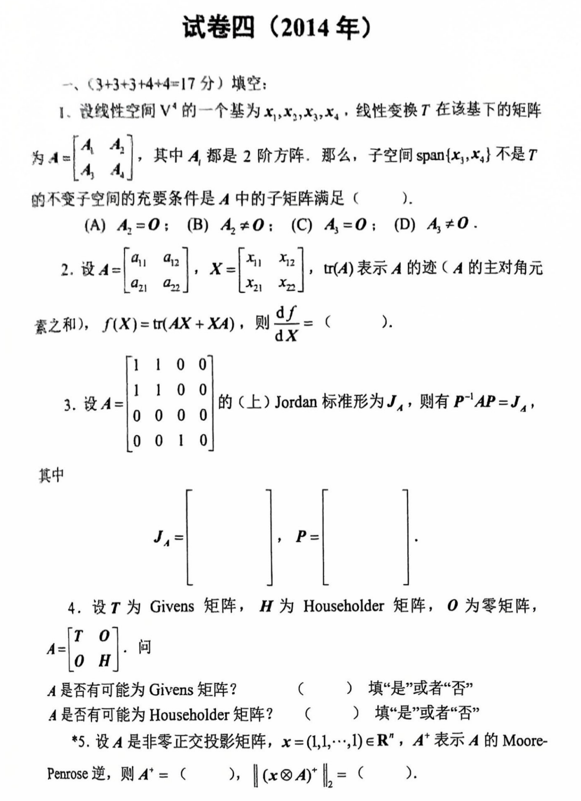
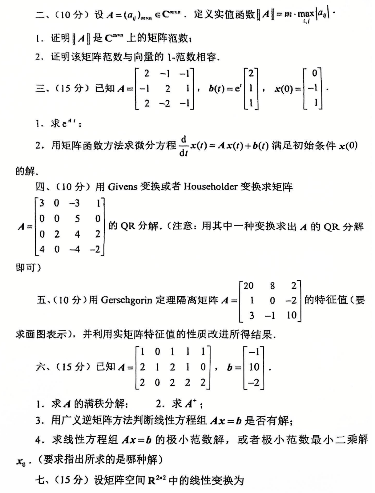
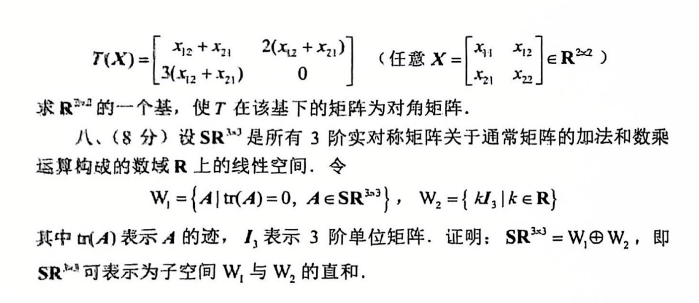

# 2014

# 试卷四 (2014 年)
## 一、(3+3+3+4+4=17 分) 填空：
1. 设线性空间 $ V^4 $ 的一组基为 $ x_1, x_2, x_3, x_4 $，线性变换 $ T $ 在该基下的矩阵为：

$ A = 
   \begin{bmatrix}
   A_1 & A_2 \\
   A_3 & A_4
   \end{bmatrix} $

   其中 $ A_i $ 都是 $ 2 \times 2 $ 的方阵。那么，子空间 $ span\{x_1, x_4\} $ 不是 $ T $ 的不变子空间的充要条件是 $ A $ 中的子矩阵满足 ( )。

   (A) $ A_2 = 0 $；(B) $ A_2 \neq 0 $；(C) $ A_3 = 0 $；(D) $ A_3 \neq 0 $。

2. 设 $ A = \begin{bmatrix} a_{11} & a_{12} \\ a_{21} & a_{22} \end{bmatrix} $, $ X = \begin{bmatrix} x_{11} & x_{12} \\ x_{21} & x_{22} \end{bmatrix} $，$ tr(A) $ 表示 $ A $ 的迹（$ A $ 的主对角元素之和），$ f(X) = tr(AX + XA) $，则：

$ \frac{df}{dX} = ( ) $

3. 设

$ A = 
   \begin{bmatrix}
   1 & 1 & 0 & 0 \\
   1 & 1 & 0 & 0 \\
   0 & 0 & 0 & 0 \\
   0 & 0 & 0 & 1
   \end{bmatrix} $

   的 (上) Jordan 标准形为 $ J_A $，则有 $ P^{-1}AP = J_A $，其中：

$ J_A = \begin{bmatrix} \, \end{bmatrix}, \quad P = \begin{bmatrix} \, \end{bmatrix}. $

4. 设 $ T $ 为 Givens 矩阵，$ H $ 为 Householder 矩阵，$ O $ 为零矩阵，

$ A = \begin{bmatrix} T & O \\ O & H \end{bmatrix}. $

   问：

+ $ A $ 是否有可能为 Givens 矩阵？（ ）填写“是”或者“否”。
+ $ A $ 是否有可能为 Householder 矩阵？（ ）填写“是”或者“否”。
5. 设 $ A $ 是非零正交投影矩阵，$ x = (1, 1, \cdots, 1) \in \mathbb{R}^n $，$ A^* $ 表示 $ A $ 的 Moore-Penrose 逆，则 $ A^* = ( ) $，且 $ \| (x \otimes A)^* \|_2 = ( ) $。

---

## 二、(10 分)
设 $ A = (a_{ij})_{n \times n} \in \mathbb{C}^{n \times n} $，定义矩阵范数 $ \| A \| = \max_{i,j} |a_{ij}| $。

1. 证明 $ \| A \| $ 是 $ \mathbb{C}^{n \times n} $ 上的矩阵范数；
2. 证明该矩阵范数与向量的 1- 范数相容。

---

## 三、(15 分)
已知：

$ A = \begin{bmatrix} 
2 & -1 & -1 \\
-1 & 2 & 1 \\
2 & -2 & -1 
\end{bmatrix}, \quad b(t) = e^t 
\begin{bmatrix} 2 \\ 1 \\ 0 \end{bmatrix}. $

1. 求 $ e^{tA} $；
2. 用矩阵函数方法求微分方程 $ \frac{d}{dt}x(t) = Ax(t) + b(t) $ 满足初始条件 $ x(0) = \begin{bmatrix} -1 \\ 0 \\ 1 \end{bmatrix} $ 的解。

---

## 四、(10 分)
用 Givens 变换或者 Householder 变换求矩阵

$ A = \begin{bmatrix} 
3 & 0 & -3 \\
0 & 0 & 5 \\
4 & 0 & -4 \\
\end{bmatrix} $

的 QR 分解。（注意：用其中一种变换求出 $ A $ 的 QR 分解即可。）

---

## 五、(10 分)
用 Gershgorin 定理隔离矩阵 

$ A = \begin{bmatrix} 
20 & 8 & 2 \\
1 & 0 & -2 \\
3 & -1 & 10
\end{bmatrix} $

的特征值（要求画图表示），并利用实矩阵特征值的性质改进所得结果。

---

## 六、(15 分)
已知：

$ A = \begin{bmatrix}
1 & 0 & 1 & 1 \\
2 & 1 & 2 & 0 \\
2 & 0 & 2 & 2
\end{bmatrix}, \quad b = \begin{bmatrix} 10 \\ 1 \\ -2 \end{bmatrix}. $

1. 求 $ A $ 的满秩分解；
2. 求 $ A^+ $；
3. 用广义逆矩阵方法判断线性方程组 $ Ax = b $ 是否有解；
4. 求线性方程组 $ Ax = b $ 的极小范数解，或者极小范数最小二乘解 $ x_0 $。（要求指出所求的是哪种解。）

---

## 七、(15 分)
设矩阵空间 $ \mathbb{R}^{2 \times 2} $ 中的线性变换为：

$ T(X) = \begin{bmatrix}
x_{12} + x_{21} & 2(x_{12} + x_{21}) \\
3(x_{12} + x_{21}) & 0
\end{bmatrix},
\quad \text{任意 } X = \begin{bmatrix}
x_{11} & x_{12} \\
x_{21} & x_{22}
\end{bmatrix} \in \mathbb{R}^{2 \times 2}. $

求 $ \mathbb{R}^{2 \times 2} $ 的一个基，使得 $ T $ 在该基下的矩阵为对角矩阵。

---

## 八、(8 分)
设 $ SR^{3 \times 3} $ 是所有 $ 3 $ 阶实对称矩阵关于通常矩阵的加法和数乘运算构成的数域 $ \mathbb{R} $ 上的线性空间。令：

$ W_1 = \{ A \,|\, tr(A) = 0, A \in SR^{3 \times 3} \}, \quad W_2 = \{ kI_3 \,|\, k \in \mathbb{R} \}, $

其中 $ tr(A) $ 表示 $ A $ 的迹，$ I_3 $ 表示 $ 3 $ 阶单位矩阵。证明：

$ SR^{3 \times 3} = W_1 \oplus W_2, $

即 $ SR^{3 \times 3} $ 可以表示为子空间 $ W_1 $ 与 $ W_2 $ 的直和。

# 代码与图片
```plain
# 试卷四 (2014 年)

## 一、(3+3+3+4+4=17 分) 填空：

1. 设线性空间 $V^4$ 的一组基为 $x_1, x_2, x_3, x_4$，线性变换 $T$ 在该基下的矩阵为：
   $$
   A = 
   \begin{bmatrix}
   A_1 & A_2 \\
   A_3 & A_4
   \end{bmatrix}
   $$
   其中 $A_i$ 都是 $2 \times 2$ 的方阵。那么，子空间 $span\{x_1, x_4\}$ 不是 $T$ 的不变子空间的充要条件是 $A$ 中的子矩阵满足 ( )。

   (A) $A_2 = 0$；(B) $A_2 \neq 0$；(C) $A_3 = 0$；(D) $A_3 \neq 0$。

2. 设 $A = \begin{bmatrix} a_{11} & a_{12} \\ a_{21} & a_{22} \end{bmatrix}$, $X = \begin{bmatrix} x_{11} & x_{12} \\ x_{21} & x_{22} \end{bmatrix}$，$tr(A)$ 表示 $A$ 的迹（$A$ 的主对角元素之和），$f(X) = tr(AX + XA)$，则：
   $$
   \frac{df}{dX} = ( )
   $$

3. 设
   $$
   A = 
   \begin{bmatrix}
   1 & 1 & 0 & 0 \\
   1 & 1 & 0 & 0 \\
   0 & 0 & 0 & 0 \\
   0 & 0 & 0 & 1
   \end{bmatrix}
   $$
   的 (上) Jordan 标准形为 $J_A$，则有 $P^{-1}AP = J_A$，其中：
   $$
   J_A = \begin{bmatrix} \, \end{bmatrix}, \quad P = \begin{bmatrix} \, \end{bmatrix}.
   $$

4. 设 $T$ 为 Givens 矩阵，$H$ 为 Householder 矩阵，$O$ 为零矩阵，
   $$
   A = \begin{bmatrix} T & O \\ O & H \end{bmatrix}.
   $$
   问：
   - $A$ 是否有可能为 Givens 矩阵？（ ）填写“是”或者“否”。
   - $A$ 是否有可能为 Householder 矩阵？（ ）填写“是”或者“否”。

5. 设 $A$ 是非零正交投影矩阵，$x = (1, 1, \cdots, 1) \in \mathbb{R}^n$，$A^*$ 表示 $A$ 的 Moore-Penrose 逆，则 $A^* = ( )$，且 $\| (x \otimes A)^* \|_2 = ( )$。

---

## 二、(10 分) 

设 $A = (a_{ij})_{n \times n} \in \mathbb{C}^{n \times n}$，定义矩阵范数 $\| A \| = \max_{i,j} |a_{ij}|$。

1. 证明 $\| A \|$ 是 $\mathbb{C}^{n \times n}$ 上的矩阵范数；
2. 证明该矩阵范数与向量的 $l_\infty$ 范数相容。

---

## 三、(15 分)

已知：
$$
A = \begin{bmatrix} 
2 & -1 & -1 \\
-1 & 2 & 1 \\
2 & -2 & -1 
\end{bmatrix}, \quad b(t) = e^t 
\begin{bmatrix} 2 \\ 1 \\ 0 \end{bmatrix}.
$$

1. 求 $e^{tA}$；
2. 用矩阵函数方法求微分方程 $\frac{d}{dt}x(t) = Ax(t) + b(t)$ 满足初始条件 $x(0) = \begin{bmatrix} -1 \\ 0 \\ 1 \end{bmatrix}$ 的解。

---

## 四、(10 分)

用 Givens 变换或者 Householder 变换求矩阵
$$
A = \begin{bmatrix} 
3 & 0 & -3 \\
0 & 0 & 5 \\
4 & 0 & -4 \\
\end{bmatrix}
$$
的 QR 分解。（注意：用其中一种变换求出 $A$ 的 QR 分解即可。）

---

## 五、(10 分)

用 Gershgorin 定理隔离矩阵 
$$
A = \begin{bmatrix} 
20 & 8 & 2 \\
1 & 0 & -2 \\
3 & -1 & 10
\end{bmatrix}
$$
的特征值（要求画图表示），并利用实矩阵特征值的性质改进所得结果。

---

## 六、(15 分)

已知：
$$
A = \begin{bmatrix}
1 & 0 & 1 & 1 \\
2 & 1 & 2 & 0 \\
2 & 0 & 2 & 2
\end{bmatrix}, \quad b = \begin{bmatrix} 10 \\ 1 \\ -2 \end{bmatrix}.
$$

1. 求 $A$ 的满秩分解；
2. 求 $A^+$；
3. 用广义逆矩阵方法判断线性方程组 $Ax = b$ 是否有解；
4. 求线性方程组 $Ax = b$ 的极小范数解，或者极小范数最小二乘解 $x_0$。（要求指出所求的是哪种解。）

---

## 七、(15 分)

设矩阵空间 $\mathbb{R}^{2 \times 2}$ 中的线性变换为：
$$
T(X) = \begin{bmatrix}
x_{12} + x_{21} & 2(x_{12} + x_{21}) \\
3(x_{12} + x_{21}) & 0
\end{bmatrix},
\quad \text{任意 } X = \begin{bmatrix}
x_{11} & x_{12} \\
x_{21} & x_{22}
\end{bmatrix} \in \mathbb{R}^{2 \times 2}.
$$

求 $\mathbb{R}^{2 \times 2}$ 的一个基，使得 $T$ 在该基下的矩阵为对角矩阵。

---

## 八、(8 分)

设 $SR^{3 \times 3}$ 是所有 $3$ 阶实对称矩阵关于通常矩阵的加法和数乘运算构成的数域 $\mathbb{R}$ 上的线性空间。令：
$$
W_1 = \{ A \,|\, tr(A) = 0, A \in SR^{3 \times 3} \}, \quad W_2 = \{ kI_3 \,|\, k \in \mathbb{R} \},
$$
其中 $tr(A)$ 表示 $A$ 的迹，$I_3$ 表示 $3$ 阶单位矩阵。证明：
$$
SR^{3 \times 3} = W_1 \oplus W_2,
$$
即 $SR^{3 \times 3}$ 可以表示为子空间 $W_1$ 与 $W_2$ 的直和。

```


