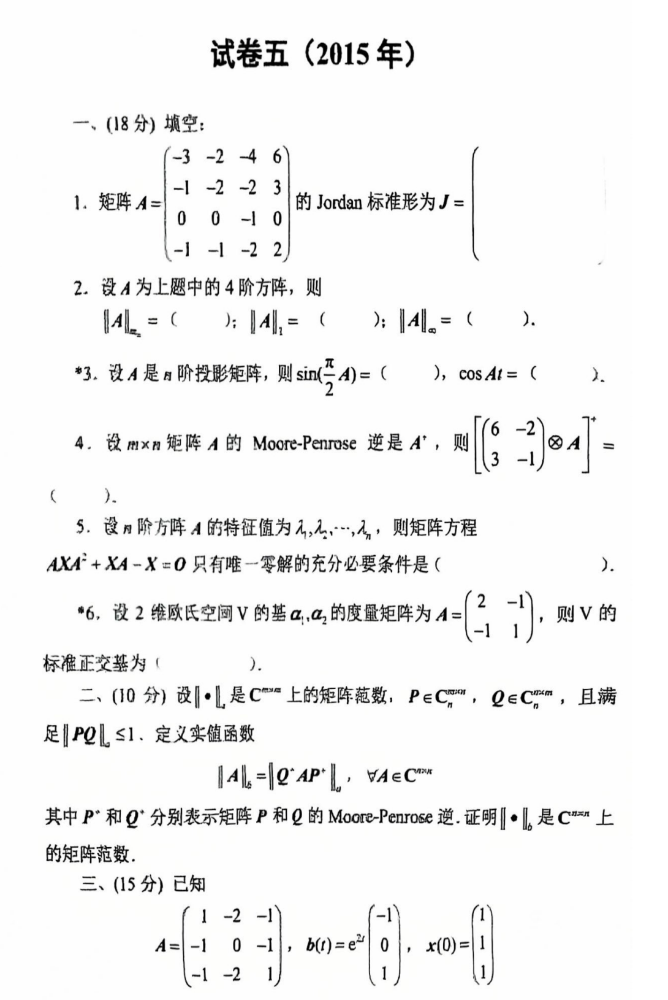
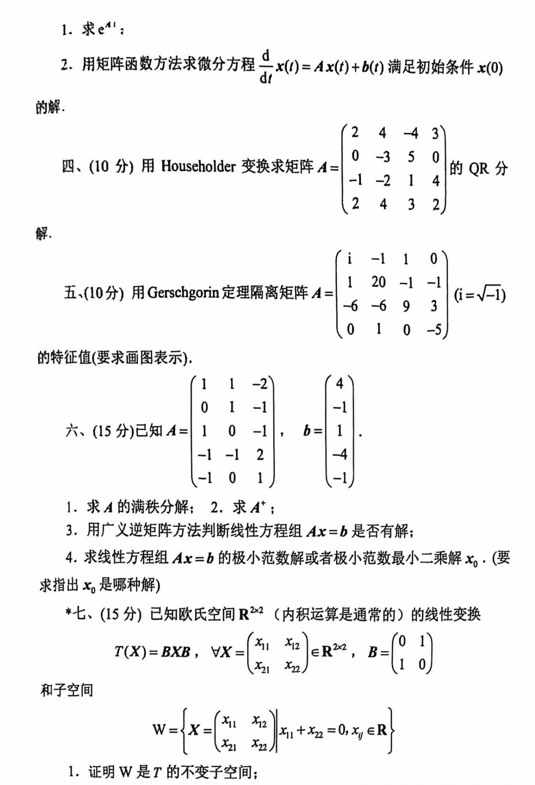
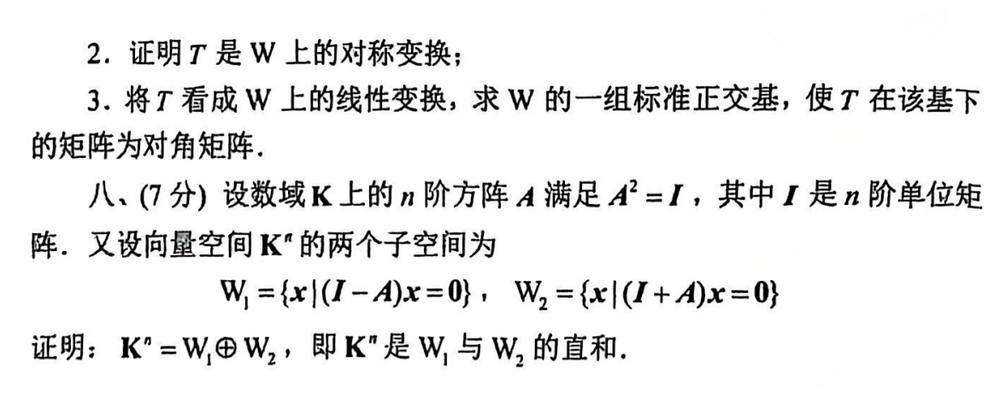

# 2015

# 试卷五（2015年）
## 一、(18分) 填空：
1. 矩阵 $ A = \begin{bmatrix} -3 & -2 & -4 & 6 \\ -1 & -2 & -2 & 3 \\ 0 & 0 & -1 & 0 \\ -1 & -1 & -2 & 2 \end{bmatrix} $ 的 Jordan 标准形为 $ J = \begin{bmatrix} \quad \quad \end{bmatrix} $。
2. 设 $ A $ 为上题中的 4 阶方阵，则

$ \|A\|_2 = ( \quad ); \|A\|_1 = ( \quad ); \|A\|_\infty = ( \quad )。 $

3. 
    - 设 $ A $ 是 $ n $ 阶投影矩阵，则

$ \sin\left(\frac{\pi}{2}A\right) = ( \quad ), \cos(A) = ( \quad )。 $

4. 设 $ m \times n $ 矩阵 $ A $ 的 Moore-Penrose 逆是 $ A^+ $，则

$ \begin{bmatrix} 6 & -2 \\ 3 & -1 \end{bmatrix} \otimes A^+ = ( \quad )。 $

5. 设 $ n $ 阶方阵 $ A $ 的特征值为 $ \lambda_1, \lambda_2, \cdots, \lambda_n $，则矩阵方程

$ AXA^+ + XA - X = 0 $

   只有唯一零解的充分必要条件是 $ ( $ \quad $ ) $。

6. 设 2 维欧氏空间 $ V $ 的基 $ a_1, a_2 $ 的度量矩阵为 $ A = \begin{bmatrix} 2 & -1 \\ -1 & 1 \end{bmatrix} $，则 $ V $ 的标准正交基为 $ ( $ \quad $ ) $。

---

## 二、(10分)
设 $ \| \cdot \|_b $ 是 $ \mathbb{C}^{m \times n} $ 上的矩阵范数，$ P \in \mathbb{C}^{m \times m}, Q \in \mathbb{C}^{n \times n} $，且满足

$ \|P Q\|_b \leq 1, $

定义变换函数

$ \|A\|_b = \|Q^*AP\|_b, \quad \forall A \in \mathbb{C}^{m \times n}, $

其中 $ P^* $ 和 $ Q^* $ 分别表示矩阵 $ P $ 和 $ Q $ 的 Moore-Penrose 逆。证明 $ \| \cdot \|_b $ 是 $ \mathbb{C}^{m \times n} $ 上的矩阵范数。

---

## 三、(15分)
已知 

$ A = \begin{bmatrix} 1 & -2 & -1 \\ -1 & 0 & 1 \\ -1 & -2 & 1 \end{bmatrix}, \quad b(t) = e^{2t} \begin{bmatrix} -1 \\ -1 \\ 1 \end{bmatrix}, \quad x(0) = \begin{bmatrix} 1 \\ 1 \\ 1 \end{bmatrix} $

1. 求 $ e^{A^t} $；
2. 用矩阵函数数方法求微分方程

$ \frac{d}{dt}x(t) = A x(t) + b(t) $

   满足初始条件 $ x(0) $ 的解。

---

## 四、(10分)
用 Householder 变换求矩阵 $ A = \begin{bmatrix} 2 & 4 & -4 & 3 \\ 0 & -3 & 5 & 0 \\ -1 & -2 & 1 & 4 \\ 2 & 4 & 3 & 2 \end{bmatrix} $ 的 QR 分解。

---

## 五、(10分)
用 Gerschgorin 定理隔离矩阵 

$ A = \begin{bmatrix} i & -1 & 1 & 0 \\ 1 & 20 & -1 & -1 \\ -6 & -6 & 9 & 3 \\ 0 & 1 & 0 & -5 \end{bmatrix}, \quad (i = \sqrt{-1}) $

的特征值（要求画图表示）。

---

## 六、(15分)
已知 

$ A = \begin{bmatrix} 1 & 1 & -2 \\ 0 & 1 & -1 \\ -1 & -2 & 1 \\ -1 & 2 & 1 \end{bmatrix}, \quad b = \begin{bmatrix} 4 \\ -1 \\ -4 \\ -1 \end{bmatrix} $

1. 求 $ A $ 的满秩分解；
2. 求 $ A^+ $；
3. 用广义逆矩阵方法判断线性方程组 $ Ax = b $ 是否有解；
4. 求线性方程组 $ Ax = b $ 的极小范数解或者极小二乘解 $ x_0 $。（要求指出 $ x_0 $ 是哪种解）

---

## 七、(15分)
已知欧氏空间 $ R^{2 \times 2} $ （内积运算是通常的）的线性变换

$ T(X) = B X B, \quad \forall X = \begin{bmatrix} x_{11} & x_{12} \\ x_{21} & x_{22} \end{bmatrix} \in R^{2 \times 2}, \quad B = \begin{bmatrix} 0 & 1 \\ 1 & 0 \end{bmatrix} $

和子空间

$ W = \left\{X = \begin{bmatrix} x_{11} & x_{12} \\ x_{21} & x_{22} \end{bmatrix} \mid x_{11} + x_{22} = 0, x_{ij} \in R \right\}。 $

1. 证明 $ W $ 是 $ T $ 的不变子空间；
2. 证明 $ T $ 是 $ W $ 上的对称变换；
3. 将 $ T $ 看成 $ W $ 上的线性变换，求 $ W $ 的一组标准正交基，使 $ T $ 在该基下的矩阵为对角矩阵。

---

## 八、(7分)
设数域 $ \mathbb{K} $ 上的 $ n $ 阶方阵 $ A $ 满足 $ A^2 = I $，其中 $ I $ 是 $ n $ 阶单位矩阵。又设向量空间 $ \mathbb{K}^n $ 的两个子空间为

$ W_1 = \{x \mid (I - A)x = 0\}, \quad W_2 = \{x \mid (I + A)x = 0\} $

证明：

$ \mathbb{K}^n = W_1 \oplus W_2, \quad 即 \mathbb{K}^n 是 W_1 与 W_2 的直和。 $

# 代码与图片
```plain
# 试卷五（2015年）

## 一、(18分) 填空：

1. 矩阵 $A = \begin{bmatrix} -3 & -2 & -4 & 6 \\ -1 & -2 & -2 & 3 \\ 0 & 0 & -1 & 0 \\ -1 & -1 & -2 & 2 \end{bmatrix}$ 的 Jordan 标准形为 $J = \begin{bmatrix} \quad \quad \end{bmatrix}$。

2. 设 $A$ 为上题中的 4 阶方阵，则
   $$\|A\|_2 = ( \quad ); \|A\|_1 = ( \quad ); \|A\|_\infty = ( \quad )。$$

3. * 设 $A$ 是 $n$ 阶投影矩阵，则 
   $$\sin\left(\frac{\pi}{2}A\right) = ( \quad ), \cos(A) = ( \quad )。$$

4. 设 $m \times n$ 矩阵 $A$ 的 Moore-Penrose 逆是 $A^+$，则 
   $$\begin{bmatrix} 6 & -2 \\ 3 & -1 \end{bmatrix} \otimes A^+ = ( \quad )。$$

5. 设 $n$ 阶方阵 $A$ 的特征值为 $\lambda_1, \lambda_2, \cdots, \lambda_n$，则矩阵方程
   $$AXA^+ + XA - X = 0$$
   只有唯一零解的充分必要条件是 $($ \quad $)$。

6. 设 2 维欧氏空间 $V$ 的基 $a_1, a_2$ 的度量矩阵为 $A = \begin{bmatrix} 2 & -1 \\ -1 & 1 \end{bmatrix}$，则 $V$ 的标准正交基为 $($ \quad $)$。

---

## 二、(10分) 

设 $\| \cdot \|_b$ 是 $\mathbb{C}^{m \times n}$ 上的矩阵范数，$P \in \mathbb{C}^{m \times m}, Q \in \mathbb{C}^{n \times n}$，且满足
$$\|P Q\|_b \leq 1,$$
定义变换函数
$$\|A\|_b = \|Q^*AP\|_b, \quad \forall A \in \mathbb{C}^{m \times n},$$
其中 $P^*$ 和 $Q^*$ 分别表示矩阵 $P$ 和 $Q$ 的 Moore-Penrose 逆。证明 $\| \cdot \|_b$ 是 $\mathbb{C}^{m \times n}$ 上的矩阵范数。

---

## 三、(15分)

已知 
$$A = \begin{bmatrix} 1 & -2 & -1 \\ -1 & 0 & 1 \\ -1 & -2 & 1 \end{bmatrix}, \quad b(t) = e^{2t} \begin{bmatrix} -1 \\ -1 \\ 1 \end{bmatrix}, \quad x(0) = \begin{bmatrix} 1 \\ 1 \\ 1 \end{bmatrix}$$

1. 求 $e^{A^t}$；

2. 用矩阵函数数方法求微分方程 
   $$\frac{d}{dt}x(t) = A x(t) + b(t)$$
   满足初始条件 $x(0)$ 的解。

---

## 四、(10分)

用 Householder 变换求矩阵 $A = \begin{bmatrix} 2 & 4 & -4 & 3 \\ 0 & -3 & 5 & 0 \\ -1 & -2 & 1 & 4 \\ 2 & 4 & 3 & 2 \end{bmatrix}$ 的 QR 分解。

---

## 五、(10分)

用 Gerschgorin 定理隔离矩阵 
$$A = \begin{bmatrix} i & -1 & 1 & 0 \\ 1 & 20 & -1 & -1 \\ -6 & -6 & 9 & 3 \\ 0 & 1 & 0 & -5 \end{bmatrix}, \quad (i = \sqrt{-1})$$
的特征值（要求画图表示）。

---

## 六、(15分)

已知 
$$A = \begin{bmatrix} 1 & 1 & -2 \\ 0 & 1 & -1 \\ -1 & -2 & 1 \\ -1 & 2 & 1 \end{bmatrix}, \quad b = \begin{bmatrix} 4 \\ -1 \\ -4 \\ -1 \end{bmatrix}$$

1. 求 $A$ 的满秩分解；

2. 求 $A^+$；

3. 用广义逆矩阵方法判断线性方程组 $Ax = b$ 是否有解；

4. 求线性方程组 $Ax = b$ 的极小范数解或者极小二乘解 $x_0$。（要求指出 $x_0$ 是哪种解）

---

## 七、(15分)

已知欧氏空间 $R^{2 \times 2}$ （内积运算是通常的）的线性变换
$$T(X) = B X B, \quad \forall X = \begin{bmatrix} x_{11} & x_{12} \\ x_{21} & x_{22} \end{bmatrix} \in R^{2 \times 2}, \quad B = \begin{bmatrix} 0 & 1 \\ 1 & 0 \end{bmatrix}$$
和子空间
$$W = \left\{X = \begin{bmatrix} x_{11} & x_{12} \\ x_{21} & x_{22} \end{bmatrix} \mid x_{11} + x_{22} = 0, x_{ij} \in R \right\}。$$

1. 证明 $W$ 是 $T$ 的不变子空间；

2. 证明 $T$ 是 $W$ 上的对称变换；

3. 将 $T$ 看成 $W$ 上的线性变换，求 $W$ 的一组标准正交基，使 $T$ 在该基下的矩阵为对角矩阵。

---

## 八、(7分)

设数域 $\mathbb{K}$ 上的 $n$ 阶方阵 $A$ 满足 $A^2 = I$，其中 $I$ 是 $n$ 阶单位矩阵。又设向量空间 $\mathbb{K}^n$ 的两个子空间为
$$W_1 = \{x \mid (I - A)x = 0\}, \quad W_2 = \{x \mid (I + A)x = 0\}$$
证明：
$$\mathbb{K}^n = W_1 \oplus W_2, \quad 即 \mathbb{K}^n 是 W_1 与 W_2 的直和。$$

```





