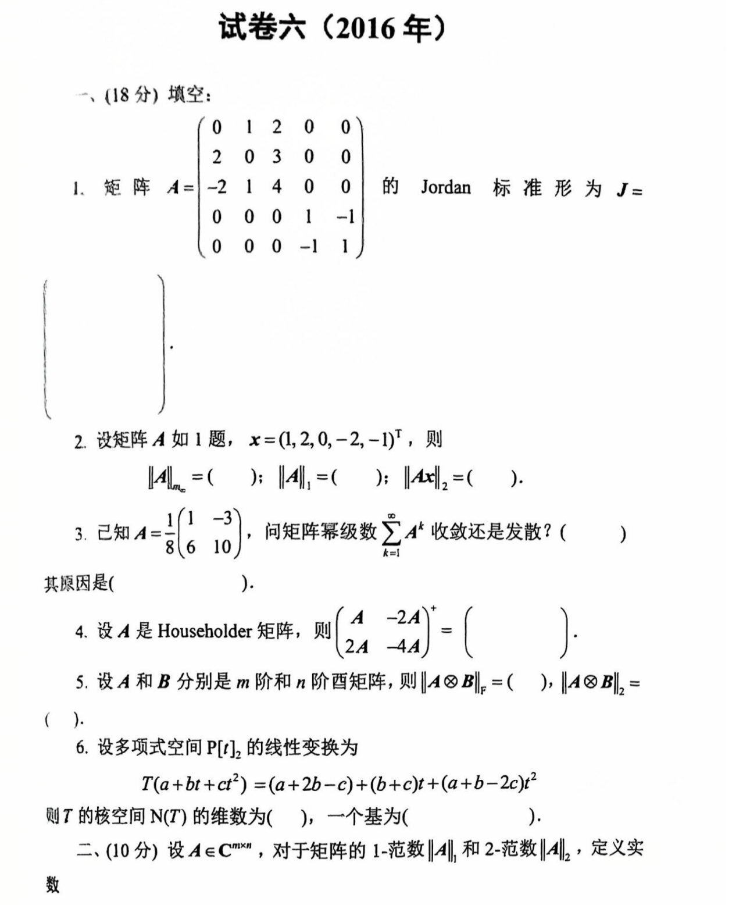
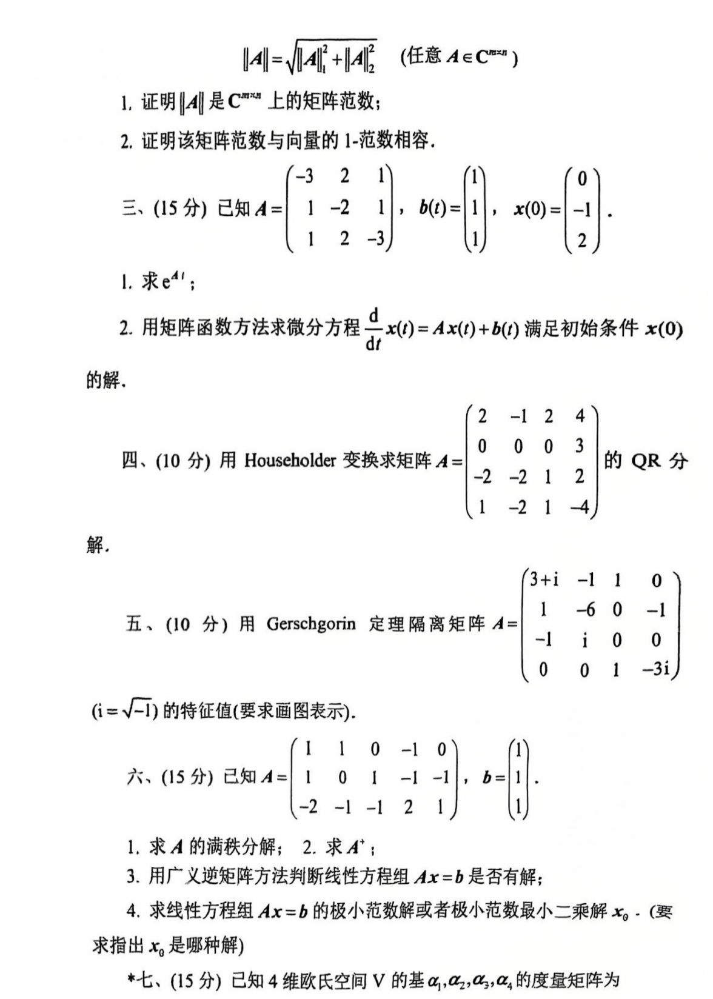
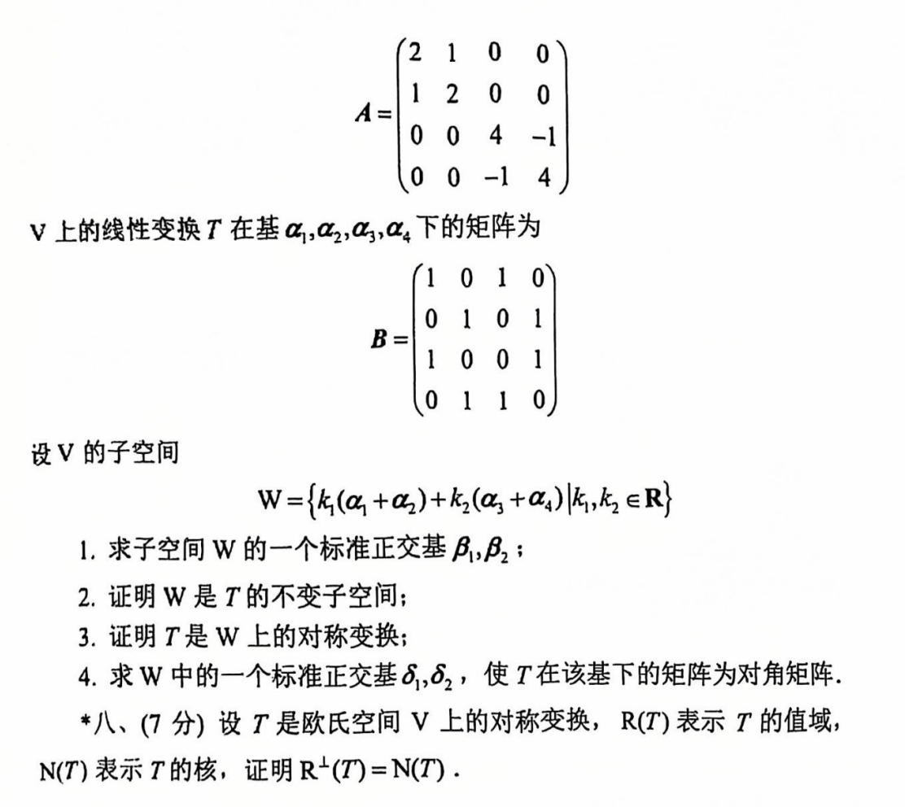

# 2016

# 试卷六（2016年）
### （18分）填空：
1. 矩阵 $ A = 
\begin{bmatrix}
0 & 1 & 2 & 0 & 0 \\
2 & 0 & 3 & 0 & 0 \\
-2 & 1 & 4 & 0 & 0 \\
0 & 0 & 0 & 1 & -1 \\
0 & 0 & 0 & -1 & 1
\end{bmatrix} $  
的 Jordan 标准形为 $ J= $

---

2. 设矩阵 $ A $ 如题，$ x = (1, 2, 0, -2, -1)^T $，则  
$ \|A\|_\infty = (\ \ \ ) $，$ \|A\|_1 = (\ \ \ ) $，$ \|Ax\|_2 = (\ \ \ ) $。

---

3. 已知 $ A = \frac{1}{8} 
\begin{bmatrix}
1 & 6 \\
-3 & 10
\end{bmatrix} $，问矩阵幂级数 $ \sum_{k=1}^\infty A^k $ 收敛还是发散？（\ \ \ ）。  
其原因是：（\ \ \ ）。

---

4. 设 $ A $ 是 Householder 矩阵，则  
$ 
\begin{bmatrix}
A & -2A \\
2A & -4A
\end{bmatrix}^+ = 
\begin{bmatrix}
(\ \ \ ) & (\ \ \ ) \\
(\ \ \ ) & (\ \ \ )
\end{bmatrix}
 $。

---

5. 设 $ A $ 和 $ B $ 分别是 $ m $ 阶和 $ n $ 阶矩阵，则  
$ \|A \otimes B\|_F = (\ \ \ ) $，$ \|A \otimes B\|_2 = (\ \ \ ) $。

---

6. 设多项式空间 $ P[t_2] $ 的线性变换  
$ T(a+b t + c t^2) = (a+2b-c) + (b+c)t + (a+b-2c)t^2 $，  
则 $ T $ 的核空间 $ N(T) $ 的维数为 (\ \ \ )，一个基为 (\ \ \ )。

---

### 二、（10分）
设 $ A \in \mathbb{C}^{m\times n} $，对于矩阵的 1-范数 $ \|A\|_1 $ 和 2-范数 $ \|A\|_2 $，定义实数

$ \|A\| = \sqrt{\|A\|_1^2 + \|A\|_2^2}. $

1. 证明 $ \|A\| $ 是 $ \mathbb{C}^{m\times n} $ 上的矩阵范数；
2. 证明该矩阵范数与向量的 1-范数相容。

---

### 三、（15分）
已知 $ A = 
\begin{bmatrix}
-3 & 2 & 1 \\
1 & -2 & 1 \\
1 & 2 & -3
\end{bmatrix} $，$ b(t) = 
\begin{bmatrix}
1 \\ 1 \\ 0
\end{bmatrix} $，$ x(0) = 
\begin{bmatrix}
-1 \\ 0 \\ 2
\end{bmatrix} $。

1. 求 $ e^{At} $；
2. 用矩阵函数方法求微分方程

$ \frac{d}{dt} x(t) = A x(t) + b(t) $

满足初始条件 $ x(0) $ 的解。

---

### 四、（10分）
用 Householder 变换求矩阵 

$ A = 
\begin{bmatrix}
2 & -1 & 2 & 4 \\
0 & 0 & 0 & 3 \\
-2 & 1 & 2 & 1 \\
1 & -2 & 1 & -4
\end{bmatrix} $

的 QR 分解。

---

### 五、（10分）
用 Gerschgorin 定理隔离矩阵 

$ A = 
\begin{bmatrix}
3+i & -1 & 1 & 0 \\
-1 & -6 & 0 & -1 \\
1 & 0 & -1 & i \\
0 & 1 & 1 & -3i
\end{bmatrix} $

（$ i = \sqrt{-1} $）的特征值（要求画图表示）。

---

### 六、（15分）
已知 $ A = 
\begin{bmatrix}
1 & 1 & 0 & -1 & 0 \\
1 & 0 & 1 & -1 & -1 \\
-2 & -1 & -1 & 2 & 1
\end{bmatrix} $，$ b = 
\begin{bmatrix}
1 \\ 1 \\ 1
\end{bmatrix} $。

1. 求 $ A $ 的满秩分解；
2. 求 $ A^+ $；
3. 用广义逆矩阵方法判断线性方程组 $ Ax = b $ 是否有解；
4. 求线性方程组 $ Ax = b $ 的极小范数解或极小二乘最小二乘解 $ x_0 $。（要求指出 $ x_0 $ 是哪种解）

---

### 七、（15分）
已知 4 维欧氏空间 $ V $ 的基 $ \alpha_1, \alpha_2, \alpha_3, \alpha_4 $ 的度量矩阵为

$ A = 
\begin{bmatrix}
2 & 1 & 0 & 0 \\
1 & 2 & 0 & 0 \\
0 & 0 & 4 & -1 \\
0 & 0 & -1 & 4
\end{bmatrix} $

$ V $ 上的线性变换 $ T $ 在基 $ \alpha_1, \alpha_2, \alpha_3, \alpha_4 $ 下的矩阵为

$ B = 
\begin{bmatrix}
1 & 0 & 1 & 0 \\
0 & 1 & 0 & 1 \\
1 & 0 & 0 & 1 \\
0 & 1 & 1 & 0
\end{bmatrix} $

设 $ V $ 的子空间

$ W = \{k_1 (\alpha_1+\alpha_2) + k_2 (\alpha_3+\alpha_4) \mid k_1, k_2 \in \mathbb{R}\}。 $

1. 求子空间 $ W $ 的一个标准正交基 $ \beta_1, \beta_2 $；
2. 证明 $ W $ 是 $ T $ 的不变子空间；
3. 证明 $ T $ 是 $ W $ 上的对称变换；
4. 求 $ W $ 中的一个标准正交基 $ \delta_1, \delta_2 $，使得 $ T $ 在该基下的矩阵为对角矩阵。

---

### 八、（7分）
设 $ T $ 是欧氏空间 $ V $ 上的对称变换，$ R(T) $ 表示 $ T $ 的值域，$ N(T) $ 表示 $ T $ 的核，证明 $ R^\perp(T) = N(T) $。

# 代码与图片
```plain
# 试卷六（2016年）

### （18分）填空：

1. 矩阵 $A = 
\begin{bmatrix}
0 & 1 & 2 & 0 & 0 \\
0 & 2 & 0 & 3 & 0 \\
-2 & 1 & 4 & 0 & 0 \\
0 & 0 & 1 & -1 & 0 \\
0 & 0 & 0 & -1 & 1
\end{bmatrix}$
的 Jordan 标准形为 $J=$

---

2. 设矩阵 $A$ 如题，$x = (1, 2, 0, -2, -1)^T$，则
$\|A\|_\infty = (\ \ \ )$，$\|A\|_1 = (\ \ \ )$，$\|Ax\|_2 = (\ \ \ )$。

---

3. 已知 $A = \frac{1}{8} 
\begin{bmatrix}
1 & 6 \\
-3 & 10
\end{bmatrix}$，问矩阵幂级数 $\sum_{k=1}^\infty A^k$ 收敛还是发散？（\ \ \ ）。
其原因是：（\ \ \ ）。

---

4. 设 $A$ 是 Householder 矩阵，则
$
\begin{bmatrix}
A & -2A \\
2A & -4A
\end{bmatrix}^+ = 
\begin{bmatrix}
(\ \ \ ) & (\ \ \ ) \\
(\ \ \ ) & (\ \ \ )
\end{bmatrix}
$。

---

5. 设 $A$ 和 $B$ 分别是 $m$ 阶和 $n$ 阶矩阵，则
$\|A \otimes B\|_F = (\ \ \ )$，$\|A \otimes B\|_2 = (\ \ \ )$。

---

6. 设多项式空间 $P[t_2]$ 的线性变换
$T(a+b t + c t^2) = (a+2b-c) + (b+c)t + (a+b-2c)t^2$，
则 $T$ 的核空间 $N(T)$ 的维数为 (\ \ \ )，一个基为 (\ \ \ )。

---

7. （10分）设 $A \in \mathbb{C}^{m\times n}$，对于矩阵的 1-范数 $\|A\|_1$ 和 2-范数 $\|A\|_2$，定义实数
$$
\|A\| = \sqrt{\|A\|_1^2 + \|A\|_2^2}.
$$

---

1. 证明 $\|A\|$ 是 $\mathbb{C}^{m\times n}$ 上的矩阵范数；
2. 证明该矩阵范数与向量的 1-范数相容。

---

### 三、（15分）

已知 $A = 
\begin{bmatrix}
-3 & 2 & 1 \\
1 & -2 & 1 \\
1 & 2 & -3
\end{bmatrix}$，$b(t) = 
\begin{bmatrix}
1 \\ 1 \\ 0
\end{bmatrix}$，$x(0) = 
\begin{bmatrix}
-1 \\ 0 \\ 2
\end{bmatrix}$。

1. 求 $e^{At}$；
2. 用矩阵函数方法求微分方程 
$$
\frac{d}{dt} x(t) = A x(t) + b(t)
$$
满足初始条件 $x(0)$ 的解。

---

### 四、（10分）

用 Householder 变换求矩阵 
$$
A = 
\begin{bmatrix}
2 & -1 & 2 & 4 \\
0 & 0 & 0 & 3 \\
-2 & 1 & 2 & 1 \\
1 & -2 & 1 & -4
\end{bmatrix}
$$
的 QR 分解。

---

### 五、（10分）

用 Gerschgorin 定理隔离矩阵 
$$
A = 
\begin{bmatrix}
3+i & -1 & 1 & 0 \\
-1 & -6 & 0 & -1 \\
1 & 0 & -1 & i \\
0 & 1 & 1 & -3i
\end{bmatrix}
$$
（$i = \sqrt{-1}$）的特征值（要求画图表示）。

---

### 六、（15分）

已知 $A = 
\begin{bmatrix}
1 & 1 & 0 & -1 & 0 \\
1 & 0 & 1 & -1 & -1 \\
-2 & -1 & -1 & 2 & 1
\end{bmatrix}$，$b = 
\begin{bmatrix}
1 \\ 1 \\ 1
\end{bmatrix}$。

1. 求 $A$ 的满秩分解；
2. 求 $A^+$；
3. 用广义逆矩阵方法判断线性方程组 $Ax = b$ 是否有解；
4. 求线性方程组 $Ax = b$ 的极小范数解或极小二乘最小二乘解 $x_0$。（要求指出 $x_0$ 是哪种解）

---

### 七、（15分）

已知 4 维欧氏空间 $V$ 的基 $\alpha_1, \alpha_2, \alpha_3, \alpha_4$ 的度量矩阵为
$$
A = 
\begin{bmatrix}
2 & 1 & 0 & 0 \\
1 & 2 & 0 & 0 \\
0 & 0 & 4 & -1 \\
0 & 0 & -1 & 4
\end{bmatrix}
$$
$V$ 上的线性变换 $T$ 在基 $\alpha_1, \alpha_2, \alpha_3, \alpha_4$ 下的矩阵为
$$
B = 
\begin{bmatrix}
1 & 0 & 1 & 0 \\
0 & 1 & 0 & 1 \\
1 & 0 & 0 & 1 \\
0 & 1 & 1 & 0
\end{bmatrix}
$$

设 $V$ 的子空间
$$
W = \{k_1 (\alpha_1+\alpha_2) + k_2 (\alpha_3+\alpha_4) \mid k_1, k_2 \in \mathbb{R}\}。
$$

1. 求子空间 $W$ 的一个标准正交基 $\beta_1, \beta_2$；
2. 证明 $W$ 是 $T$ 的不变子空间；
3. 证明 $T$ 是 $W$ 上的对称变换；
4. 求 $W$ 中的一个标准正交基 $\delta_1, \delta_2$，使得 $T$ 在该基下的矩阵为对角矩阵。

---

### 八、（7分）

设 $T$ 是欧氏空间 $V$ 上的对称变换，$R(T)$ 表示 $T$ 的值域，$N(T)$ 表示 $T$ 的核，证明 $R^\perp(T) = N(T)$。

```






