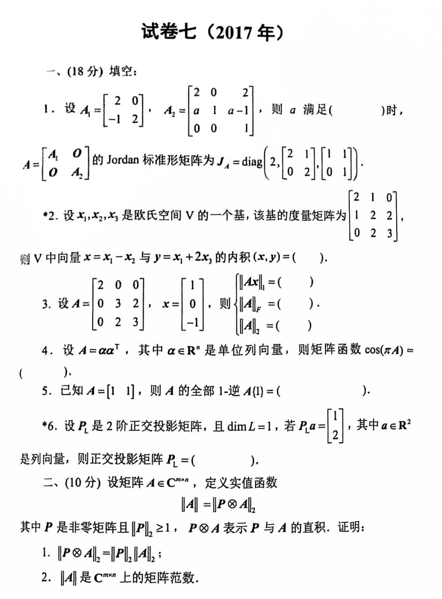
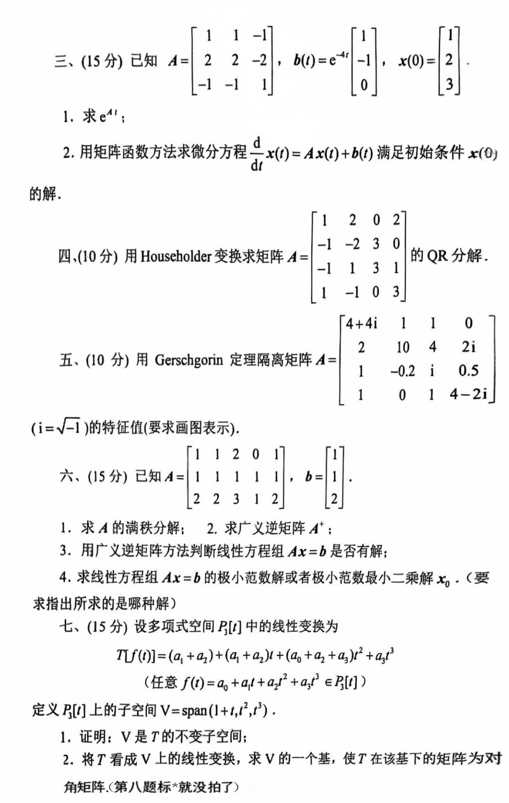

# 2017

# 试卷七（2017年）
## 一、(18 分) 填空
1. 设 $ A_1 = \begin{bmatrix} 2 & 0 \\ -1 & 2 \end{bmatrix} $，$ A_2 = \begin{bmatrix}2 & 0 & 2 \\ a & 1 & a-1 \\0 & 0 & 1\end{bmatrix} $，则 $ a $ 满足（_____）时，$ A = \begin{bmatrix} A_1 & 0 \\ 0 & A_2 \end{bmatrix} $

的 Jordan 标准形矩阵为 $ J_A = \text{diag}\left( 2, \begin{bmatrix} 2 & 1 \\ 0 & 2 \end{bmatrix}, \begin{bmatrix} 1 & 1 \\ 0 & 1 \end{bmatrix} \right) $。

2. 设 $ x_1, x_2, x_3 $ 是欧氏空间 $ V $ 的一个基，该基的度量矩阵为$ \begin{bmatrix} 2 & 1 & 0 \\ 1 & 2 & 2 \\ 0 & 2 & 3 \end{bmatrix}, $则 $ V $ 中向量 $ x = x_1 - x_2 $ 与 $ y = x_1 + 2x_3 $ 的内积 $ (x, y) =  $。
3. 设

$ A = \begin{bmatrix} 2 & 0 & 0 \\ 0 & 3 & 2 \\ 0 & 2 & 3 \end{bmatrix}, \quad x = \begin{bmatrix} 1 \\ 0 \\ -1 \end{bmatrix}, $

则 

$ \|Ax\| = ， \quad \|A\|_1 = ， \quad \|A\|_2 =  $

4. 设 $ A = \alpha \alpha^T $，其中 $ \alpha \in \mathbb{R}^n $ 是单位列向量，则矩阵函数 $ \cos(\pi A) =  $。
5. 已知 $ A = \begin{bmatrix} 1 & 1 \end{bmatrix} $，则 $ A $ 的全部 1-逆 $ A^{\{1\}} =  $。
6. 设 $ P_L $ 是 2 阶正交投影矩阵，且 $ \dim L = 1 $，若 $ P_L a = \begin{bmatrix} 1 \\ 2 \end{bmatrix} $，其中 $ a \in \mathbb{R}^2 $ 是列向量，则正交投影矩阵 $ P_L =  $。

---

## 二、(10 分) 
设矩阵 $ A \in \mathbb{C}^{m \times n} $，定义实值函数

$ \|A\| = \|P \otimes A\|_2, $

其中 $ P $ 是非零矩阵且 $ \|P\|_2 \geq 1 $，$ P \otimes A $ 表示 $ P $ 与 $ A $ 的直积。证明：

1. $ \|P \otimes A\|_2 = \|P\|_2 \|A\|_2 $；
2. $ \|A\| $ 是 $ \mathbb{C}^{m \times n} $ 上的矩阵范数。

---

## 三、(15 分) 已知
$ A = \begin{bmatrix} 1 & 1 & -1 \\ 2 & 2 & -2 \\ -1 & -1 & 1 \end{bmatrix}, \quad b(t) = e^{-4t} \begin{bmatrix} -1 \\ 1 \\ 0 \end{bmatrix}, \quad x(0) = \begin{bmatrix} 2 \\ 3 \\ 0 \end{bmatrix}. $

1. 求 $ e^{4t}A $；
2. 用矩阵函数方法求微分方程

$ \frac{d}{dt}x(t) = Ax(t) + b(t) $

满足初始条件 $ x(0) $ 的解。

---

## 四、(10 分) 用 Householder 变换求矩阵
$ A = \begin{bmatrix} 1 & 2 & 0 & 2 \\ -1 & -2 & 3 & 0 \\ -1 & 1 & 3 & 1 \\ 1 & -1 & 0 & 3 \end{bmatrix} $

的 QR 分解。

---

## 五、(10 分) 用 Gerschgorin 定理隔离矩阵
$ A = \begin{bmatrix} 4 + 4i & 1 & 1 & 0 \\ 2 & 10 & 4 & 2i \\ -1 & -0.2i & 1 & 0.5 \\ 1 & 0 & 1 & 4 - 2i \end{bmatrix} $

的特征值（要求画图表示）。

---

## 六、(15 分) 已知
$ A = \begin{bmatrix} 1 & 1 & 2 & 0 \\ 1 & 1 & 1 & 1 \\ 2 & 2 & 3 & 1 \end{bmatrix}, \quad b = \begin{bmatrix} 1 \\ 1 \\ 2 \end{bmatrix}. $

1. 求 $ A $ 的满秩分解；
2. 求广义逆矩阵 $ A^+ $；
3. 用广义逆矩阵方法判断线性方程组 $ Ax = b $ 是否有解；
4. 求线性方程组 $ Ax = b $ 的极小范数解或极小范数最小二乘解 $ x_0 $（要指出所求的是哪种解）。

---

## 七、(15 分) 
设多项式空间 $ P_3[t] $ 中的线性变换为

$ T[f(t)] = (a_1 + a_2) + (a_0 + a_2) t + (a_0 + a_2 + a_3) t^2 + a_3 t^3 \quad (\text{任意 } f(t) = a_0 + a_1 t + a_2 t^2 + a_3 t^3 \in P_3[t]) $

定义 $ P_3[t] $ 上的子空间

$ V = \text{span}\{1 + t, t^2, t^3\}。 $

1. 证明：$ V $ 是 $ T $ 的不变子空间；
2. 将 $ T $ 看成 $ V $ 上的线性变换，求 $ V $ 的一个基，使 $ T $ 在该基下的矩阵为对角矩阵。


```plain
# 试卷七（2017年）

## 一、(18 分) 填空

1. 设 $A_1 = \begin{bmatrix} 2 & 0 \\ -1 & 2 \end{bmatrix}$，$A_2 = \begin{bmatrix}2 & 0 & 2 \\ a & 1 & a-1 \\0 & 0 & 1\end{bmatrix}$，则 $a$ 满足（_____）时，$A = \begin{bmatrix} A_1 & 0 \\ 0 & A_2 \end{bmatrix}$
的 Jordan 标准形矩阵为 $J_A = \text{diag}\left( 2, \begin{bmatrix} 2 & 1 \\ 0 & 2 \end{bmatrix}, \begin{bmatrix} 1 & 1 \\ 0 & 1 \end{bmatrix} \right)$。

2. 设 $x_1, x_2, x_3$ 是欧氏空间 $V$ 的一个基，该基的度量矩阵为
$$
\begin{bmatrix} 2 & 1 & 0 \\ 1 & 2 & 2 \\ 0 & 2 & 3 \end{bmatrix},
$$
则 $V$ 中向量 $x = x_1 - x_2$ 与 $y = x_1 + 2x_3$ 的内积 $(x, y) = （_____）$。

3. 设 
$$
A = \begin{bmatrix} 2 & 0 & 0 \\ 0 & 3 & 2 \\ 0 & 2 & 3 \end{bmatrix}, \quad x = \begin{bmatrix} 1 \\ 0 \\ -1 \end{bmatrix},
$$
则 
$$
\|Ax\| = （_____）， \quad \|A\|_1 = （_____）， \quad \|A\|_2 = （_____）。
$$

4. 设 $A = \alpha \alpha^T$，其中 $\alpha \in \mathbb{R}^n$ 是单位列向量，则矩阵函数 $\cos(\pi A) = （_____）$。

5. 已知 $A = \begin{bmatrix} 1 & 1 \end{bmatrix}$，则 $A$ 的全部 1-逆 $A^{\{1\}} = （_____）$。

6. 设 $P_L$ 是 2 阶正交投影矩阵，且 $\dim L = 1$，若 $P_L a = \begin{bmatrix} 1 \\ 2 \end{bmatrix}$，其中 $a \in \mathbb{R}^2$ 是列向量，则正交投影矩阵 $P_L = （_____）$。

---

## 二、(10 分) 设矩阵 $A \in \mathbb{C}^{m \times n}$，定义实值函数
$$
\|A\| = \|P \otimes A\|_2,
$$
其中 $P$ 是非零矩阵且 $\|P\|_2 \geq 1$，$P \otimes A$ 表示 $P$ 与 $A$ 的直积。证明：

1. $\|P \otimes A\|_2 = \|P\|_2 \|A\|_2$；
2. $\|A\|$ 是 $\mathbb{C}^{m \times n}$ 上的矩阵范数。

---

## 三、(15 分) 已知
$$
A = \begin{bmatrix} 1 & 1 & -1 \\ 2 & 2 & -2 \\ -1 & -1 & 1 \end{bmatrix}, \quad b(t) = e^{-4t} \begin{bmatrix} -1 \\ 1 \\ 0 \end{bmatrix}, \quad x(0) = \begin{bmatrix} 2 \\ 3 \\ 0 \end{bmatrix}.
$$

1. 求 $e^{4t}A$；

2. 用矩阵函数方法求微分方程
$$
\frac{d}{dt}x(t) = Ax(t) + b(t)
$$
满足初始条件 $x(0)$ 的解。

---

## 四、(10 分) 用 Householder 变换求矩阵
$$
A = \begin{bmatrix} 1 & 2 & 0 & 2 \\ -1 & -2 & 3 & 0 \\ -1 & 1 & 3 & 1 \\ 1 & -1 & 0 & 3 \end{bmatrix}
$$
的 QR 分解。

---

## 五、(10 分) 用 Gerschgorin 定理隔离矩阵
$$
A = \begin{bmatrix} 4 + 4i & 1 & 1 & 0 \\ 2 & 10 & 4 & 2i \\ -1 & -0.2i & 1 & 0.5 \\ 1 & 0 & 1 & 4 - 2i \end{bmatrix}
$$
的特征值（要求画图表示）。

---

## 六、(15 分) 已知
$$
A = \begin{bmatrix} 1 & 1 & 2 & 0 \\ 1 & 1 & 1 & 1 \\ 2 & 2 & 3 & 1 \end{bmatrix}, \quad b = \begin{bmatrix} 1 \\ 1 \\ 2 \end{bmatrix}.
$$

1. 求 $A$ 的满秩分解；

2. 求广义逆矩阵 $A^+$；

3. 用广义逆矩阵方法判断线性方程组 $Ax = b$ 是否有解；

4. 求线性方程组 $Ax = b$ 的极小范数解或极小范数最小二乘解 $x_0$（要指出所求的是哪种解）。

---

## 七、(15 分) 设多项式空间 $P_3[t]$ 中的线性变换为
$$
T[f(t)] = (a_1 + a_2) + (a_0 + a_2) t + (a_0 + a_2 + a_3) t^2 + a_3 t^3 \quad (\text{任意 } f(t) = a_0 + a_1 t + a_2 t^2 + a_3 t^3 \in P_3[t])
$$
定义 $P_3[t]$ 上的子空间
$$
V = \text{span}\{1 + t, t^2, t^3\}。
$$

1. 证明：$V$ 是 $T$ 的不变子空间；

2. 将 $T$ 看成 $V$ 上的线性变换，求 $V$ 的一个基，使 $T$ 在该基下的矩阵为对角矩阵。

```




