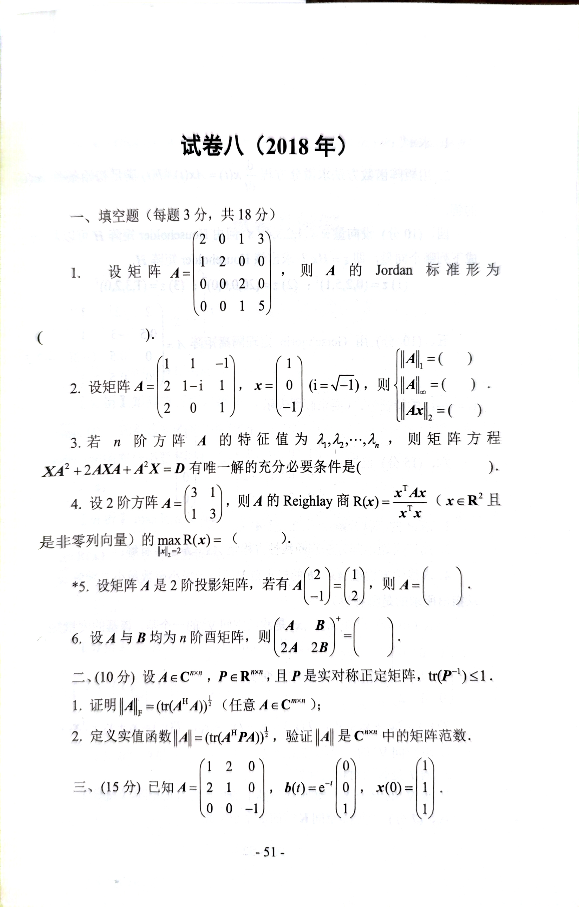
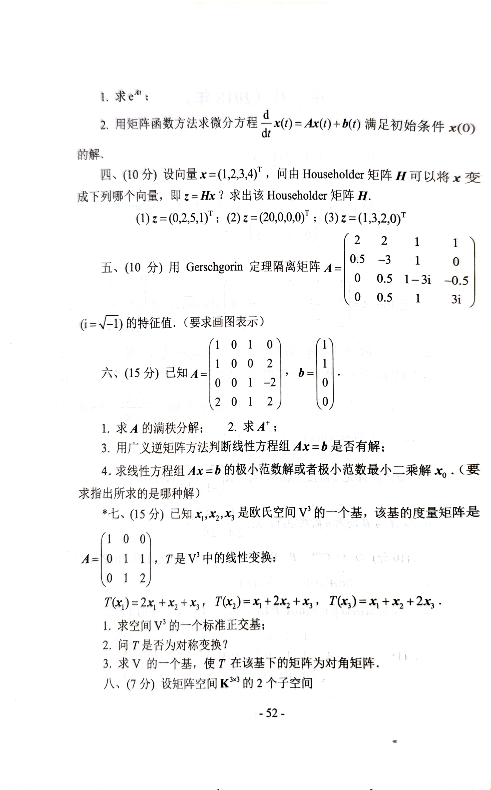
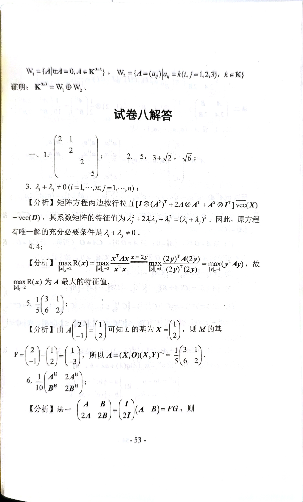

# 2018

# 试卷八（2018年）
## 一、填空题（每题 3 分，共 18 分）
1. 设矩阵 $ A = 
\begin{pmatrix}
2 & 0 & 1 & 3 \\
1 & 2 & 0 & 0 \\
0 & 0 & 2 & 0 \\
0 & 0 & 1 & 5 
\end{pmatrix} $ ，则 $ A $ 的 Jordan 标准形为 $  \boxed{\ } $。
2. 设矩阵   
$ A = 
\begin{pmatrix}
1 & 1 & -1 \\
2 & 1-i & 1 \\
2 & 0 & 1
\end{pmatrix},\ 
x = 
\begin{pmatrix}
1 \\
0 \\
-1 
\end{pmatrix}\ 
(i = \sqrt{-1}) $，则：
    - $ \|A\|_1 = (\boxed{\ }) $
    - $ \|A\|_\infty = (\boxed{\ }) $
    - $ \|Ax\|_2 = (\boxed{\ }) $
3. 若 $ n $ 阶方阵 $ A $ 的特征值为 $ \lambda_1, \lambda_2, \dots, \lambda_n $，则矩阵方程 $ XA^2 + 2AXA + A^2X = D $ 有唯一解的充分必要条件是 $  \boxed{\ } $。
4. 设 2 阶方阵 $ A = 
\begin{pmatrix}
3 & 1 \\
1 & 3 
\end{pmatrix} $，则 $ A $ 的 Rayleigh 商 $ R(x) = \frac{x^T A x}{x^T x}\ (x \in \mathbb{R}^2, x \neq 0) $ 的 $ \max_{ \|x\|_2 = 2 } R(x) = (\boxed{\ }) $。
5. 设矩阵 $ A $ 是 2 阶投影矩阵，若有   
$ A 
\begin{pmatrix}
2 \\
-1
\end{pmatrix} = 
\begin{pmatrix}
1 \\
2
\end{pmatrix} $，则 $ A = (\boxed{\ }) $。
6. 设 $ A $ 和 $ B $ 均为 $ n $ 阶西尔矩阵，则  
$ \begin{pmatrix}
A & B \\
2A & 2B 
\end{pmatrix}^+ = (\boxed{\ }) $。

---

## 二、证明题（10 分）
1. 设 $ A \in \mathbb{C}^{n \times n} $，$ P \in \mathbb{R}^{n \times n} $，且 $ P $ 是实对称正定矩阵，$ \mathrm{tr}(P^{-1}) \leq 1 $。证明：
    - $ \|A\|_F = (\mathrm{tr}(A^H A))^{\frac{1}{2}} $（任意 $ A \in \mathbb{C}^{n \times n} $）。
2. 定义实值函数 $ f(\lambda) = (\mathrm{tr}(A^H P A))^{\frac{1}{2}} $，验证 $ \|A\| $ 是 $ \mathbb{C}^{n \times n} $ 中的矩阵范数。

---

## 三、（15 分）
已知 $ A = 
\begin{pmatrix}
1 & 2 & 0 \\
2 & 1 & 0 \\
0 & 0 & -1
\end{pmatrix},\ 
b(t) = e^{-t} 
\begin{pmatrix}
0 \\
0 \\
1
\end{pmatrix},\ 
x(0) = 
\begin{pmatrix}
0 \\
0 \\
1
\end{pmatrix} $：

1. 求 $ e^{At} $；
2. 用矩阵函数方法求微分方程 $ \frac{d}{dt}x(t) = Ax(t) + b(t) $ 满足初始条件 $ x(0) $ 的解。

---

## 四、（10 分）
设向量 $ x = (1, 2, 3, 4)^T $，向由 Householder 矩阵 $ H $ 可将 $ x $ 变成下列哪个向量，即 $ z = Hx $？求出该 Householder 矩阵 $ H $：

1. $ z = (0, 2, 5, 1)^T $；
2. $ z = (20, 0, 0, 0)^T $；
3. $ z = (1, 3, 2, 0)^T $。

---

## 五、（10 分）
用 Gerschgorin 定理隔离矩阵   
$ A = 
\begin{pmatrix}
2 & 2 & 1 & 1 \\
0.5 & -3 & 1 & 0 \\
0 & 0.5 & 1-3i & -0.5 \\
0 & 0.5 & 1 & 3i 
\end{pmatrix}\ 
(i = \sqrt{-1}) $ 的特征值。（要求画图表示）

---

## 六、（15 分）
已知   
$ A = 
\begin{pmatrix}
1 & 0 & 0 \\
1 & 0 & 2 \\
2 & 0 & 1
\end{pmatrix},\ 
b = 
\begin{pmatrix}
1 \\
0 \\
0
\end{pmatrix} $：

1. 求 $ A $ 的满秩分解；
2. 求 $ A^+ $；
3. 用广义逆矩阵方法判断线性方程组 $ Ax = b $ 是否有解；
4. 求线性方程组 $ Ax = b $ 的极小范数解或极小范数最小二乘解 $ x_0 $。（要求指出所求的是哪种解）

---

## 七、（15 分）
已知 $ x_1, x_2, x_3 $ 是欧氏空间 $ \mathbb{V}^3 $ 的一个基，该基的度量矩阵是   
$ A = 
\begin{pmatrix}
1 & 0 & 0 \\
0 & 1 & 1 \\
0 & 1 & 2
\end{pmatrix} $，$ T $ 是 $ \mathbb{V}^3 $ 中的线性变换：  
$ T(x_1) = 2x_1 + x_2 + x_3 $，$ T(x_2) = x_1 + 2x_2 + x_3 $，$ T(x_3) = x_1 + x_2 + 2x_3 $。

1. 求空间 $ \mathbb{V}^3 $ 的一个标准正交基；
2. 问 $ T $ 是否为对称变换；
3. 求 $ V $ 的一个基，使 $ T $ 在该基下的矩阵为对角矩阵。

---

## 八、（7 分）
设矩阵空间 $ \mathbb{K}^{3 \times 3} $ 的 2 个子空间：

$ W_1 = \{A | \mathrm{tr} A = 0, A \in \mathbb{K}^{3 \times 3}\} $，

$ W_2 = \{A = (a_{ij}) | a_{ij} = k (i,j = 1,2,3), k \in \mathbb{K}\} $。

证明：$ \mathbb{K}^{3 \times 3} = W_1 \oplus W_2 $。

