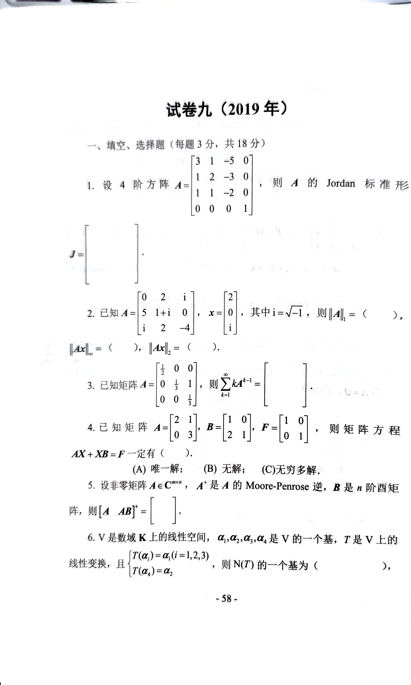
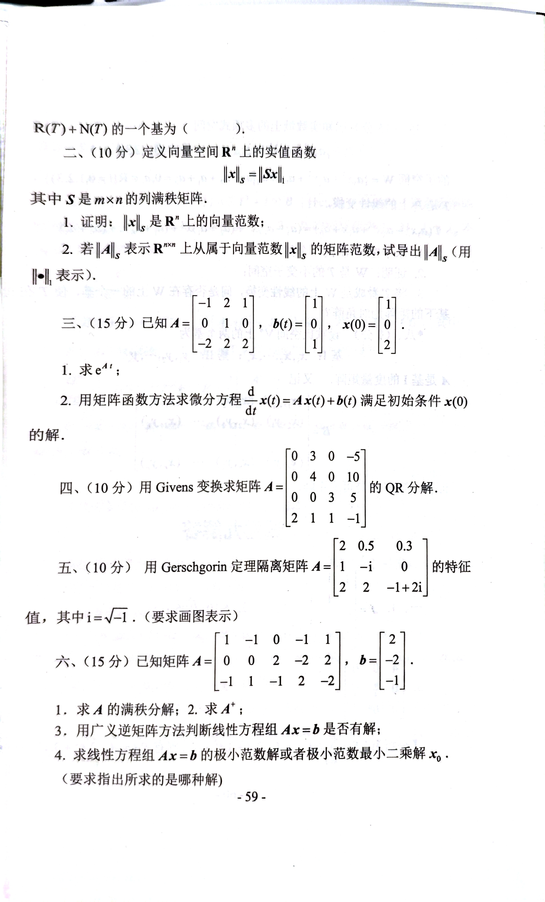
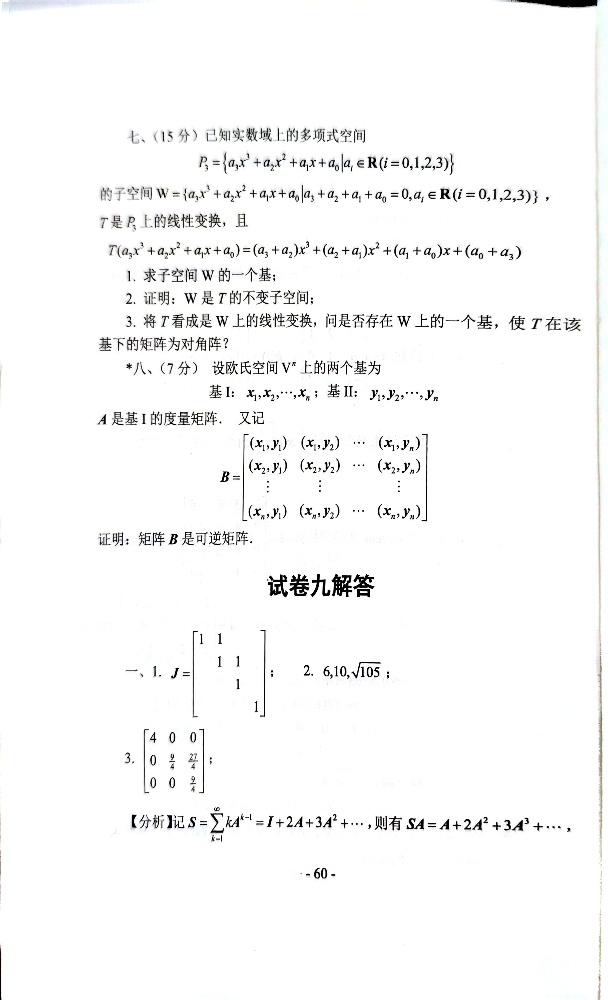

# 2019

# 试卷九（2019 年）
---

## 一、填空、选择题（每题 3 分，共 18 分）
1. 设 4 阶方阵 $ A = \begin{bmatrix} 3 & 1 & -5 & 0 \\ 3 & 1 & 2 & -3 \\ 1 & 1 & -2 & 0 \\ 0 & 0 & 0 & 0 \end{bmatrix} $，则 $ A $ 的 Jordan 标准形为

$ J = \begin{bmatrix}
    &  &  &  \\
    &  &  &  \\
    &  &  &  \\
    &  &  & 
\end{bmatrix}. $

2. 已知 $ A = \begin{bmatrix} 0 & 2 & i \\ 5 & 1+i & 0 \\ i & 2 & -4 \end{bmatrix}, x = \begin{bmatrix} 2 \\ 0 \\ i \end{bmatrix} $，其中 $ i = \sqrt{-1} $，则 $ \|A\|_\infty = (\ ) $，$ \|Ax\|_\infty = (\ ) $。
3. 已知矩阵 $ A = \begin{bmatrix} \frac{1}{2} & 0 & 0 \\ 0 & \frac{1}{3} & 1 \\ 0 & 0 & \frac{1}{3} \end{bmatrix} $，则 $ \sum_{k=1}^\infty kA^{k-1} = \begin{bmatrix} \ & \ & \ \\ \ & \ & \ \\ \ & \ & \ \end{bmatrix} $。
4. 已知矩阵 $ A = \begin{bmatrix} 2 & 1 \\ 0 & 3 \end{bmatrix}, B = \begin{bmatrix} 1 & 0 \\ 2 & 1 \end{bmatrix}, F = \begin{bmatrix} 1 & 0 \\ 0 & 1 \end{bmatrix} $，则矩阵方程 $ AX + XB = F $ 一定有（）。
+ (A) 唯一解；
+ (B) 无解；
+ (C) 无穷多解。
5. 设非零矩阵 $ A \in \mathbb{C}^{m \times n} $，$ A^+ $ 是 $ A $ 的 Moore-Penrose 逆，$ B $ 是 $ n $ 阶单位矩阵，则 $ [A\ AB]^+ = \begin{bmatrix} \ & \ \\ \ & \ \end{bmatrix} $。
6. $ V $ 是数域 $ K $ 上的线性空间，$ \alpha_1, \alpha_2, \alpha_3, \alpha_4 $ 是 $ V $ 的一个基，$ T $ 是 $ V $ 上的线性变换，且 $ T(\alpha_i) = \alpha_i (i=1,2,3), T(\alpha_4) = \alpha_2 $，则 $ N(T) $ 的一个基为（ ），$ R(T) + N(T) $ 的一个基为（ ）。

---

## 二、（10 分）
定义向量空间 $ R^n $ 上的实值函数 $ \|x\|_S = \|Sx\| $，其中 $ S $ 是 $ m \times n $ 的列满秩矩阵。

1. 证明：$ \|x\|_S $ 是 $ R^n $ 上的向量范数；
2. 若 $ \|A\|_S $ 表示从 $ R^{m \times n} $ 上属于向量范数 $ \|x\|_S $ 的矩阵范数，试导出 $ \|A\|_S $（用 $ \|.\| $ 表示）。

---

## 三、（15 分）
已知 $ A = \begin{bmatrix} -1 & 2 & 1 \\ 0 & 1 & 0 \\ -2 & 2 & 2 \end{bmatrix}, b(t) = \begin{bmatrix} 1 \\ 0 \\ 1 \end{bmatrix}, x(0) = \begin{bmatrix} 0 \\ 0 \\ 2 \end{bmatrix} $。

1. 求 $ e^{At} $；
2. 用矩阵函数方法求微分方程 $ \frac{d}{dt}x(t) = Ax(t) + b(t) $ 满足初始条件 $ x(0) $ 的解。

---

## 四、（10 分）
用 Givens 变换求矩阵 $ A = \begin{bmatrix} 0 & 3 & 0 & -5 \\ 0 & 4 & 0 & 10 \\ 0 & 0 & 3 & 5 \\ 2 & 1 & 1 & -1 \end{bmatrix} $ 的 QR 分解。

---

## 五、（10 分）
用 Gerschgorin 定理隔离矩阵 $ A = \begin{bmatrix} 2 & 0.5 & 0.3 \\ 1 & -i & 0 \\ 2 & 2 & -1+2i \end{bmatrix} $ 的特征值，其中 $ i = \sqrt{-1} $。（要求画图表示）

---

## 六、（15 分）
已知矩阵 $ A = \begin{bmatrix} 1 & -1 & 0 & -1 & 1 \\ 0 & 0 & 2 & -2 & 2 \\ -1 & 1 & -1 & -2 & -2 \end{bmatrix}, b = \begin{bmatrix} 2 \\ -2 \\ -1 \end{bmatrix} $。

1. 求 $ A $ 的满秩分解；
2. 求 $ A^+ $；
3. 用广义逆矩阵方法判断线性方程组 $ Ax = b $ 是否有解；
4. 求线性方程组 $ Ax = b $ 的极小范数解或者极小范数最小二乘解 $ x_0 $。（要求指出所求的是哪种解）

---

## 七、（15 分）
已知实数域上的多项式空间 $ P_3 = \{a_3x^3 + a_2x^2 + a_1x + a_0|a_i \in \mathbb{R} (i = 0,1,2,3)\} $ 的子空间 $ W = \{a_3x^3 + a_2x^2 + a_1x + a_0|a_3 + a_2 + a_1 + a_0 = 0, a_i \in \mathbb{R} (i=0,1,2,3)\} $，$ T $ 是 $ P_3 $ 上的线性变换，且

$ T(a_3x^3 + a_2x^2 + a_1x + a_0) = (a_3 + a_2)x^3 + (a_2 + a_1)x^2 + (a_1 + a_0)x + (a_0 + a_3). $

1. 求子空间 $ W $ 的一个基；
2. 证明：$ W $ 是 $ T $ 的不变子空间；
3. 将 $ T $ 看成是 $ W $ 上的线性变换，问是否存在 $ W $ 上的一个基，使 $ T $ 在该基下的矩阵为对角阵？

---

## 八、（7 分）
设欧氏空间 $ V^n $ 上的两个基为

基 I: $ x_1, x_2, \cdots, x_n $；基 II: $ y_1, y_2, \cdots, y_n $。

$ A $ 是基 I 的度量矩阵，又记

$ B = \begin{bmatrix} 
(x_1, y_1) & (x_1, y_2) & \cdots & (x_1, y_n) \\
(x_2, y_1) & (x_2, y_2) & \cdots & (x_2, y_n) \\
\vdots & \vdots & \ddots & \vdots \\
(x_n, y_1) & (x_n, y_2) & \cdots & (x_n, y_n) 
\end{bmatrix}. $

证明：矩阵 $ B $ 是可逆矩阵。

# 代码与图片
```plain
# 试卷九（2019 年）

---

## 一、填空、选择题（每题 3 分，共 18 分）

1. 设 4 阶方阵 $A = \begin{bmatrix} 3 & 1 & -5 & 0 \\ 3 & 1 & 2 & -3 \\ 1 & 1 & -2 & 0 \\ 0 & 0 & 0 & 0 \end{bmatrix}$，则 $A$ 的 Jordan 标准形为

$$
J = \begin{bmatrix}
    &  &  &  \\
    &  &  &  \\
    &  &  &  \\
    &  &  & 
\end{bmatrix}.
$$

2. 已知 $A = \begin{bmatrix} 0 & 2 & i \\ 5 & 1+i & 0 \\ i & 2 & -4 \end{bmatrix}, x = \begin{bmatrix} 2 \\ 0 \\ i \end{bmatrix}$，其中 $i = \sqrt{-1}$，则 $\|A\|_\infty = (\ )$，$\|Ax\|_\infty = (\ )$。

3. 已知矩阵 $A = \begin{bmatrix} \frac{1}{2} & 0 & 0 \\ 0 & \frac{1}{3} & 1 \\ 0 & 0 & \frac{1}{3} \end{bmatrix}$，则 $\sum_{k=1}^\infty kA^{k-1} = \begin{bmatrix} \ & \ & \ \\ \ & \ & \ \\ \ & \ & \ \end{bmatrix}$。

4. 已知矩阵 $A = \begin{bmatrix} 2 & 1 \\ 0 & 3 \end{bmatrix}, B = \begin{bmatrix} 1 & 0 \\ 2 & 1 \end{bmatrix}, F = \begin{bmatrix} 1 & 0 \\ 0 & 1 \end{bmatrix}$，则矩阵方程 $AX + XB = F$ 一定有（）。

- (A) 唯一解；
- (B) 无解；
- (C) 无穷多解。

5. 设非零矩阵 $A \in \mathbb{C}^{m \times n}$，$A^+$ 是 $A$ 的 Moore-Penrose 逆，$B$ 是 $n$ 阶单位矩阵，则 $[A\ AB]^+ = \begin{bmatrix} \ & \ \\ \ & \ \end{bmatrix}$。

6. $V$ 是数域 $K$ 上的线性空间，$\alpha_1, \alpha_2, \alpha_3, \alpha_4$ 是 $V$ 的一个基，$T$ 是 $V$ 上的线性变换，且 $T(\alpha_i) = \alpha_i (i=1,2,3), T(\alpha_4) = \alpha_2$，则 $N(T)$ 的一个基为（ ），$R(T) + N(T)$ 的一个基为（ ）。

---

## 二、（10 分）定义向量空间 $R^n$ 上的实值函数 $\|x\|_S = \|Sx\|$，其中 $S$ 是 $m \times n$ 的列满秩矩阵。

1. 证明：$\|x\|_S$ 是 $R^n$ 上的向量范数；
2. 若 $\|A\|_S$ 表示从 $R^{m \times n}$ 上属于向量范数 $\|x\|_S$ 的矩阵范数，试导出 $\|A\|_S$（用 $\|.\|$ 表示）。

---

## 三、（15 分）已知 $A = \begin{bmatrix} -1 & 2 & 1 \\ 0 & 1 & 0 \\ -2 & 2 & 2 \end{bmatrix}, b(t) = \begin{bmatrix} 1 \\ 0 \\ 1 \end{bmatrix}, x(0) = \begin{bmatrix} 0 \\ 0 \\ 2 \end{bmatrix}$。

1. 求 $e^{At}$；
2. 用矩阵函数方法求微分方程 $\frac{d}{dt}x(t) = Ax(t) + b(t)$ 满足初始条件 $x(0)$ 的解。

---

## 四、（10 分）用 Givens 变换求矩阵 $A = \begin{bmatrix} 0 & 3 & 0 & -5 \\ 0 & 4 & 0 & 10 \\ 0 & 0 & 3 & 5 \\ 2 & 1 & 1 & -1 \end{bmatrix}$ 的 QR 分解。

---

## 五、（10 分）用 Gerschgorin 定理隔离矩阵 $A = \begin{bmatrix} 2 & 0.5 & 0.3 \\ 1 & -i & 0 \\ 2 & 2 & -1+2i \end{bmatrix}$ 的特征值，其中 $i = \sqrt{-1}$。（要求画图表示）

---

## 六、（15 分）已知矩阵 $A = \begin{bmatrix} 1 & -1 & 0 & -1 & 1 \\ 0 & 0 & 2 & -2 & 2 \\ -1 & 1 & -1 & -2 & -2 \end{bmatrix}, b = \begin{bmatrix} 2 \\ -2 \\ -1 \end{bmatrix}$。

1. 求 $A$ 的满秩分解；
2. 求 $A^+$；
3. 用广义逆矩阵方法判断线性方程组 $Ax = b$ 是否有解；
4. 求线性方程组 $Ax = b$ 的极小范数解或者极小范数最小二乘解 $x_0$。（要求指出所求的是哪种解）

---

## 七、（15 分）已知实数域上的多项式空间 $P_3 = \{a_3x^3 + a_2x^2 + a_1x + a_0|a_i \in \mathbb{R} (i = 0,1,2,3)\}$ 的子空间 $W = \{a_3x^3 + a_2x^2 + a_1x + a_0|a_3 + a_2 + a_1 + a_0 = 0, a_i \in \mathbb{R} (i=0,1,2,3)\}$，$T$ 是 $P_3$ 上的线性变换，且 

$$
T(a_3x^3 + a_2x^2 + a_1x + a_0) = (a_3 + a_2)x^3 + (a_2 + a_1)x^2 + (a_1 + a_0)x + (a_0 + a_3).
$$

1. 求子空间 $W$ 的一个基；
2. 证明：$W$ 是 $T$ 的不变子空间；
3. 将 $T$ 看成是 $W$ 上的线性变换，问是否存在 $W$ 上的一个基，使 $T$ 在该基下的矩阵为对角阵？

---

## 八、（7 分）设欧氏空间 $V^n$ 上的两个基为

基 I: $x_1, x_2, \cdots, x_n$；基 II: $y_1, y_2, \cdots, y_n$。

$A$ 是基 I 的度量矩阵，又记

$$
B = \begin{bmatrix} 
(x_1, y_1) & (x_1, y_2) & \cdots & (x_1, y_n) \\
(x_2, y_1) & (x_2, y_2) & \cdots & (x_2, y_n) \\
\vdots & \vdots & \ddots & \vdots \\
(x_n, y_1) & (x_n, y_2) & \cdots & (x_n, y_n) 
\end{bmatrix}.
$$

证明：矩阵 $B$ 是可逆矩阵。

```








