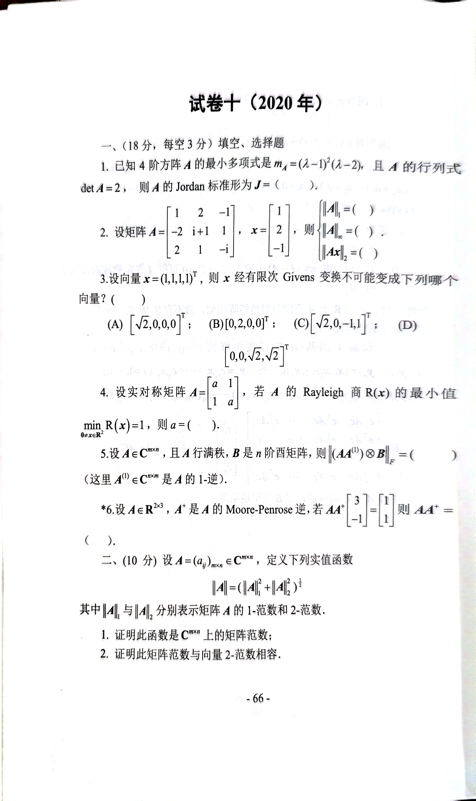
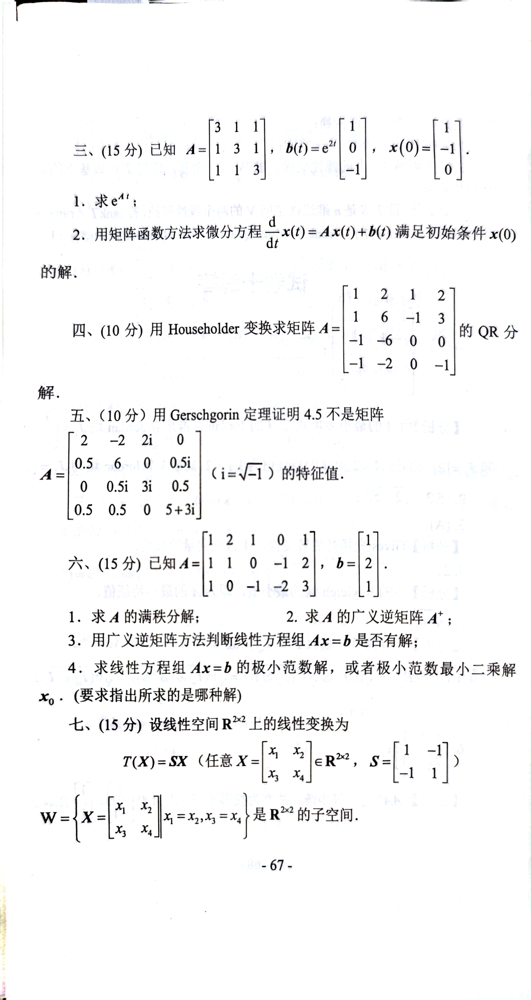
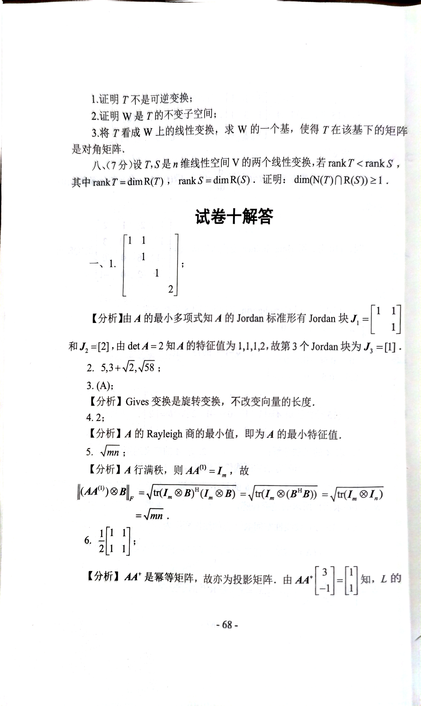

# 2020

# 试卷十 (2020 年)
## 一、（18 分，每空 3 分）填空、选择题
1. 已知 4 阶方阵 $ A $ 的最小多项式是 $ m_A = (\lambda -1)^2(\lambda -2) $，且 $ A $ 的行列式 $ \det A = 2 $，则 $ A $ 的 Jordan 标准形为 $ J = (\ \ \ ) $。
2. 设矩阵

$ A = \begin{bmatrix}
   1 & 2 & -1 \\
   -2 & i+1 & 1 \\
   2 & 1 & -i
   \end{bmatrix},
   \quad
   x = \begin{bmatrix}
   1 \\
   2 \\
   -1
   \end{bmatrix}, $

   则 $ \|A\|_1 = (\ \ \ ) $，$ \|A\|_\infty = (\ \ \ ) $，$ \|Ax\|_2 = (\ \ \ ) $。

3. 设向量 $ x = (1,1,1,1)^T $，则 $ x $ 经有限次 Givens 变换不可能变成下列哪个向量？（ ）

(A) $ \begin{bmatrix} \sqrt{2} \\ 0 \\ 0 \\ 0 \end{bmatrix}^T $  
(B) $ \begin{bmatrix} 0 \\ 2 \\ 0 \\ 0 \end{bmatrix}^T $  
(C) $ \begin{bmatrix} \sqrt{2} \\ 0 \\ -1 \\ 1 \end{bmatrix}^T $  
(D) $ \begin{bmatrix} 0 \\ 0 \\ \sqrt{2} \\ \sqrt{2} \end{bmatrix}^T $  

4. 设实对称矩阵

$ A = \begin{bmatrix}
   a & 1 \\
   1 & a
   \end{bmatrix}, $

   若 $ A $ 的 Rayleigh 商 $ R(x) $ 的最小值 $ \min R(x) = 1 $，则 $ a = (\ \ \ ) $。

5. 设 $ A \in \mathbb{C}^{m \times n} $，且 $ A $ 行满秩，$ B $ 是 $ n $ 阶西矩阵，则 $ \| (A^{(1)}) \otimes B \|_F = (\ \ \ ) $  
（这里 $ A^{(1)} \in \mathbb{C}^{m \times n} $ 是 $ A $ 的 1-逆）。
6. 设 $ A \in \mathbb{R}^{2 \times 3} $，$ A^+ $ 是 $ A $ 的 Moore-Penrose 逆，若

$ AA^+ \begin{bmatrix}
   3 \\
   -1
   \end{bmatrix}
   =
   \begin{bmatrix}
   1 \\
   1
   \end{bmatrix}, $

   则 $ AA^+ = (\ \ \ ) $。

---

## 二、（10 分）
设 $ A = (a_{ij})_{m \times k} \in \mathbb{C}^{m \times k} $，定义下列实值函数

$ \|A\| = (\|A\|_1^2 + \|A\|_2^2)^{\frac{1}{2}} $

其中 $ \|A\|_1 $ 与 $ \|A\|_2 $ 分别表示矩阵 $ A $ 的 1-范数和 2-范数。

1. 证明此函数是 $ \mathbb{C}^{m \times k} $ 上的矩阵范数；
2. 证明此矩阵范数与向量 2-范数相容。 

---

## 三、（15 分）
已知

$ A = \begin{bmatrix}
3 & 1 & 1 \\
1 & 3 & 1 \\
1 & 1 & 3
\end{bmatrix},
\quad
b(t) = e^{2t} \begin{bmatrix}
1 \\
0 \\
-1
\end{bmatrix},
\quad
x(0) = \begin{bmatrix}
-1 \\
1 \\
0
\end{bmatrix}. $

1. 求 $ e^{At} $；
2. 用矩阵函数方法微分方程

$ \frac{d}{dt}x(t) = Ax(t) + b(t) $

   满足初始条件 $ x(0) $ 的解。

---

## 四、（10 分）
用 Householder 变换求矩阵

$ A = \begin{bmatrix}
1 & 2 & 1 & 2 \\
1 & 6 & -1 & 3 \\
-1 & 6 & 0 & 0 \\
-1 & -2 & 0 & -1
\end{bmatrix} $

的 QR 分解。

---

## 五、（10 分）
用 Gerschgorin 定理证明 $ 4.5 $ 不是矩阵

$ A = \begin{bmatrix}
2 & -2 & 2i & 0 \\
0.5 & 6 & 0 & 0.5i \\
0 & 0.5i & 3i & 0.5 \\
0.5 & 0.5 & 0 & 5+3i
\end{bmatrix} $

（$ i = \sqrt{-1} $）的特征值。

---

## 六、（15 分）
已知

$ A = \begin{bmatrix}
1 & 2 & 1 & 0 \\
1 & 0 & -1 & 2 \\
0 & -1 & -2 & 3
\end{bmatrix},
\quad
b = \begin{bmatrix}
1 \\
2 \\
1
\end{bmatrix}. $

1. 求 $ A $ 的满秩分解；
2. 求 $ A $ 的广义逆矩阵 $ A^+ $；
3. 用广义逆矩阵方法判断线性方程组 $ Ax = b $ 是否有解；
4. 求线性方程组 $ Ax = b $ 的极小范数解，或者极小范数最小二乘解 $ x_0 $（要求指出所求的是哪种解）。

---

## 七、（15 分）
设线性空间 $ \mathbb{R}^{2 \times 2} $ 上的线性变换为

$ T(X) = SX $

（任意 $ X = \begin{bmatrix} x_1 & x_2 \\ x_3 & x_4 \end{bmatrix} \in \mathbb{R}^{2 \times 2} $，$ S = \begin{bmatrix} 1 & -1 \\ -1 & 1 \end{bmatrix} $），

$ W = \{ X = \begin{bmatrix} x_1 & x_2 \\ x_3 & x_4 \end{bmatrix} : x_1 = x_2, x_3 = x_4 \} $ 是 $ \mathbb{R}^{2 \times 2} $ 的子空间。

1. 证明 $ T $ 不是可逆变换；
2. 证明 $ W $ 是 $ T $ 的不变子空间；
3. 将 $ T $ 看成 $ W $ 上的线性变换，求 $ W $ 的一个基，使得 $ T $ 在该基下的矩阵是对角矩阵。

---

## 八、（7 分）
设 $ T, S $ 是 $ n $ 维线性空间 $ V $ 的两个线性变换，若 $ \mathrm{rank}\ T < \mathrm{rank}\ S $，其中 $ \mathrm{rank}\ T = \dim R(T) $，$ \mathrm{rank}\ S = \dim R(S) $。证明：

$ \dim (N(T) \cap R(S)) \geq 1. $

# 代码与图片 






```plain
# 试卷十 (2020 年)

## 一、（18 分，每空 3 分）填空、选择题

1. 已知 4 阶方阵 $A$ 的最小多项式是 $m_A = (\lambda -1)^2(\lambda -2)$，且 $A$ 的行列式 $\det A = 2$，则 $A$ 的 Jordan 标准形为 $J = (\ \ \ )$。

2. 设矩阵
   $$
   A = \begin{bmatrix}
   1 & 2 & -1 \\
   -2 & i+1 & 1 \\
   2 & 1 & -i
   \end{bmatrix},
   \quad
   x = \begin{bmatrix}
   1 \\
   2 \\
   -1
   \end{bmatrix},
   $$
   则 $\|A\|_1 = (\ \ \ )$，$\|A\|_\infty = (\ \ \ )$，$\|Ax\|_2 = (\ \ \ )$。

3. 设向量 $x = (1,1,1,1)^T$，则 $x$ 经有限次 Givens 变换不可能变成下列哪个向量？（ ）

(A) $\begin{bmatrix} \sqrt{2} \\ 0 \\ 0 \\ 0 \end{bmatrix}^T$  
(B) $\begin{bmatrix} 0 \\ 2 \\ 0 \\ 0 \end{bmatrix}^T$  
(C) $\begin{bmatrix} \sqrt{2} \\ 0 \\ -1 \\ 1 \end{bmatrix}^T$  
(D) $\begin{bmatrix} 0 \\ 0 \\ \sqrt{2} \\ \sqrt{2} \end{bmatrix}^T$  

4. 设实对称矩阵 
   $$
   A = \begin{bmatrix}
   a & 1 \\
   1 & a
   \end{bmatrix},
   $$
   若 $A$ 的 Rayleigh 商 $R(x)$ 的最小值 $\min R(x) = 1$，则 $a = (\ \ \ )$。

5. 设 $A \in \mathbb{C}^{m \times n}$，且 $A$ 行满秩，$B$ 是 $n$ 阶西矩阵，则 $\| (A^{(1)}) \otimes B \|_F = (\ \ \ )$  
（这里 $A^{(1)} \in \mathbb{C}^{m \times n}$ 是 $A$ 的 1-逆）。

6. 设 $A \in \mathbb{R}^{2 \times 3}$，$A^+$ 是 $A$ 的 Moore-Penrose 逆，若
   $$
   AA^+ \begin{bmatrix}
   3 \\
   -1
   \end{bmatrix}
   =
   \begin{bmatrix}
   1 \\
   1
   \end{bmatrix},
   $$
   则 $AA^+ = (\ \ \ )$。

---

## 二、（10 分）设 $A = (a_{ij})_{m \times k} \in \mathbb{C}^{m \times k}$，定义下列实值函数
$$
\|A\| = (\|A\|_1^2 + \|A\|_2^2)^{\frac{1}{2}}
$$
其中 $\|A\|_1$ 与 $\|A\|_2$ 分别表示矩阵 $A$ 的 1-范数和 2-范数。

1. 证明此函数是 $\mathbb{C}^{m \times k}$ 上的矩阵范数；
2. 证明此矩阵范数与向量 2-范数相容。

---

## 三、（15 分）

已知
$$
A = \begin{bmatrix}
3 & 1 & 1 \\
1 & 3 & 1 \\
1 & 1 & 3
\end{bmatrix},
\quad
b(t) = e^{2t} \begin{bmatrix}
1 \\
0 \\
-1
\end{bmatrix},
\quad
x(0) = \begin{bmatrix}
-1 \\
1 \\
0
\end{bmatrix}.
$$

1. 求 $e^{At}$；
2. 用矩阵函数方法微分方程
   $$
   \frac{d}{dt}x(t) = Ax(t) + b(t)
   $$
   满足初始条件 $x(0)$ 的解。

---

## 四、（10 分）

用 Householder 变换求矩阵
$$
A = \begin{bmatrix}
1 & 2 & 1 & 2 \\
1 & 6 & -1 & 3 \\
-1 & 6 & 0 & 0 \\
-1 & -2 & 0 & -1
\end{bmatrix}
$$
的 QR 分解。

---

## 五、（10 分）

用 Gerschgorin 定理证明 $4.5$ 不是矩阵
$$
A = \begin{bmatrix}
2 & -2 & 2i & 0 \\
0.5 & 6 & 0 & 0.5i \\
0 & 0.5i & 3i & 0.5 \\
0.5 & 0.5 & 0 & 5+3i
\end{bmatrix}
$$
（$i = \sqrt{-1}$）的特征值。

---

## 六、（15 分）

已知
$$
A = \begin{bmatrix}
1 & 2 & 1 & 0 \\
1 & 0 & -1 & 2 \\
0 & -1 & -2 & 3
\end{bmatrix},
\quad
b = \begin{bmatrix}
1 \\
2 \\
1
\end{bmatrix}.
$$

1. 求 $A$ 的满秩分解；
2. 求 $A$ 的广义逆矩阵 $A^+$；
3. 用广义逆矩阵方法判断线性方程组 $Ax = b$ 是否有解；
4. 求线性方程组 $Ax = b$ 的极小范数解，或者极小范数最小二乘解 $x_0$（要求指出所求的是哪种解）。

---

## 七、（15 分）

设线性空间 $\mathbb{R}^{2 \times 2}$ 上的线性变换为
$$
T(X) = SX
$$
（任意 $X = \begin{bmatrix} x_1 & x_2 \\ x_3 & x_4 \end{bmatrix} \in \mathbb{R}^{2 \times 2}$，$S = \begin{bmatrix} 1 & -1 \\ -1 & 1 \end{bmatrix}$），

$W = \{ X = \begin{bmatrix} x_1 & x_2 \\ x_3 & x_4 \end{bmatrix} : x_1 = x_2, x_3 = x_4 \}$ 是 $\mathbb{R}^{2 \times 2}$ 的子空间。

1. 证明 $T$ 不是可逆变换；
2. 证明 $W$ 是 $T$ 的不变子空间；
3. 将 $T$ 看成 $W$ 上的线性变换，求 $W$ 的一个基，使得 $T$ 在该基下的矩阵是对角矩阵。

---

## 八、（7 分）

设 $T, S$ 是 $n$ 维线性空间 $V$ 的两个线性变换，若 $\mathrm{rank}\ T < \mathrm{rank}\ S$，其中 $\mathrm{rank}\ T = \dim R(T)$，$\mathrm{rank}\ S = \dim R(S)$。证明：
$$
\dim (N(T) \cap R(S)) \geq 1.
$$

```


