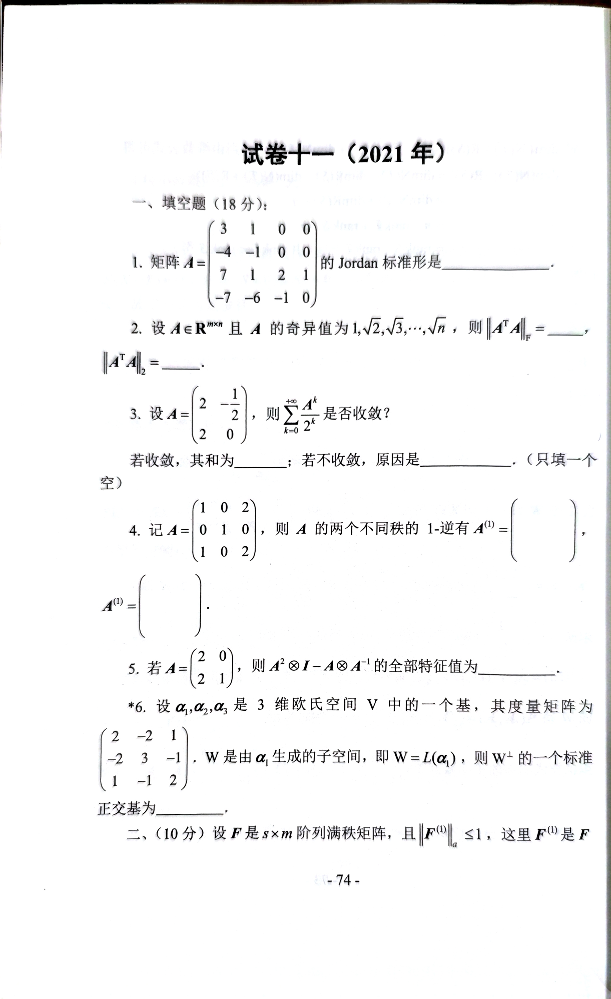
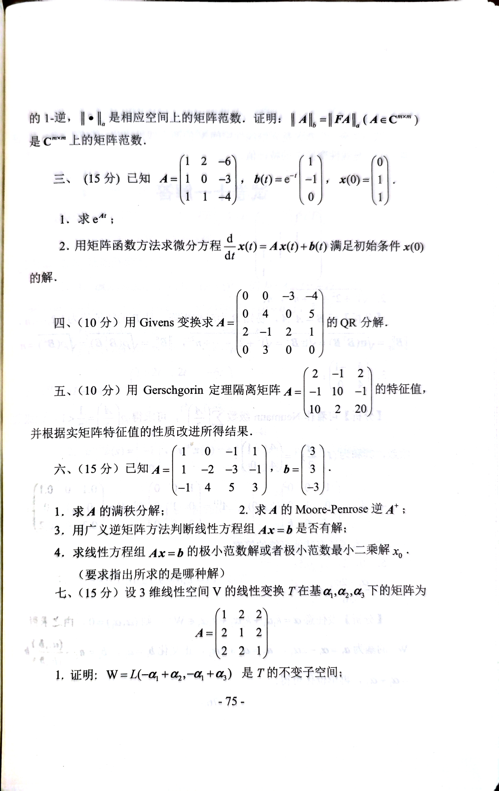

# 2021

```plain
# 试卷十一 (2021 年)

## 一、填空题 (18 分)

1. 矩阵 $A = \begin{bmatrix} 3 & 1 & 0 & 0 \\ -4 & -1 & 0 & 0 \\ 7 & 1 & 2 & 1 \\ -7 & -6 & -1 & 0 \end{bmatrix}$ 的 Jordan 标准形是 $\_\_\_$。

2. 设 $A \in \mathbb{R}^{m \times n}$ 且 $A$ 的奇异值为 $1, \sqrt{2}, \sqrt{3}, \dots, \sqrt{n}$，则 $\|A^T A\|_F = \_\_\_$。

3. 设 $A = \begin{bmatrix} 2 & -\frac{1}{2} \\ 2 & 0 \end{bmatrix}$，则 $\sum_{k=0}^{+\infty} \frac{A^k}{2^k}$ 是否收敛？  
   若收敛，其和为 $\_\_\_$；若不收敛，原因是 $\_\_\_$。(只填一个空)

4. 记 $A = \begin{bmatrix} 1 & 0 & 2 \\ 0 & 1 & 0 \\ 1 & 0 & 2 \end{bmatrix}$，则 $A$ 的两个不同秩的 $1$-逆有 $A^{(1)} = \begin{bmatrix} \_\_\_ \end{bmatrix}$。

5. 若 $A = \begin{bmatrix} 2 & 0 \\ 2 & 1 \end{bmatrix}$，则 $A^2 \otimes I - A \otimes A^{-1}$ 的全部特征值为 $\_\_\_$。

6. 设 $\alpha_1, \alpha_2, \alpha_3$ 是 $3$ 维欧氏空间 $V$ 中的一个基，其度量矩阵为  
   $ \begin{bmatrix} 2 & -2 & 1 \\ -2 & 3 & -1 \\ 1 & -1 & 2 \end{bmatrix}$，  
   $W$ 是由 $\alpha_1$ 生成的子空间，即 $W = L(\alpha_1)$，则 $W^\perp$ 的一个标准正交基为 $\_\_\_$。

---

## 二、(10 分)

设 $F$ 是 $s \times m$ 阶列满秩矩阵，且 $\|F^{(1)}\|_a \leq 1$，这里 $F^{(1)}$ 是 $F$ 的 $1$-逆，$\|\cdot\|_a$ 是相应空间上的矩阵范数。证明：$\|A\|_6 = \|FA\|_a (A \in \mathbb{C}^{m \times n})$ 是 $\mathbb{C}^{m \times n}$ 上的矩阵范数。

---

## 三、(15 分)

已知 $A = \begin{bmatrix} 1 & 2 & -6 \\ 1 & 0 & -3 \\ 1 & 1 & -4 \end{bmatrix}$，$b(t) = e^t \begin{bmatrix} -1 \\ 1 \\ 0 \end{bmatrix}$，$x(0) = \begin{bmatrix} 1 \\ 1 \\ 1 \end{bmatrix}$。

1. 求 $e^{At}$；
2. 用矩阵函数方法求微分方程 $\frac{d}{dt} x(t) = A x(t) + b(t)$ 满足初始条件 $x(0)$ 的解。

---

## 四、(10 分)

用 Givens 变换求 $A = \begin{bmatrix} 0 & 0 & -3 & -4 \\ 0 & 4 & 0 & 5 \\ 2 & -1 & 2 & 1 \\ 0 & 0 & 3 & 0 \end{bmatrix}$ 的 QR 分解。

---

## 五、(10 分)

用 Gerschgorin 定理离散矩阵 $A = \begin{bmatrix} 2 & -1 & 2 \\ -1 & 10 & -1 \\ 10 & 2 & 20 \end{bmatrix}$ 的特征值，并根据矩阵特征值的性质改进所得结果。

---

## 六、(15 分)

已知 $A = \begin{bmatrix} 1 & -2 & -3 \\ -1 & 4 & 5 \\ -1 & 4 & 5 \end{bmatrix}$，$b = \begin{bmatrix} 3 \\ -3 \\ -3 \end{bmatrix}$。

1. 求 $A$ 的满秩分解；
2. 求 $A$ 的 Moore-Penrose 逆 $A^+$；
3. 用广义逆矩阵方法判断线性方程组 $Ax = b$ 是否有解；
4. 求线性方程组 $Ax = b$ 的极小范数解或极小范数最小二乘解 $x_0$。

---

## 七、(15 分)

设 3 维线性空间 $V$ 的线性变换 $T$ 在基 $\alpha_1, \alpha_2, \alpha_3$ 下的矩阵为  
$A = \begin{bmatrix} 1 & 2 & 2 \\ 2 & 1 & 2 \\ 2 & 2 & 1 \end{bmatrix}$。

1. 证明：$W = L(-\alpha_1 + \alpha_2, -\alpha_1 + \alpha_3)$ 是 $T$ 的不变子空间。

```


# 试卷十一 (2021 年)
## 一、填空题 (18 分)
1. 矩阵 $ A = \begin{bmatrix} 3 & 1 & 0 & 0 \\ -4 & -1 & 0 & 0 \\ 7 & 1 & 2 & 1 \\ -7 & -6 & -1 & 0 \end{bmatrix} $ 的 Jordan 标准形是 $ \_\_\_ $。
2. 设 $ A \in \mathbb{R}^{m \times n} $ 且 $ A $ 的奇异值为 $ 1, \sqrt{2}, \sqrt{3}, \dots, \sqrt{n} $，则 $ \|A^T A\|_F = \_\_\_ $，$ \|A^T A\|_2= $。
3. 设 $ A = \begin{bmatrix} 2 & -\frac{1}{2} \\ 2 & 0 \end{bmatrix} $，则 $ \sum_{k=0}^{+\infty} \frac{A^k}{2^k} $ 是否收敛？  
若收敛，其和为 $ \_\_\_ $；若不收敛，原因是 $ \_\_\_ $。(只填一个空)
4. 记 $ A = \begin{bmatrix} 1 & 0 & 2 \\ 0 & 1 & 0 \\ 1 & 0 & 2 \end{bmatrix} $，则 $ A $ 的两个不同秩的 $ 1 $-逆有 $ A^{(1)} = \begin{bmatrix} \_\_\_ \end{bmatrix} $。
5. 若 $ A = \begin{bmatrix} 2 & 0 \\ 2 & 1 \end{bmatrix} $，则 $ A^2 \otimes I - A \otimes A^{-1} $ 的全部特征值为 $ \_\_\_ $。
6. 设 $ \alpha_1, \alpha_2, \alpha_3 $ 是 $ 3 $ 维欧氏空间 $ V $ 中的一个基，其度量矩阵为  
$  \begin{bmatrix} 2 & -2 & 1 \\ -2 & 3 & -1 \\ 1 & -1 & 2 \end{bmatrix} $，  
$ W $ 是由 $ \alpha_1 $ 生成的子空间，即 $ W = L(\alpha_1) $，则 $ W^\perp $ 的一个标准正交基为 $ \_\_\_ $。

---

## 二、(10 分)
设 $ F $ 是 $ s \times m $ 阶列满秩矩阵，且 $ \|F^{(1)}\|_a \leq 1 $，这里 $ F^{(1)} $ 是 $ F $ 的 $ 1 $-逆，$ \|\cdot\|_a $ 是相应空间上的矩阵范数。证明：$ \|A\|_6 = \|FA\|_a (A \in \mathbb{C}^{m \times n}) $ 是 $ \mathbb{C}^{m \times n} $ 上的矩阵范数。

---

## 三、(15 分)
已知 $ A = \begin{bmatrix} 1 & 2 & -6 \\ 1 & 0 & -3 \\ 1 & 1 & -4 \end{bmatrix} $，$ b(t) = e^t \begin{bmatrix} -1 \\ 1 \\ 0 \end{bmatrix} $，$ x(0) = \begin{bmatrix} 1 \\ 1 \\ 1 \end{bmatrix} $。

1. 求 $ e^{At} $；
2. 用矩阵函数方法求微分方程 $ \frac{d}{dt} x(t) = A x(t) + b(t) $ 满足初始条件 $ x(0) $ 的解。

---

## 四、(10 分)
用 Givens 变换求 $ A = \begin{bmatrix} 0 & 0 & -3 & -4 \\ 0 & 4 & 0 & 5 \\ 2 & -1 & 2 & 1 \\ 0 & 0 & 3 & 0 \end{bmatrix} $ 的 QR 分解。

---

## 五、(10 分)
用 Gerschgorin 定理离散矩阵 $ A = \begin{bmatrix} 2 & -1 & 2 \\ -1 & 10 & -1 \\ 10 & 2 & 20 \end{bmatrix} $ 的特征值，并根据矩阵特征值的性质改进所得结果。

---

## 六、(15 分)
已知 $ A = \begin{bmatrix} 1 & -2 & -3 \\ -1 & 4 & 5 \\ -1 & 4 & 5 \end{bmatrix} $，$ b = \begin{bmatrix} 3 \\ -3 \\ -3 \end{bmatrix} $。

1. 求 $ A $ 的满秩分解；
2. 求 $ A $ 的 Moore-Penrose 逆 $ A^+ $；
3. 用广义逆矩阵方法判断线性方程组 $ Ax = b $ 是否有解；
4. 求线性方程组 $ Ax = b $ 的极小范数解或极小范数最小二乘解 $ x_0 $。

---

## 七、(15 分)
设 3 维线性空间 $ V $ 的线性变换 $ T $ 在基 $ \alpha_1, \alpha_2, \alpha_3 $ 下的矩阵为  
$ A = \begin{bmatrix} 1 & 2 & 2 \\ 2 & 1 & 2 \\ 2 & 2 & 1 \end{bmatrix} $。

1. 证明：$ W = L(-\alpha_1 + \alpha_2, -\alpha_1 + \alpha_3) $ 是 $ T $ 的不变子空间。
2. 求$V$的一个基，使得$T$在该基下的矩阵为对角矩阵。


## 八、
设$ T,S $是$ n $维线性空间$ V $的两个线性变换，若$ ST = T + S $，证明：1不是线性变换T的特征值







