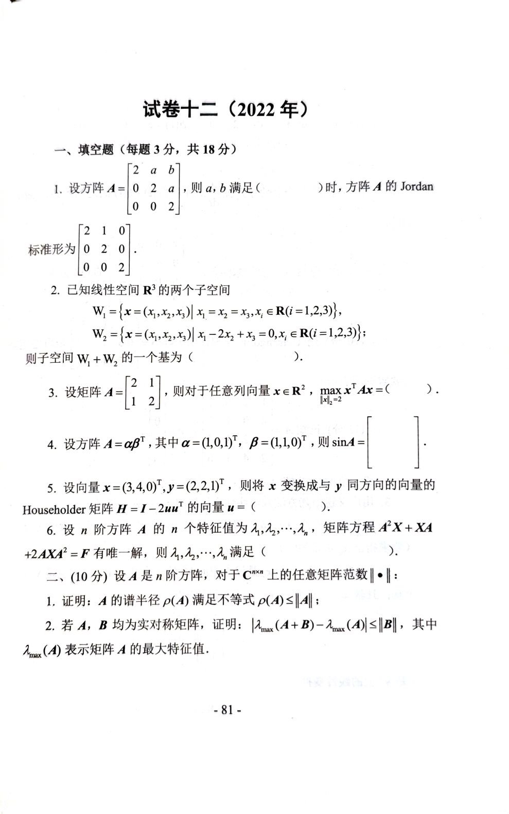
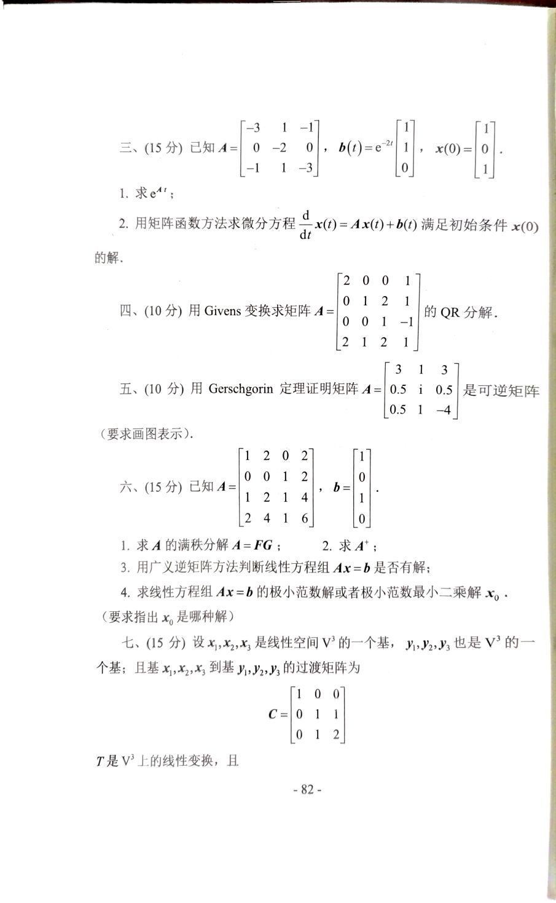
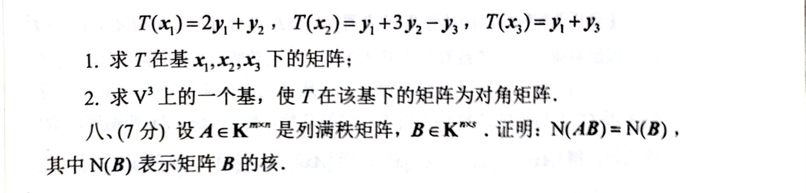

# 2022年

# 2022年
## 填空题
1. 设方阵 $ A = \begin{bmatrix} 2 & a & b \\ 0 & 2 & a \\ 0 & 0 & 2 \end{bmatrix} $，则 $ a, b $ 满足 $ \underline{\quad\quad\quad} $ 时，方阵 $ A $ 的 Jordan 标准形为 $ \begin{bmatrix} 2 & 1 & 0 \\ 0 & 2 & 0 \\ 0 & 0 & 2 \end{bmatrix} $。


2. 已知线性空间 $ R^3 $ 的两个子空间

$ W_1 = \{x = (x_1, x_2, x_3) | x_1 = x_2 = x_3, x_i \in R (i = 1, 2, 3)\}, $

$ W_2 = \{x = (x_1, x_2, x_3) | x_1 - 2x_2 + x_3 = 0, x_i \in R (i = 1, 2, 3)\}； $

则子空间 $ W_1 + W_2 $ 的一个基为 $ \underline{\quad\quad\quad} $。


3. 设矩阵 $ A = \begin{bmatrix} 2 & 1 \\ 1 & 2 \end{bmatrix} $，则对于任意列向量 $ x \in R^2 $，$ \|x\|_2 = 2 $$ \max x^T A x = \underline{\quad\quad\quad} $。


4. 设方阵 $ A = \alpha \beta^T $，其中 $ \alpha = (1, 0, 1)^T, \beta = (1, 1, 0)^T $，则 $ \sin A = \underline{\quad\quad\quad} $。


5. 设向量 $ x = (3, 4, 0)^T, y = (2, 2, 1)^T $，则将 $ x $ 变换成与 $ y $ 同方向的向量的 Householder 矩阵 $ H = I - 2uu^T $ 的向量 $ u = \underline{\quad\quad\quad} $。


6. 设 $ n $ 阶方阵 $ A $ 的 $ n $ 个特征值为 $ \lambda_1, \lambda_2, \cdots, \lambda_n $，矩阵方程 $ A^2 X + XA^2 + 2AXA^2 = F $ 有唯一解，则 $ \lambda_1, \lambda_2, \cdots, \lambda_n $ 满足 $ \underline{\quad\quad\quad} $。

---

## 大题
二、(10 分) 设 $ A $ 是 $ n $ 阶方阵，对于 $ C^{m \times n} $ 上的任意矩阵范数 $ \|\cdot\| $：

1. 证明：$ A $ 的谱半径 $ \rho(A) $ 满足不等式 $ \rho(A) \leq \|A\| $。
2. 若 $ A, B $ 均为实对称矩阵，证明：

$ \lambda_{\max}(A + B) - \lambda_{\max}(A) \leq \|B\|， $

其中 $ \lambda_{\max}(A) $ 表示矩阵 $ A $ 的最大特征值。


三、(15 分) 已知 $ A = \begin{bmatrix} -3 & 1 & -1 \\ 0 & -2 & 0 \\ -1 & 1 & -3 \end{bmatrix}, \ b(t) = e^{-2t} \begin{bmatrix} 1 \\ 1 \\ 0 \end{bmatrix}, \ x(0) = \begin{bmatrix} 1 \\ 0 \\ 1 \end{bmatrix} $。

1. 求 $ e^{At} $；
2. 用矩阵函数方法求微分方程 $ \frac{d}{dt}x(t) = A x(t) + b(t) $ 满足初始条件 $ x(0) $ 的解。


四、(10 分) 用 Givens 变换求矩阵 $ A = \begin{bmatrix} 2 & 0 & 0 & 1 \\ 0 & 1 & 2 & 1 \\ 0 & 0 & -1 & -1 \\ 2 & 1 & 2 & 1 \end{bmatrix} $ 的 QR 分解。


五、(10 分) 用 Gerschgorin 定理证明矩阵 $ A = \begin{bmatrix} 3 & 1 & 3 \\ 0.5 & 1 & 0.5 \\ 0.5 & 1 & -4 \end{bmatrix} $ 是可逆矩阵 (要求画图表示)。

 

六、(15 分) 已知 $ A = \begin{bmatrix} 1 & 2 & 0 & 2 \\ 0 & 1 & 2 & 4 \\ 2 & 4 & 1 & 6 \end{bmatrix}, \ b = \begin{bmatrix} 1 \\ 0 \\ 0 \end{bmatrix} $。

1. 求 $ A $ 的满秩分解 $ A = FG $；
2. 求 $ A^+ $；
3. 用广义逆矩阵方法判断线性方程组 $ Ax = b $ 是否有解；
4. 求线性方程组 $ Ax = b $ 的极小范数解或者极小范数最小二乘解 $ x_0 $ (要求指出 $ x_0 $ 是哪种解)。


七、(15 分) 设 $ x_1, x_2, x_3 $ 是线性空间 $ V^3 $ 的一个基；$ y_1, y_2, y_3 $ 也是 $ V^3 $ 的一个基；且基 $ x_1, x_2, x_3 $ 到基 $ y_1, y_2, y_3 $ 的过渡矩阵为 

$ C = \begin{bmatrix} 
1 & 0 & 0 \\ 
0 & 1 & 1 \\ 
0 & 1 & 2 
\end{bmatrix}， $

$ T $ 是 $ V^3 $ 上的线性变换，且

$ T(x_1) = 2y_1 + y_2,\ T(x_2) = y_1 + 3y_2 - y_3,\ T(x_3) = y_1 + y_3 $。

1. 求 $ T $ 在基 $ x_1, x_2, x_3 $ 下的矩阵；
2. 求 $ V^3 $ 上的一个基，使 $ T $ 在该基下的矩阵为对角矩阵。


八、(7 分) 设 $ A \in K^{m \times n} $ 是列满秩矩阵，$ B \in K^{n \times s} $。证明：$ \text{N}(AB) = \text{N}(B) $，其中 $ \text{N}(B) $ 表示矩阵 $ B $ 的核。


# 代码与图片
```plain
1. 设方阵 $A = \begin{bmatrix} 2 & a & b \\ 0 & 2 & a \\ 0 & 0 & 2 \end{bmatrix}$，则 $a, b$ 满足 $\underline{\quad\quad\quad}$ 时，方阵 $A$ 的 Jordan 标准形为 $\begin{bmatrix} 2 & 1 & 0 \\ 0 & 2 & 0 \\ 0 & 0 & 2 \end{bmatrix}$。

2. 已知线性空间 $R^3$ 的两个子空间
$$
W_1 = \{x = (x_1, x_2, x_3) | x_1 = x_2 = x_3, x_i \in R (i = 1, 2, 3)\},
$$
$$
W_2 = \{x = (x_1, x_2, x_3) | x_1 - 2x_2 + x_3 = 0, x_i \in R (i = 1, 2, 3)\}；
$$
则子空间 $W_1 + W_2$ 的一个基为 $\underline{\quad\quad\quad}$。

3. 设矩阵 $A = \begin{bmatrix} 2 & 1 \\ 1 & 2 \end{bmatrix}$，则对于任意列向量 $x \in R^2$，$\|x\|_2 = 2$，$\max x^T A x = \underline{\quad\quad\quad}$。

4. 设方阵 $A = \alpha \beta^T$，其中 $\alpha = (1, 0, 1)^T, \beta = (1, 1, 0)^T$，则 $\sin A = \underline{\quad\quad\quad}$。

5. 设向量 $x = (3, 4, 0)^T, y = (2, 2, 1)^T$，则将 $x$ 变换成与 $y$ 同方向的向量的 Householder 矩阵 $H = I - 2uu^T$ 的向量 $u = \underline{\quad\quad\quad}$。

6. 设 $n$ 阶方阵 $A$ 的 $n$ 个特征值为 $\lambda_1, \lambda_2, \cdots, \lambda_n$，矩阵方程 $A^2 X + XA^2 + 2AXA^2 = F$ 有唯一解，则 $\lambda_1, \lambda_2, \cdots, \lambda_n$ 满足 $\underline{\quad\quad\quad}$。

---

二、(10 分) 设 $A$ 是 $n$ 阶方阵，对于 $C^{m \times n}$ 上的任意矩阵范数 $\|\cdot\|$：

1. 证明：$A$ 的谱半径 $\rho(A)$ 满足不等式 $\rho(A) \leq \|A\|$。

2. 若 $A, B$ 均为实对称矩阵，证明：
$$
\lambda_{\max}(A + B) - \lambda_{\max}(A) \leq \|B\|，
$$
其中 $\lambda_{\max}(A)$ 表示矩阵 $A$ 的最大特征值。

三、(15 分) 已知 $A = \begin{bmatrix} -3 & 1 & -1 \\ 0 & -2 & 0 \\ -1 & 1 & -3 \end{bmatrix}, \ b(t) = e^{-2t} \begin{bmatrix} 1 \\ 1 \\ 0 \end{bmatrix}, \ x(0) = \begin{bmatrix} 1 \\ 0 \\ 1 \end{bmatrix}$。

1. 求 $e^{At}$；
2. 用矩阵函数方法求微分方程 $\frac{d}{dt}x(t) = A x(t) + b(t)$ 满足初始条件 $x(0)$ 的解。

四、(10 分) 用 Givens 变换求矩阵 $A = \begin{bmatrix} 2 & 0 & 0 & 1 \\ 0 & 1 & 2 & 1 \\ 0 & 0 & -1 & -1 \\ 2 & 1 & 2 & 1 \end{bmatrix}$ 的 QR 分解。

五、(10 分) 用 Gerschgorin 定理证明矩阵 $A = \begin{bmatrix} 3 & 1 & 3 \\ 0.5 & 1 & 0.5 \\ 0.5 & 1 & -4 \end{bmatrix}$ 是可逆矩阵 (要求画图表示)。

六、(15 分) 已知 $A = \begin{bmatrix} 1 & 2 & 0 & 2 \\ 0 & 1 & 2 & 4 \\ 2 & 4 & 1 & 6 \end{bmatrix}, \ b = \begin{bmatrix} 1 \\ 0 \\ 0 \end{bmatrix}$。

1. 求 $A$ 的满秩分解 $A = FG$；
2. 求 $A^+$；
3. 用广义逆矩阵方法判断线性方程组 $Ax = b$ 是否有解；
4. 求线性方程组 $Ax = b$ 的极小范数解或者极小范数最小二乘解 $x_0$ (要求指出 $x_0$ 是哪种解)。

七、(15 分) 设 $x_1, x_2, x_3$ 是线性空间 $V^3$ 的一个基；$y_1, y_2, y_3$ 也是 $V^3$ 的一个基；且基 $x_1, x_2, x_3$ 到基 $y_1, y_2, y_3$ 的过渡矩阵为 
$$
C = \begin{bmatrix} 
1 & 0 & 0 \\ 
0 & 1 & 1 \\ 
0 & 1 & 2 
\end{bmatrix}，
$$
$T$ 是 $V^3$ 上的线性变换，且
$T(x_1) = 2y_1 + y_2,\ T(x_2) = y_1 + 3y_2 - y_3,\ T(x_3) = y_1 + y_3$。

1. 求 $T$ 在基 $x_1, x_2, x_3$ 下的矩阵；
2. 求 $V^3$ 上的一个基，使 $T$ 在该基下的矩阵为对角矩阵。

八、(7 分) 设 $A \in K^{m \times n}$ 是列满秩矩阵，$B \in K^{n \times s}$。证明：$\text{N}(AB) = \text{N}(B)$，其中 $\text{N}(B)$ 表示矩阵 $B$ 的核。
```







