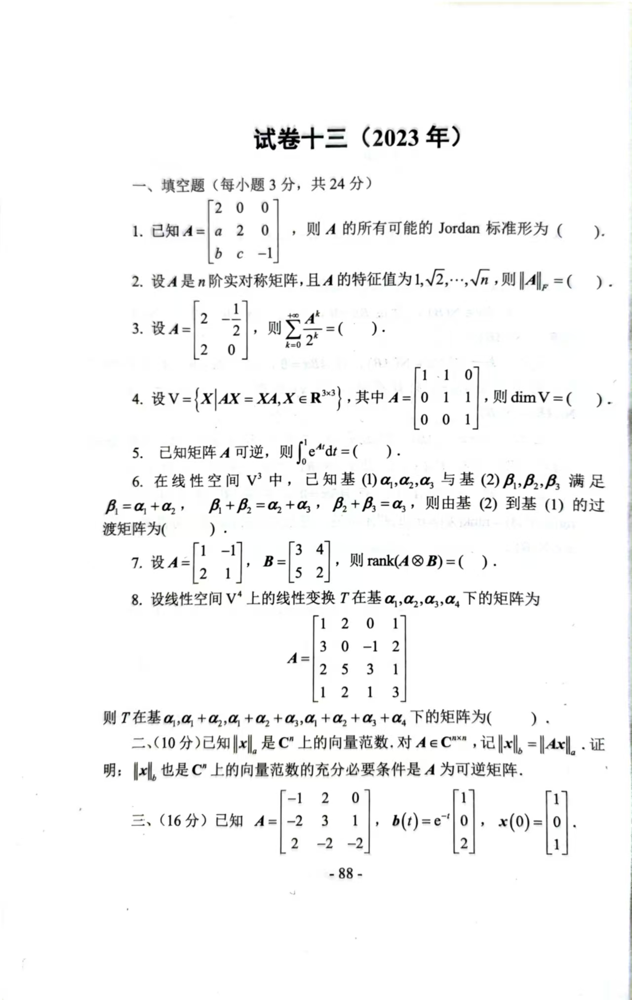
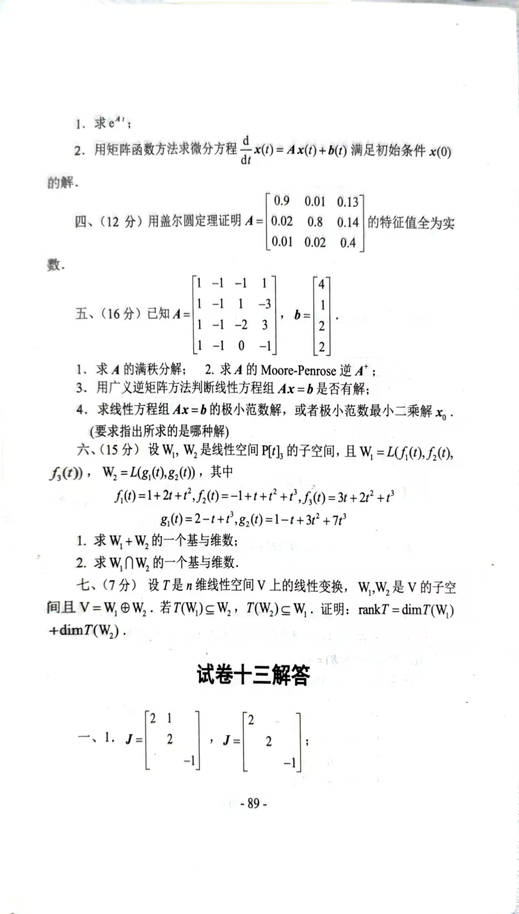

# 2023年

# 试卷十三（2023年）
## 一、填空题（每小题3分，共24分）
1. 已知 $ A=\begin{bmatrix} 2 & 0 & 0 \\ a & 2 & 0 \\ b & c & -1 \end{bmatrix} $，则 $ A $ 的所有可能的 Jordan 标准形为（ ）。
2. 设 $ A $ 是 $ n $ 阶实对称矩阵，且 $ A $ 的特征值为 $ 1, \sqrt{2}, \dots, \sqrt{n} $，则 $ \|A\|_F= $（ ）。
3. 设 $ A=\begin{bmatrix} 2 & -1 \\ 2 & 0 \end{bmatrix} $，则 $ \sum_{k=0}^\infty \frac{A^k}{2^k}= $（ ）。
4. 设 $ V=\{X | AX=XA, X \in \mathbb{R}^{3\times 3}\} $，其中 $ A=\begin{bmatrix} 1 & 1 & 0 \\ 0 & 1 & 1 \\ 0 & 0 & 1 \end{bmatrix} $，则 $ \dim V= $（ ）。
5. 已知矩阵 $ A $ 可逆，则 $ \int_0^1 e^{A t} \, dt= $（ ）。
6. 在线性空间 $ V^3 $ 中，已知基 (1) $ \alpha_1, \alpha_2, \alpha_3 $ 与基 (2) $ \beta_1, \beta_2, \beta_3 $ 满足：

$ \beta_1 = \alpha_1 + \alpha_2, \quad \beta_1 + \beta_2 = \alpha_2 + \alpha_3, \quad \beta_2 + \beta_3 = \alpha_3, $

   则由基 (2) 到基 (1) 的过渡矩阵为（ ）。

7. 设 $ A=\begin{bmatrix} 1 & -1 \\ 2 & 1 \end{bmatrix} $，$ B=\begin{bmatrix} 3 & 4 \\ 5 & 2 \end{bmatrix} $，则 $ \operatorname{rank}(A \otimes B)= $（ ）。
8. 设线性空间 $ V^4 $ 上的线性变换 $ T $ 在基 $ \alpha_1, \alpha_2, \alpha_3, \alpha_4 $ 下的矩阵为

$ A=\begin{bmatrix}
   1 & 2 & 0 & 1 \\
   3 & 0 & -1 & 2 \\
   2 & 5 & 3 & 1 \\
   1 & 2 & 1 & 3
   \end{bmatrix}, $

   则 $ T $ 在基 $ \alpha_1, \alpha_1 + \alpha_2, \alpha_1 + \alpha_2 + \alpha_3, \alpha_1 + \alpha_2 + \alpha_3 + \alpha_4 $ 下的矩阵为（ ）。

---

## 二、（10分）
已知 $ \|x\|_a $ 是 $ \mathbb{C}^n $ 上的向量范数，对 $ A \in \mathbb{C}^{n \times n} $，记 $ \|x\|_b = \|Ax\|_a $。证明：$ \|x\|_b $ 也是 $ \mathbb{C}^n $ 上的向量范数的充分必要条件是 $ A $ 为可逆矩阵。

---

## 三、（16分）
已知 $ A=\begin{bmatrix} -1 & 2 & 0 \\ -2 & 3 & 1 \\ 2 & -2 & -2 \end{bmatrix} $，$ b(t)=e^{-t}\begin{bmatrix} 1 \\ 0 \\ 1 \end{bmatrix} $，$ x(0)=\begin{bmatrix} 1 \\ 0 \\ 0 \end{bmatrix} $。

1. 求 $ e^{A t} $；
2. 用矩阵函数方法求微分方程 $ \frac{d}{dt}x(t)=Ax(t)+b(t) $ 满足初始条件 $ x(0) $ 的解。

---

## 四、（12分）
用盖尔圆定理证明 $ A=\begin{bmatrix} 0.9 & 0.01 & 0.13 \\ 0.02 & 0.8 & 0.14 \\ 0.01 & 0.02 & 0.4 \end{bmatrix} $ 的特征值全为实数。

---

## 五、（16分）
已知 $ A=\begin{bmatrix} 1 & -1 & -1 & 1 \\ -1 & 1 & -1 & 3 \\ 1 & -1 & -2 & 3 \\ -1 & 0 & -1 & -1 \end{bmatrix} $，$ b=\begin{bmatrix} 4 \\ 1 \\ 2 \\ 2 \end{bmatrix} $。

1. 求 $ A $ 的满秩分解；
2. 求 $ A $ 的 Moore-Penrose 逆 $ A^+ $；
3. 用广义逆矩阵方法判断线性方程组 $ Ax=b $ 是否有解；
4. 求线性方程组 $ Ax=b $ 的极小范数解，或者极小范数最小二乘解 $ x_0 $（要求指出所求的是哪种解）。

---

## 六、（15分）
设 $ W_1, W_2 $ 是线性空间 $ P[t]_3 $ 的子空间，且

$ W_1 = L\{f_1(t), f_2(t), f_3(t)\}, \quad W_2 = L\{g_1(t), g_2(t)\}, $

其中

$ f_1(t)=1+2t+t^2, \quad f_2(t)=-1+t+t^2+t^3, \quad f_3(t)=3t+2t^2+t^3, $

$ g_1(t)=2-t+t^3, \quad g_2(t)=1+t^3+2t^2. $

1. 求 $ W_1 + W_2 $ 的一个基与维数；
2. 求 $ W_1 \cap W_2 $ 的一个基与维数。

---

## 七、（7分）
设 $ T $ 是 $ n $ 维线性空间 $ V $ 上的线性变换，$ W_1, W_2 $ 是 $ V $ 的子空间且 $ V=W_1 \oplus W_2 $。若 $ T(W_1) \subseteq W_2, T(W_2) \subseteq W_1 $，证明：

$ \operatorname{rank}T = \dim W_1 + \dim W_2. $

